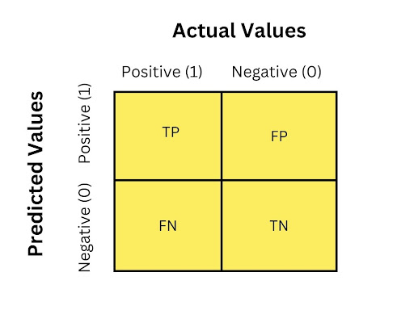

# ML : Supervised Learning 
# Classification Analysis
Supervised learning encompasses two main techniques: classification and regression. This page is all about classification analysis. It provides essential information and it detailed insights into machine learning models used for classification tasks. This resource is a valuable tool for aspiring data scientists and machine learning engineers preparing for technical interviews, offering a concise yet thorough guide whether you're reviewing basics or diving into specific concepts.

### Q0- What does classification analysis mean?
- It is one fundamental task in machine learning and data science. 
- It uses the supervised learning approach which consists on splitting input data into training and testing
- Commonly used in building predictive models to categorize data into predefined classes or categories based on input features or attributes. 
- Algorithm learns patterns and relationships between input features and class labels.
- Once the model is trained, it can predict the class labels of new or unseen data instances. 
- This predictive capability enables various applications such as spam detection, sentiment analysis, medical diagnosis, and fraud detection.

### Q1- What are some real-life applications of classification algorithms?
- Classification algorithms have numerous real-life applications across various fields.
- Here are some examples:
   - **Email Spam Detection:** classifying emails as spam or not spam 
   - **Medical Diagnosis:** predicting diseases or medical conditions 
   - **Sentiment Analysis:** classifying text data (e.g., customer reviews, social media posts) as positive, negative, or neutral sentiments.
   - **Credit Risk Assessment:** predicting the creditworthiness of individuals or businesses
   - **Image Recognition:** identifying objects like facial recognition, object detection, and medical imaging.
   - **Fraud Detection:** detecting fraudulent transactions or activities.
   - **Customer Churn Prediction:** predicting whether customers are likely to churn or leave a service. 
   - **Disease Outbreak Prediction:** identifying potential disease outbreaks or epidemics 
   - **Predictive Maintenance:** predicting equipment failures or malfunctions in industrial machinery, vehicles, or infrastructure

### Q2- Examples of well-known machine learning algorithms used to solve classification problems
Here are some well-known machine learning algorithms commonly used to solve classification problems:
- Logistic Regression
- Decision Trees
- Support Vector Machines (SVM)
- K-Nearest Neighbors (KNN)
- Naive Bayes
- Random Forest
- AdaBoost
- Gradient Boosting Machines (GBM)
- XGBoost
- CatBoost
- LightGBM
- Neural Networks (Deep Learning)

### Q3. how to choose a classifier based on training dataset size?
- For small training datasets:
  - Choose simpler classifiers like Naive Bayes or k-Nearest Neighbors (kNN).
  - It is better to use simple model with high bias and low variance.
  - They work better because they are less likely to overfit. 
- For Larger datasets:
  - It is better to use more complex classifiers such as Support Vector Machines (SVMs) or Random Forests.
  - It is better to use model with low bias and high variance
  - This model type will tend to perform better with complex relationships. 
-  Balancing variance and bias is essential for developing models that perform well on both training and unseen data.
- Simple classifiers are preferred to avoid overfitting and reduce computational complexity with limited data.
- Complex classifiers excel in capturing intricate patterns in larger datasets and handling higher dimensionality.

### Q4- How to address class imbalance in classification problems
- Two techniques are used to address class imbalance : 
   - Downsampling
   - Upsampling
- This two techniques are part of the feature engineering and the preprocessing phase.
- **Downsampling:** involves reducing the size of the majority class by randomly removing instances.
- **Upsampling:** involves increasing the size of the minority class by duplicating instances or generating synthetic samples.
- By balancing the class distribution, we improve the performance of machine learning models.

### Q5- How to evaluate a Classification model?
- Many metrics are commonly used to evaluate the performance of classification models in machine learning.
- The choice of metrics depends on the specific goals and characteristics of the classification problem.
- Here are some classification metrics:
    - Confusion matrix
    - Accuracy
    - Precision
    - F1 Score
    - Recall (Sensitivity or True Positive Rate)
    - Specificity or True Negative Rate
    - Area Under the Receiver Operating Characteristic (ROC) Curve (AUC-ROC)
    - Area Under the Precision-Recall Curve (AUC-PR) 
- The choice of metrics depends on the specific requirements of the classification problem (binary classification or multiclass classification).
- For example, in imbalanced datasets, where one class significantly has large number of samples than the second class, precision, recall, and F1 score are often more informative than accuracy.

### Q6- What is confusion matrix in classification problems?
- Confusion matrix is a table used to measure the performance of classification model
- It gives more details regarding the number of instances that were correctly or incorrectly classified for each class.
- The confusion matrix is a valuable tool for assessing the strengths and weaknesses of a classification model and guiding further optimization efforts.
- Here is an example of confusion matrix for a binary classification problem : 

##### 1. True Positive : 
- Samples that are from the positive class and were correctly classified or predicted as positive by the model.
##### 2. True Negative :  
- Samples that are from the negative class and were correctly classified or predicted as negative by the model.
##### 3. False Positive : 
- Samples that are from  the negative class but were incorrectly classified or predicted as positive by the model.
##### 4. False Negative : 
- Samples that are from  the positive class but were incorrectly classified or predicted as negative by the model

### Q7- How to define Accuracy?

- An evaluation metric used to evaluate the performance of classification model.

- Divides the number of correctly classified observations by the total number of samples.

- **Formula:** $$Accuracy ={ Number\ of\ Correct\ Predictions \over Total\ number\ of\ predictions }$$

- Here a second formula : $$Accuracy ={ TP + TN \over TP + TN + FP + FN }$$

### Q8- How to define Precision ?
- An evaluation metric that measures the accuracy of the positive predictions made by the model. 
- It divides the number of true positive predictions by the sum of true positives and false positives.
- It belongs to [0,1] interval, 0 corresponds to no precision and 1 corresponds to perfect precision.
- Precision = Positive Predictive Power
- **Formula:** $$Precision = {True\ Positives \over True\ Positives + False\ Positives}$$ 

### Q9- How to define Recall, Sensitivity or True Positive Rate?
- An evaluation metric that measures the ability of the model to capture all the positive samples.
- It divides number of true positives samples by the sum of true positives and false negatives.
- Recall = Sensitivity = True Positive Rate. 
- **Formula:** $$Recall= {True\ Positives \over True\ Positives + False\ Negatives}$$
  
### Q10- How to define F1-score? 
- An evaluation metric that combines both Precision and Recall.
- Wighted average of Precision and Recall.
- It can be calculated using the `f1_score()` function of `scikit-learn`
- F1 belongs to [0,1]: 0 is the worst case and 1 is the best.
- **Formula :** $$F1= {2×Precision×Recall \over Precision+Recall}$$
