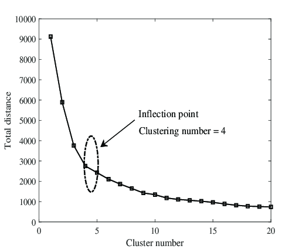

# ML : Unsupervised Learning
# Clustering Analysis

💡 This page is dedicated to clustering analysis as it focuses specifically on clustering analysis and offers a thorough exploration of concepts. It provides wide range of questions and answers, from fundamental concepts to advanced techniques. 
📚 This resource is a valuable tool for aspiring data scientists and machine learning engineers preparing for technical interviews, offering a concise yet deep guide whether you're reviewing basics or diving into specific concepts.
🚀 It enhances understanding of clustering algorithms and their applications, making it an indispensable resource for interview preparation and skill development in clustering analysis.

## List Of Questions
### Q0- What does Clustering Analysis mean?
- It is unsupervised machine learning technique to group similar data points based on their characteristics.
- It aims to identify clusters within a dataset.
- Data points within the same cluster are more similar to each other than to those in other clusters.
- Clustering analysis is commonly used for:
   - Exploratory data analysis
   - Pattern recognition
   - Segmentation 
- It is used in various fields such as marketing, biology, finance, and image analysis.

### Q1- What are some real-life applications of clustering algorithms?
Some examples of real-life applications of clustering algorithms are:
- **Customer segmentation:** grouping customers based on their behavior and preferences for targeted marketing strategies.
- **Anomaly detection:** Identifying unusual patterns in data, such as network traffic, for cybersecurity purposes.
- **Document clustering:** organizing and categorizing documents based on their content or topics for easier retrieval and analysis.
- **Healthcare data analysis:** grouping patients with similar medical characteristics for disease diagnosis, treatment planning, and resource allocation.
- **Recommendation engine**

### Q2- Examples of well-known machine learning algorithms used to solve clustering problems
Several well-known machine learning algorithms are commonly used for solving clustering problems. Here are some examples:
- K-Means Clustering 
- Hierarchical Clustering
- DBSCAN (Density-Based Spatial Clustering of Applications with Noise)
- Mean Shift
- Gaussian Mixture Model (GMM)
- Agglomerative Clustering

**Notes:**
- These algorithms address different types of clustering scenarios
- They have varying strengths depending on the nature of the data and the desired outcomes.

### Q3- What is K-Means ?
- Most known and used clsutering algorithm.
- It aims to partition data into K distinct clusters based on similarity.
- Number of clusters is known at the beginning.
- It assigns each point to the nearest custer centroid based on distance
- Has two version : 
 - Hard-Kmeans 
 - Soft Kmeans 
 
### Q4- How hard K-Means works
- It works as follow :
1. Randomly select K data points from the dataset as initial cluster centroids.
2. Assign each data point to the nearest centroid, forming K clusters.
3. Recalculate the centroid of each cluster as the mean of all data points assigned to that cluster.
4. Repeat steps 2 and 3 until convergence or a predefined number of iterations is reached.
5. The algorithm converges when:
    - The centroids stabilize: no longer change significantly
    - AND each data point remains assigned to the nearest centroid.
- **Formula :** y(n)=x(n)+v(n) :
     - y(n): data point
     - x(n): centroid 
     - v(n): Gausian noise (Gaussian, statistically idependent , mean=0 and ${\sigma_{k}^2}$=variance

### Q5- Advantages Vs Disadvantages of Kmeans
- **Advantages:**
   - Simple and easy to implement.
   - Efficient computational performance, making it suitable for large datasets.
   - Works well with spherical clusters and linear boundaries.

- **Disadvantages:**
   - Sensitive to the choice of initial centroids: different choices can led to different results
   - Assumes clusters are spherical and of similar size, which may not always hold true.
   - Struggles with clusters of varying density or non-linear boundaries.
   - Requiring users to specify the number of clusters beforehand can be limiting.

### Q6- What does soft Kmeans mean?
- Also, it is known as fuzzy K-means or fuzzy C-means.
- It is a variant of the K-means algorithm.
- Instead of assigning each data point to a single cluster ==> Hard decision 
- It assigns each point a membership value for each cluster, indicating the probability of the point belonging to that cluster.
- Centroid $x_k$ is calculated in function of weights assigned to each point
- It allows more flexibility in clustering when data points exhibit ambiguity or uncertainty in their assignments.

### Q7- What does K-means++ means ?
- It is an algorithm used for initializing the centroids in the K-means. 
- It Involves selecting the initial cluster centroids in a way that improves the convergence and quality of the final clustering solution.
- It works as follow:
   - The first centroid is selected randomly from the data points. 
   - The selection of subsequent centroids is based on their separation from the initial centroids.
   - The probability of a point being selected as the next centroid is proportional to the squared distance between the point and the closest centroid that has already been selected.
  
- It ensures that centroids are evenly distributed, reducing the chance of converging to suboptimal clusters.
- It enhances the algorithm's ability to find the global minimum rather than settling for local minima.

### Q8- What is the K-median
- It is a clustering algorithm that uses the median to calculate the updated center/ centroid of group.
- Median is less affected by outliers but this method is much slower for large datasets because sorting is required on each iteration to compute median.
- It works the same as Kmeans : 
   - It assigns data points to the nearest cluster median
   - It updates the cluster medians to minimize the total distance between data points and their respective cluster medians.
   - Repeat the process until convergence: each point is closer to the median of its cluster than to the medians of other clusters.
### Q9- What is Hierarchical Clustering ? 
- It is a clustering technique used in data analysis and machine learning.
- It starts with each data point as a separate cluster and then iteratively merges or splits clusters based on their similarity, forming a dendrogram.
- Dendrogram is representation of clusters hierarchy, with the vertical lines indicating the merging or splitting points.
- It can be classified into two main types:
    - **Agglomerative (Bottom-Up)** Hierarchical Clustering: it starts with individual data points as separate clusters and merges them iteratively to form larger clusters.
    - **Divisive (Top-Down)** Hierarchical Clustering: it starts with all data points in a single cluster and recursively splits them into smaller clusters.

### Q10- How Agglomerative Hierarchical Clustering works ? 
- Here are the steps:
1. Each data point starts as a singleton cluster
2. The similarity or dissimilarity between data points is calculated using a chosen distance metric. 
3. Based on the similarity/dissimilarity values, the algorithm either merges clusters into new clusters.
4. After merging clusters, a dendrogram is constructed.
5. The algorithm continues until all data points belong to a single cluster (convergence) or until a predefined stopping criterion is met.

### Q11- Advantages Vs Disadvantages of Hierarchical Clustering
- **Advantages :**
    - Does not require number of clusters in advance.
    - Easy to implement.
    - Produces a dendrogram which helps with understanding the data.
    - It is possible to cut dendrogram if we want to change the number of clusters. 
    - Captures the hierarchical structure of the data

- **Disadvantages:**
    - Computationally more intensive, especially for large datasets. 
    - Need to identify distance between two observations or between two clusters
    - sometimes it is difficult to identify number of clusters. 
    - May struggle to capture complex and intricate patterns present in the data that do not conform to spherical clusters.

### Q12.- What distance metrics are used as similarity measures between two samples in clustering? 
- Several distance metrics are commonly used as similarity measures between two samples. 
- The choice of distance metric depends on the nature of the data and the characteristics of the analysis.
- Here are some commonly used distance metrics:
    - Euclidean Distance 
    - Manhattan Distance 
    - Minkowski Distance 
    - Maximum Distance  
    - Hamming Distance
    - Chebyshev Distance
    
1.  **Euclidean Distance:**
    - Measures the straight-line distance between two points in Euclidean space.
    - Represents the shortest distance between two vectors
    - Suitable for continuous numerical data
    - Formula:  $  d(c, x) = \sqrt{\sum_i (c_i - x_i)^2}$
    - Where : 
       - c is the centroid of the cluster.
       - x is the data point.
       - $c_i and\  x_i$  are the respective coordinates of the centroid and data point in n dimensions.
       - n represents the number of dimensions in the dataset.
   
2. **Manhattan Distance:**
   - Calculates the sum of the absolute differences between the coordinates of two points.
   - Suitable for data with attributes that have different units or scales.
   - Formula: $d(c,x) = \sum_{i=1}^{n} |c_i - x_i|$
   - Where : 
     - $x_i$ : $i^{th}$ dimensions of the data point
     - $c_i$ : $i^{th}$ dimensions of the cluster centroid
     - n is the number of features
    
3. **Minkowski Distance:**
   - Generalizes both Euclidean and Manhattan distances.
   - Parameterized by a parameter 'p,' where p = 1 corresponds to Manhattan distance, and p = 2 corresponds to Euclidean distance.
   - Formula : $d(c, x) = (\sum_{i=1}^{n}|c_i - x_i|^p)^{1/p}$
   - Where :
     - $x_i$: $i^{th}$ dimensions of data point
     - $c_i$: $i^{th}$ dimensions of centroid
     - p is the order parameter, which determines the type of distance:
       - When p = 1, it's the Manhattan Distance
       - When p = 2, it's the Euclidean Distance

4. **Hamming Distance:**
   - Measures the similarity between two strings of the same length.
   - The distance between two strings of the same length is the number of positions at which the corresponding characters are different.
   - Suitable for categorical data or binary data.
   - Formula : $d(c, x) = \sum_{i=1}^{n}delta(c_i, x_i)$
   - Where :
     - $x_i$: $i^{th}$ dimensions of data point
     - $c_i$: $i^{th}$ dimensions of centroid 
     - delta function : which equals 0 if $c_i$ equals $x_i$ and 1 otherwise.

5. **Chebyshev Distance:**
   - Measures the maximum absolute difference between coordinates.
   - Suitable for data where outliers might have a significant impact.
   - Formula: $ d(c, x) = \max_i |c_i - x_i| $
   - Where : 
     - $c_i$: the $i$-th attributes of the centroid
     - $x_i$: the $i$-th attributes of the data point

**Notes:**

Here are more details regarding other metrics that could be used to measure the distance :      
  
- **Cosine Similarity:**
    - Measures the cosine of the angle between two vectors.
    - Suitable for text data, document clustering, and cases where the magnitude of the data points is less important.
- **Correlation Distance:**
    - Measures the similarity in shape between two vectors, taking into account the correlation between variables.
    - Suitable for datasets where the relative changes in variables are more important than their absolute values.
- **Jaccard Similarity Coefficient:**
    - Measures the similarity between two sets by comparing the size of their intersection to the size of their union.
    - Suitable for binary or categorical data.

### Q13- How to calculate distance between two clusters ?
- The distance between two clusters, often referred to as linkage or proximity.
- These distance measures are used during the agglomeration process in hierarchical clustering.
- The algorithm iteratively merges clusters based on the chosen linkage method until all data points belong to a single cluster.
- The choice of linkage method can impact the resulting dendrogram and the interpretation of the cluster structure.
- Different linkage methods may be suitable for different types of data and clustering objectives.
- Here are some commonly used linkage methods:
    - Single Linkage (Minimum Linkage)
    - Complete Linkage (Maximum Linkage)
    - Average Linkage
    - Centroid Linkage (UPGMA - Unweighted Pair Group Method with Arithmetic Mean)
    - Ward's Method

Here are more details regarding each method:
- **Single Linkage (Minimum Linkage):**
    - The distance between two clusters is the minimum distance between any two points in the two clusters.
    - Formula: $d(C_{1},C_{2})={min_{i \in C_{1}, j \in C_{2}} distance(i,j)}$
   
- **Complete Linkage (Maximum Linkage):**
    - The distance between two clusters is the maximum distance between any two points in the two clusters.
    - Formula: $d(C_{1},C_{2})={max{i \in C_{1}, j \in C_{2}} distance(i,j)}$ 
- **Average Linkage:**
    - The distance between two clusters is the average distance between all pairs of points from the two clusters.
    - Formula: $d(C_{1},C_{2})={1 \over |C_{1}|\times|C_{2}|}{\sum \limits _{i\in C_{1}} \sum \limits _{j\in C_{2}} distance(i,j)}$
- **Centroid Linkage (UPGMA - Unweighted Pair Group Method with Arithmetic Mean):**
    - The distance between two clusters is the distance between their centroids (mean vectors).
    - Formula: d($C_{1}$,$C_{2}$)=distance(centroid($C_{1}$), centroid($C_{2}$))
- **Ward's Method:**
    - Minimizes the increase in variance within the clusters when merging.
    - It considers the sum of squared differences within each cluster and the sum of squared differences between the centroids of the clusters.
    - Formula: $d(C_{1},C_{2})= {\sqrt{{|C_{1}|\times|C_{2}|}\over {|C_{1}|+|C_{2}|}}}distance(centroid(C_{1}), centroid(C_{2}))$

### Q14- What are the performance metrics for Clustering ?
- Evaluating the performance of clustering algorithms is less straightforward compared to supervised learning tasks like classification.
- Clustering is often exploratory, and there may not be explicit labels for assessing correctness.
- Several metrics and methods are commonly used to assess the quality of clustering results. Here are some performance metrics for clustering:
    - Silhouette Score
    - Davies-Bouldin Index
    - Calinski-Harabasz Index (Variance Ratio Criterion)
    - Inertia (Within-Cluster Sum of Squares)
    - Normalized Mutual Information (NMI)
    - Cluster Purity
    
### Q15- What does Silhouette Score mean?
- It is a metric used to evaluate the quality of clusters produced by a clustering algorithm.
- It measures how similar each data point is to its own cluster compared to other clusters.
- The formula: $s(i) = {b(i) - a(i) \over max\{a(i), b(i)\}}$
- Where : 
 - a(i): represents the cohesion within the cluster. it is the average distance of a data point to all other data points in the same cluster
 - b(i): represents the separation from other clusters. It is the average distance of a data point to all data points in the nearest cluster that i is not a part of.
- Score ranges from -1 to 1:
 - Close to +1: Well-clustered points with good separation from neighboring clusters.
 - Close to 0: Points near the boundary between clusters.
 - Negative: Points potentially assigned to the wrong cluster.
- Higher Silhouette Scores indicate better clustering performance.

### Q16- What does Davies-Bouldin Index mean?
- It is a validation metric that is used to evaluate clustering models.
- It quantifies the "goodness" of a clustering by considering both the within-cluster similarity and the between-cluster dissimilarity.
- It is very effective compared to other clustering evaluation metrics:
  - It adapts well to any number of clusters, providing flexibility.
  - Unlike the Silhouette Score, it doesn't assume any specific cluster shape.
  - It is easy to use and intuitive.
- It works as follow: 
  - Calculates the within-cluster similarity: for each cluster, the average distance between each point in the cluster and the centroid of the cluster.
  - Calculates the between-cluster dissimilarity: for each pair of clusters, the distance between their centroids
  - For each cluster, calculates the ratio of the sum of the within-cluster similarities divided by the between-cluster dissimilarities.
  - The DBI is the average of these ratios over all clusters.
- A lower DBI value indicates a better clustering solution.

### Q17- How to choose an optimal number of clusters?
- Using the Elbow method, we can find the optimal number of clusters that our clustering algorithm must try to form. 
- It aims to evaluate and plot the custering algorithm performance (the error value) using various number of clusters
- From the plot, we can identify the optimal value as follow: as clusters number increases, the error value decreases.
- After reaching an optimal number of features, the reduction in error becomes negligible. At this juncture, we select this point as the optimal number of clusters for the algorithm to aim for.

### Q18- How do measure the effectiveness of the clusters?
- Here is the list of used metrics:
 - Inertia
 - Sum of Squared Errors (SSE)
 - Silhouette Score
 - l1, and l2 scores
- The first three metrics are the most and commonly used for measuring the effectiveness of the clusters.
 
### Q19- What does SUM of Squared Error  mean ?
- SSE: SUM of Squared Error 
- Formula: $SSE={\sum \limits _{k=1} ^{K} \sum \limits _{y_{i} \in C_{k}} ||y_{i}-x_{k}||^2}$
- $y_{i}$ : is the ith vector belonging to cluster $C_{k}$ and $x_{k}$ is the centroid 
- Formula of centroid: $$x_{k}={1\over N_{k}}{\sum \limits _{y_{i} \in C_{k}} y_{i}}$$
- If SSE is small, clusters are compact and well separated
- Cluster with smallest SSE is the best one 

### Q20- What is the difference between k-means and the KNN algorithm?
- The k-means algorithm is an unsupervised learning method commonly used for clustering,
- However, KNN (k-nearest neighbors) is a supervised learning algorithm primarily used for classification tasks.
- K-means organizes data into clusters, while KNN classifies data based on its proximity to known data points.
