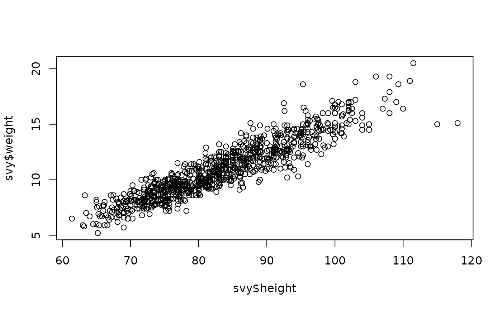

# Data Cleaning and Pre-processing 

 

Whether you're preparing for an interview or seeking to deepen your understanding of essential data science concepts, this page offers structured questions designed to enhance your proficiency and understanding of data cleaning—a fundamental stage in data science workflows. 🧹♻️

It covers various techniques used in data cleaning and provides explanations on how to choose the appropriate methods for each scenario.

Here are the social channels I am active on. I would love to connect with and follow others who share the same passion for data science, machine learning, and AI.
Let's exchange ideas, collaborate on projects, and grow together in this exciting field! 🥰 🥳

  
  
  
  
  

## List of Questions:
### Q0- What is data cleaning?
- Data cleaning is a critical step in the data preprocessing phase of the data science workflow. 
- It is the process of detecting and correcting or removing inaccurate, incomplete, irrelevant, and inconsistent data within a dataset.
- The goal of data cleaning is to ensure that the data is accurate, reliable, and suitable for analysis. 

### Q1- What are the main tasks of data cleaning in Data Science?
Here are the main tasks to perform in the cleaning phase :

- Handling Missing Values
- Removing Duplicates
- Outlier Detection and Management
  
Note : encoding categorical data can be done in feature engineering phase. 

### Q2- How to detect or identify missing values? 
- Identifying missing values is the first step to perform when dealing with them. 
- Using Pandas functions like `isnull()` or `info()`.
- Visualization method

### Q3- How to deal with missing values ?
Handling missing values is a crucial step in data cleaning to ensure accurate and unbiased analysis. Here are three main methods to deal with missing values: 

- Remove Missing Data:
    - Row Removal: delete rows with missing values.
    - Column Removal: delete columns with a high percentage of missing values.
- Impute Missing Data:
    - Mean/Median/Mode Imputation: replace missing values with the mean, median, or mode of the column.
    - Forward/Backward Fill: use previous or next values to fill missing data in time series.
    - Regression/Classification Models: use machine learning models to predict and fill missing values based on other available data.
- Domain-Specific Methods:
    - Custom Imputation: use domain knowledge to fill in missing data appropriately.

**Note:** to improve predictions, we can extend imputation by adding an extra column that indicates whether the value is a raw value or an imputed value. Model would make better prediction by considering which values were originally missing.

### Q4- How to choose the right method to deal with missing values?
- No single method is suitable for all situations, so it's essential to understand the context and implications of each approach.
- Deleting missing values from our data or keep them depends on some factors and the specific situations such as the nature of the missing data, its impact on the model, the data size, percentage of missing values and finally data integrity.
- Here are more details:
  
  - Nature of Missing Data: are they random ?, or related to certain characteristics of the data ? or are related to the target variable.
  - Impact on Model: missing values in :
      - **Training data**: may impact the training process and the quality of the resulting models.
      - **Testing data**: might affect the evaluation of the model's performance.
  - Choosing the appropriate strategy:
    - Removing missing values : deleting or removing missing values is not always adequate, as it can result in the loss of important or insightful information
    - If the percentage of missing values is very high so it is better to remove the entire row or column.
    - Imputate them with the adequate value: mean, median Forward Fill/Backward Fill or predictive imputation.
    - Maintaining data integrity: is deleting missing values would significantly reduce the dataset size so it is better to use an imputation strategy.
    - If missing values are common in real-world scenarios, it's best to keep them in the testing data.

### Q5- How to remove missing values? 
Here is how to remove missing values :

- Remove Rows: with nan/null values using `df = df.dropna()`
- Remove Columns: with nan/null values using `df = df.dropna(axis=1)`

Dropping rows or columns is not too advantageous because most values are going to be lost and they contain important information

### Q6- How to impute missing values? 

We have four main methods:

 - Impute with statistical measures: mean, median or mode
 - Impute with a Placeholder 
 - Impute with Machine Learning Algorithms
 - Impute using Interpolation
 - Multiple Imputation
     
**Note:** Imputed value won't be exactly right in most cases but it usually leads to more accurate models than you would get from dropping the column entirely  
    
#### Q6. 1- What does impute with a statistical measures mean ? 
- Fill missing values with statistical measures (mean, median, mode) or using more advanced imputation methods.
  
- Code:
     - `df['column'] = df['column'].fillna(df['column'].mean())`
     - `df['column'] = df['column'].fillna(df['column'].median())`
     - `df['column'] = df['column'].fillna(df['column'].mode())`
    
#### Q6. 2- What does impute with a Placeholder mean ? 
- Replace with a specific value that does not occur naturally in the dataset. 
- Example: `df = df.fillna(-1)`

#### Q6. 3- What does impute with a Machine Learning Algorithm mean ?    
- **Solution 1:**  use `KNNImputer()` class from the scikit-learn Python library.
- **Solution 2:**
    - Train a machine learning model to predict missing values based on other features in the dataset.
    - Example : Random Forest
      
#### Q6. 4- What does Impute using Interpolation mean ?
- Interpolation is a technique used to estimate missing values based on the observed values in a dataset.
- It works by filling in the gaps between known data points, assuming some underlying pattern or relationship.
- Here are some interpolation techniques:
  
    - Linear Interpolation 
    - Polynomial Interpolation
    - Quadratic 
    - Etc.

**Note:** the choice of the right interpolation method depends on:
- The nature of the data.
- The assumptions about its behavior
  
#### Q6. 5- What does multiple imputation mean ? 
- It is a statistical technique used to handle missing data via creating multiple imputed datasets. 
- Each of the previously mentioned datasets is created via imputing missing values with a chosen imputation method. 
- Examples : mean imputation, regression imputation, k-Nearest Neighbors imputation, or more sophisticated methods.
- Instead of imputing a single value for each missing observation, multiple imputation illustrates the uncertainty associated with missing data by generating several imputed datasets. 
- The results from the analyses conducted on the imputed datasets are combined, or "pooled," to obtain an overall estimate of the parameter of interest.
- The combined results provide not only a point estimate but also an estimate of the uncertainty associated with the missing data. This incorporates both the imputation variability and the variability due to analyzing different imputed datasets.
- `fancyimpute()` Python library can be employed to implement multiple imputation efficiently.

### Q7- How to handle missing values in case of categorical data?
- The best method to handle missing values in case of categorical data depends on the specific characteristics of your dataset.
- Here are some commonly used approaches:
   - **Mode imputation:**
      - It is an adequate method to replace missing categorical values with the most frequent category (mode) in that column.
      - However, it is suitable when the missing values are expected to occur randomly and are relatively few.
   - **Create a Separate Category:**
      - Treat missing values as a separate category or label.
      - This approach preserves the information that data was missing and can be effective if there is a reason why data might be missing systematically.
   - **Using Predictive Models:**
      - Use of ML classification algorithms to predict missing categorical values based on other features.
      - It can be more complex but may yield better results if there are correlations among features that can predict the missing values accurately.
   - **Assigning Values Using Business Rules:**
      - Use domain knowledge or business rules to impute missing categorical values.
      - This approach is useful when there are clear guidelines or rules to determine the missing values based on existing data.
   - **Multiple Imputation:** useful when uncertainty in imputed values needs to be quantified. 

### Q8- What is KNN Imputer?
- It is is a more sophisticated method for filling null values.
- It uses a distance parameter, known as the K parameter.
- It operates similarly to a clustering algorithm, imputing missing values based on the neighborhood points of the missing values.

### Q9- Why do we need an extension to imputation? 
- Sometimes, missing values themselves can be indicative.
- This method aims to create a new binary column indicating whether a value is missing. 
- For each column with missing entries in the original dataset, we add a new column that shows the location of imputed entries. 
- Models would make better predictions by considering which values were originally missing.   
- Code:  `df['column_missing'] = df['column'].isnull().astype(int)` 

### Q10- When do we use mean value for missing values imputation ?
- The mean is suitable for numerical data that follows a roughly normal distribution.
- There are no extreme outliers as the presence of significant outliers can skew the mean, making it less representative of the data.
- If the data distribution is symmetric, the mean is a good measure of central tendency
- The percentage of missing values is relatively low: imputing a small percentage of missing values with the mean is less likely to distort the overall data distribution.
  
### Q12- When it is better to use the median value for imputation ?
- Using the median for imputation in case of outliers is often considered a better solution compared to the mean.
- The median is a measure of central tendency that has: 
    - **Robustness to Outliers:** it is less influenced by extreme values because it is not affected by the actual values of data points but rather their order. Outliers have a minimal impact on the median.
    - **Resilient to Skewness:** in a skewed distribution, where the tail is longer in one direction, the mean can be heavily influenced by the skewness. The median, being the middle value, is less affected by the skewness and provides a more representative measure in such situations.
    - **Ability to avoid Biased Estimates:** in the presence of outliers, using the mean for imputation might lead to biased estimates, especially when the distribution is not symmetric. The median provides a more balanced estimate in skewed or asymmetric distributions.
    - **Ability to maintain Robustness in Non-Normal Distributions:** in case our data does not have a normal distribution, the median is often a more reliable measure of central tendency as it helps in producing more accurate imputations.
    
### Q12- How to perform Forward or Backward Fill   ? 
- Propagate the last valid observation forward or use the next valid observation to fill missing values: 
  - Forward fill using : `df = df.ffill()`  or `df.fillna(method='ffill')`
  - Backward fill using : `df = df.bfill()` or `df.fillna(method='bfill')`

### Q13- Why removing duplicates is important step?
- Removing duplicates from a dataset in data science is important because:
  - Improves Model Accuracy: duplicate records can skew the results and lead to overfitting or biased models, affecting their predictive accuracy.
  - Ensures Data Integrity: duplicates can distort the analysis, leading to incorrect conclusions and insights.
  - Reduces Redundancy: eliminating duplicates reduces the dataset size, making computations faster and more efficient.
  - Prevents Misleading Statistics: duplicates can inflate statistics, such as averages and counts, leading to inaccurate summaries of the data.
  - Enhances Data Quality: clean, duplicate-free data ensures higher quality and more reliable analysis.
  
### Q14- How to remove duplicates ? 
- Removing duplicates is is an essential step to ensure data quality and avoid biases or inaccuracies in analysis.
- Here are common methods to handle duplicates:
  - Identifying Duplicates: using `duplicated()` function of Pandas
  - Removing Duplicates - all : `df = df.drop_duplicates()`
  - Removing Duplicates - Keep first Occurrences : `df = df.drop_duplicates(keep='first')`
  - Removing Duplicates - Keep last Occurrences : `df = df.drop_duplicates(keep='last')`
  - Handling Duplicates Based on Columns
 
### Q15- What are outliers in the data?
- Outliers are data points that significantly differ from the rest.
- They can affect our analysis by causing variations in results, potentially leading to incorrect conclusions.
- Many reasons are behind outliers appearance such as mistakes during data collection by humans, inaccuracies in the instruments used for data collection, errors introduced during data processing or outliers that occur naturally in the data, not as a result of any error.
- Handling outliers concerns both continuous numerical variables or categorical variable or Mixed-type data.
  
### Q16- How to find outliers?
- To find outliers, only numerical columns are considered in our analysis.
- Here are the common methods to do that :
  - **Visualization technique:**  Box Plot, Scatter Plot and Histogram Plot (the most used ones).
  - **Mathematical approach:**
    - Z-score
    - Interquartile range : IQR score 
  - **Machine Learning Models:**
    - Clustering Algorithms : Kmeans, DBSCAN (Density-Based Spatial Clustering of Applications with Noise)
    - One-Class SVM (Support Vector Machine)
    - Autoencoders
    - Isolation Forest
  - **Domain-Specific Knowledge**

**Note:**
- It's better to try various outlier detection methods and evaluate their performance based on your specific data characteristics that are:
  - Data distribution
  - Data dimensionality
  - The type of outliers you expect to encounter. 
- It's often a good practice to combine multiple methods for a more robust outlier detection approach.

### Q17- What Visualization techniques can be used to determine outliers?

- Performing some plots and analysis:   
    - Box plot is considered as Uni-variate analysis 
    - Scatter plot is considered as Bi-variate analysis
- Box plot represents five statistical measures :
    - Q1 : Lower quartile 
    - Q2 : Median
    - Q3 : Upper quartile 
    - Min
    - Max
  - Here is an example of Box plot :
    
    

    _Source: https://www.geeksforgeeks.org/box-plot/_

  - Here an example of Scatter plot :
 
    

    _Source: https://nutriverse.io/nipnTK/articles/sp.html_
      
### Q18- How to handle outliers in dataset ? 
Here are some methods about how we handle outliers :

- **Deleting the values:** removing the value completely, if we are sure that this value is wrong and it will never occur again, we remove it using either Interquartile range or Z-score.
- **Replace the values:** change the values if we know the reason for the outliers. (Example: using 99th percentile)
- **Data transformation:** some times data transformation such as natural log reduces the variation caused by the extreme values. Most used for highly skewed data sets.

### Q19- What does Z-Score mean?
- It calculates the Z-score for each data point.
- Z-score measures how many standard deviations a data point is from the mean.
- Typically, a threshold of 2 to 3 standard deviations is used to identify outliers.
- Formula: $Z ={ X - \mu \over\sigma}$

### Q20- What does IQR : interquartile range mean? 
- The IQR is the difference between the third quartile (Q3) and the first quartile (Q1): IQR = Q3 - Q1
- Q1: It represents the median of the lower 50% of the data. Represents 0.25 percentile
- Q3 : It represents the median of the upper 50% of the data. Represents 0.75 percentile

To calculate percentiles or quantiles, we need to sort the data in ascending order and finding the value below which a certain percentage of the data falls.

 

_Source: https://www.geeksforgeeks.org/box-plot/_

### Q21- What are the limitations of IQR?
Here are the list of limitations : 

- IQR is sensitive to the size of the dataset : may not accurately represent the spread of the data in case of smaller dataset
- It assumes that the data is symmetrically distributed. In case the distribution is skewed, IQR may not accurately represent the spread of the data.
- For IQR, all data points outside the defined range are identified as outliers. However, in some datasets we expect a certain degree of variability, and not all deviations should be considered outliers.
- It does not provide information about Outlier Magnitude. It consider all values outside the defined range equally, without providing a measure of how extreme they are.
- It doesn't consider the shape of the overall data distribution. It may not perform well in detecting outliers in non-Gaussian distributions or distributions with multiple modes.
- It is possible to loose information. With deleting values that are outside the IQR range you sacrifice detailed knowledge about them. Depending on the analytical goals, this loss of detailed information may or may not be significant.
- IQR is considered robust to outliers within its calculated range. This means that if there are extreme values within this range, they have less impact on the calculation of IQR.
-  IQR provides robustness within its calculated range, it is not robust to the influence of extreme values outside that range, and such extreme values may still affect the identification of potential outliers. 

### Q22- How to mitigate these limitations ?
Here are some solutions:

- In scenarios where the nature and cause of outliers matter, the IQR alone might not be sufficient. Other methods that retain specific value information, such as boxplots or more advanced outlier detection techniques, might be more suitable for a detailed diagnostic analysis.
- In situations where extreme values might exist, and their impact needs to be minimized, other outlier detection methods that are more robust to extreme values, such as modified Z-scores or robust regression techniques, might be considered.

_Source: https://www.linkedin.com/posts/amged-younis-6b926258_histogram-histogram-is-an-important-graphical-activity-7161065469313986560-XEpH/_

### Q23- How ML Algorithms used for outliers detection ?
We have two main methods: 
- **Clustering Algorithms:** for example k-means can be used to detect outliers where points that do not belong to any cluster or are in small clusters can be identified as outliers.
- **Isolation Forest:** designed specifically for outlier detection. It isolates outliers by recursively partitioning the data.
  

