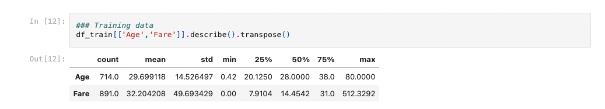
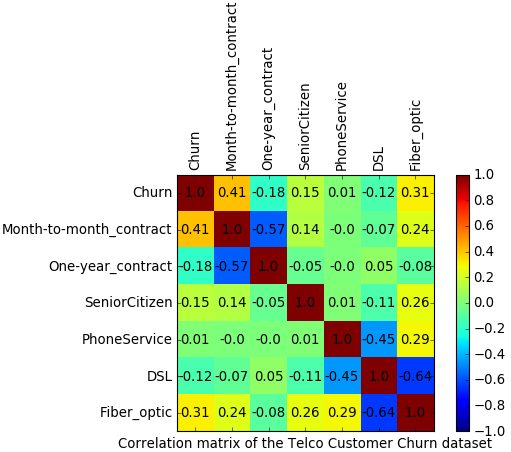

# Data Visualisation and Exploratory Data Analysis

 

This page serves as a valuable resource for interview preparation and enhancing your understanding of data visualization and exploratory data analysis 📊 within the data science lifecycle.

It provides structured questions aimed at improving your proficiency in exploratory data analysis, emphasizing how to select the right visualizations to uncover insights and details within your data ✅.

Here are the social channels I am active on. I would love to connect with and follow others who share the same passion for data science, machine learning, and AI.
Let's exchange ideas, collaborate on projects, and grow together in this exciting field! 🥰 🥳

  
  
  
  
  

## List of Questions:
### Q- What does Exploratory Data Analysis (EDA) mean? 
- It is a critical step in the data analysis process and is often the second step after cleaning the provided dataset.
- It aims to summarize the main characteristics of a dataset, gain insights into the underlying structure, identify patterns, detect anomalies, and formulate hypotheses for further analysis.
- Effective EDA helps to perform more targeted and informed analyses, leading to better decision-making and valuable insights from the data.
- **Key aspects of Exploratory Data Analysis include:**
     - Summary Statistics using `.describe()` pandas library.
     - Data Visualization
     - Distribution Analysis
     - Correlation Analysis
 
### Q- How to get statistical description of our data using pandas ? 
- In the statistical description we try to select the next values for each numerical features:
    - Maximum values
    - Minimum
    - Average
    - Standard deviation
    - Median
    - Mean
- Code: `df.describe().transpose()`
- Example:

### Q- What does Distribution Analysis mean?
- This analysis aims to examine the distribution of values within a dataset.
- Understanding the distribution of data is essential for gaining insights into its underlying characteristics, identifying patterns, and making informed decisions about subsequent analyses or modeling.
- Here are some examples of distribution analysis: 
    - Frequency Distribution:  it provides a summary of how often each value appears. 
    - Univariate and Bivariate Analysis : distplot, histplot and X versus Y etc.
    - Probability Distribution
    - Spread or Dispersion analysis
    - Skewness and Kurtosis analysis
    
- Understanding the data distribution is very important in many tasks, including identifying outliers, assessing the appropriateness of statistical models, and making decisions about data transformations.
- Different types of distributions may require different approaches in data analysis and modeling, and distribution analysis helps inform these decisions.

### Q- What does Skewness mean?
- It is a measure of the asymmetry of a distribution.
- A distribution is asymmetrical when its left and right side are not mirror images.
- A skewed data can not be used to generate normal distribution. 
- It provides insights into the shape of a distribution.
- The three types of skewness are:
    - **Skewness > 0 :** right (or positive) skewness. This indicates that the tail on the right side is longer or fatter than the left side, and the majority of the data points are concentrated on the left side.
    - **Skewness < 0 :** left (or negative) skewness. It means the tail on the left side is longer or fatter than the right side, and the majority of the data points are concentrated on the right side.
    - **Skewness=0, Zero skewness :** the distribution is perfectly symmetrical.
    

* Source:https://en.wikipedia.org/wiki/Skewness *

- If we have a positively skewed distribution:  Mode < Median < Mean 
- If we have a left-skewed distribution: Mean < Median < Mode 

### What does Kurtosis mean ?    
- A statistical measure that describes the shape or "tailedness" of a distribution. 
- It provides information about the concentration of data points in the tails relative to the center of the distribution:
   - The data can be heavy-tailed means it has more extreme values than a normal distribution.
   - Or it can be light-tailed means it has fewer extreme values than a normal distribution.
- The three types of Kurtosis are:
    - **Kurtosis=0 (Mesokurtic) :** the distribution has the same tail behavior as a normal distribution.
    - **Kurtosis>0 (Leptokurtic):** the distribution has fatter tails (heavier tails) and a sharper peak than a normal distribution. This indicates a higher probability of extreme values.
    - **Kurtosis<0 (Platykurtic):** the distribution has thinner tails (lighter tails) and a flatter peak than a normal distribution. This suggests a lower probability of extreme values.

* Source:https://en.wikipedia.org/wiki/Skewness *

### Q- What does Spread or Dispersion mean ?
- Data spread: 
    - It provides information about the range of values in a dataset.
    - It provides information about how dispersed or scattered the individual data points are around a measure of central tendency, such as the mean or median.
    - Spread measures help to understand the variability or dispersion of the data.
    - **Examples: IQR, range, variance, standard deviation** 
    - It is crucial to understand the spread of data for better outliers detection, risk assessment, decision-Making etc.
- Dispersion:
    - It explains how individual data points in a dataset deviate or spread out from a central measure of tendency, such as the mean or median. 
    - Dispersion measures provide insights into the variability or spread of the data and are crucial for understanding the overall distribution.
    - **Examples: IQR, range, variance, standard deviation, Mean Absolute Deviation (MAD), Coefficient of Variation (CV)**

### Q- What does Correlation Analysis mean?
- Correlation analysis is a statistical method used to evaluate the strength and direction of the linear relationship between two quantitative variables.
- The result of a correlation analysis is a correlation coefficient, which quantifies the degree to which changes in one variable correspond to changes in another.
- Correlation analysis is widely used in various fields, including economics, biology, psychology, and data science, to understand relationships between variables and make predictions based on observed patterns.
### Q- What are the plots used to illustrate correlation?
- Correlation matrix and heatmap 
- Scatter Plot : it provides a visual representation of the relationship between two variables. X versus Y
  
### Q- What does correlation matrix mean? 
- It is a table that displays the correlation coefficients between many variables. 
- Each cell Corresponds to the correlation coefficient between two variables. 
- This matrix helps detect the presence of any positive or negative correlation between variables.
- The correlation is calculated using the pearson correlation coefficient so values varies from -1 to 1

_source: https://www.vertica.com/blog/in-database-machine-learning-2-calculate-a-correlation-matrix-a-data-exploration-post/_

### Q- What else we can perform in EDA ? 
Here are more analysis to perform during EDA phase:
- Data frame dimension `df.shape`
- Data frame columns: `df.columns`
- Count values: `df['SaleCondition'].value_counts().to_frame()`
- Data sampling: sometimes, it is required to perform over/undersampling in case we have Imbalanced datasets
- Data Grouping using groupby : df_group=df[['YearRemodAdd','SalePrice']].groupby(by=['YearRemodAdd']).max()
- Data filtering :
    - `df_filter =df[df.column>200000]` 
    - `df_filter =df[(df.column1>150000) & (df.column2==2008)]`
    - `df_filter =df[(df.column1>2011) | (df.column2==2008)]`
- Data analysis: 
    - Univariate Analysis : `distplot` and `histplot`
    - Bivariate Analysis `pairplot`, `FacetGrid`, `jointplot` etc.
    - Multivariate Analysis: correlation matrix or heatmap

Notes:
- Multivariate analysis involves analyzing the relationship between three or more variables. We can use scatter matrix plots to visualize the relationship between each pair of features, along with the distribution of each feature.
- Bivariate analysis involves analyzing the relationship between two variables. We can use scatter plots to visualize the relationship between each pair of feature.

### Q- What is the difference between covariance and correlation?
- These two measures are used during the exploratory data analysis to gain insights from the data.
- **Covariance:** 
   - It measures the degree to which two variables change together.
   - It indicates the direction of the linear relationship between the variables.
   - It can take on any value

- **Correlation:**
   - It is a standardized measure of the strength and direction of the linear relationship between two variables.
   - It ranges from -1 to 1, where :
        - 1: perfect positive linear relationship
        - -1 indicates a perfect negative linear relationship
        - 0 indicates no linear relationship.
### Q What does Normal distribution mean ?
### Q- What does Uniform distribution mean ?
          
  ### Q- Why removing highly correlated features is very important?
- Removing highly correlated features is a preprocessing step that can be beneficial for both classification and regression tasks.
- In both cases, highly correlated features can introduce redundancy into the model, leading to overfitting and reduced generalization performance.
- Therefore, it's a common practice to identify and remove such features to improve the overall performance and interpretability of the model.

### Q- What is the Difference between Univariate, Bivariate, and Multivariate analysis

### Q- How to perform univariate analysis for numerical and categorical variables?
### Q- Mention the two kinds of target variables for predictive modeling.

### Q- How to perform Bivariate analysis for Numerical-numerical, Categorical-Categorical, and Numerical-Categorical variables?
### What are the different tests that are used for verifying analysis/hypothesis for numerical-numerical, categorical-categorical, and numerical-categorical variables?

### What is a scatter plot? For what type of data is scatter plot usually used for?
### Question9: When will you use a histogram and when will you use a bar chart? Explain with an example.}
### What type of data is box-plots usually used for? Why?
### What information could you gain from a box-plot?
### Explain descriptive, predictive, and prescriptive analytics.
### What are the different types of sampling techniques used by data analysts?
###  Describe univariate, bivariate, and multivariate analysis.

