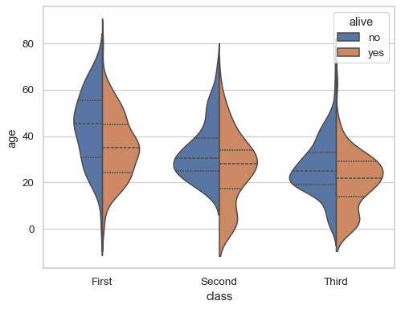

# Data Visualisation and Exploratory Data Analysis

 

This page serves as a valuable resource for interview preparation and enhancing your understanding of data visualization and exploratory data analysis 📊 within the data science lifecycle.

It provides structured questions aimed at improving your proficiency in exploratory data analysis, emphasizing how to select the right visualizations to uncover insights and details within your data ✅.

Here are the social channels I am active on. I would love to connect with and follow others who share the same passion for data science, machine learning, and AI.
Let's exchange ideas, collaborate on projects, and grow together in this exciting field! 🥰 🥳

  
  
  
  
  

## List of Questions:

### Q1- What are the types of Data Analytics
- Data analytics can be broadly categorized into four main types: descriptive, diagnostic, predictive, and prescriptive analytics.
- Each type serves a distinct purpose and provides different insights into the data.
- Here’s an overview of each type:
    - Descriptive Analytics: understands and summarizes past data
    - Diagnostic Analytics: explains why events happened.
    - Predictive Analytics: forecasts future events and trends.
    - Prescriptive Analytics: recommends actions to achieve desired outcomes.
- These types of data analytics build upon each other, starting with understanding what happened (descriptive), why it happened (diagnostic), what might happen (predictive), and what actions to take (prescriptive)
- Together, they provide a comprehensive approach to data-driven decision-making.

### Q2- Descriptive Analytics: Explanation, Pros, and Cons
- **Question:** What happened?
- It is a branch of data analytics that focuses on summarizing and interpreting historical data to gain insights and understand patterns, trends, and relationships within the data.  
- It aims to understand what has already occurred using various statistical and visualization techniques.
- It involves techniques such as data aggregation, data mining, and summarization to convert raw data into meaningful insights.
- It uses data visualization tools like charts, graphs, and dashboards to present the information in an easily understandable format.
- **Examples:** sales performance analysis, customer segmentation, financial analysis etc.
- **Pros:**
    - Summarizes Data: provides clear summaries of large datasets.
    - Identifies Patterns: helps find trends for better understanding.
    - Benchmarking: allows comparison of current and past performance.
    - Informed Decisions: enables data-driven decision-making.
    - Simple to Implement: uses basic statistical techniques.
      
- **Cons:**
    - Historical Focus: only analyzes past data, not future predictions.
    - Limited Actionability: offers insights but not explanations.
    - Potential Misinterpretation: summarized data might be misunderstood.
    - No Predictive Power: doesn't provide future insights.
    - Data Quality Dependent: relies on the quality of historical data.

### Q3- Predictive Analytics: Explanation, Pros, and Cons
- **Question:** What might happen in the future?
- It is a branch of advanced analytics that aims to forecast future outcomes based on patterns found in historical data.
- It uses historical data combined with statistical modeling, data mining techniques and machine learning.
- It helps organizations anticipate potential risks and opportunities.
- **Example:** customer churn analysis, anticipate significant equipment failures, forecast demand for energy etc.
- **Pros:**
    - Forecasting: provides insights into future trends and events.
    - Proactive Decision-Making: allows organizations to anticipate and prepare for potential scenarios.
    - Optimized Resource Allocation: helps in planning and allocating resources efficiently based on predicted needs.
    - Competitive Advantage: gives businesses an edge by identifying opportunities and threats early.
    - Improved Accuracy: often more accurate than simple heuristics or intuition.
      
- **Cons:**
    - Data Quality: highly dependent on the quality and completeness of historical data.
    - Complexity: requires sophisticated tools and expertise in statistical modeling and machine learning.
    - Cost: can be expensive to implement due to the need for advanced software and skilled personnel.
    - Uncertainty: predictions are probabilistic, not certain, and can be affected by unexpected changes or outliers.
    - Overfitting: models can become too tailored to historical data, reducing their effectiveness on new data.

### Q4- Prescriptive Analytics: Explanation, Pros, and Cons
- **Question:** What should we do next?
- It aims to recommend actions based on predictive analytics to achieve desired outcomes.
- It provides advice on possible actions and their potential impact using machine learning algorithms.
- It evaluates different scenarios and suggests the most effective strategies to achieve specific goals.
- **Examples:** investment decisions, dynamic pricing strategies to maximize revenue based on market conditions, personalized marketing campaigns etc.
- **Pros:**
    - Optimized Decisions: provides actionable insights to optimize decisions and strategies.
    - Scenario Planning: allows for simulation of various scenarios to understand potential outcomes.
    - Real-time Decision Support: can provide recommendations in real-time for dynamic decision-making.
    - Competitive Advantage: enables proactive responses to market changes and opportunities.

- **Cons:**
    - Complexity: requires advanced analytics capabilities and expertise.
    - Data Dependency: relies heavily on the availability and quality of data.
    - Implementation Cost: can be expensive to implement and maintain.
    - Ethical Considerations: recommendations may raise ethical concerns, such as privacy or fairness issues.
    - Resistance to Change: stakeholders may be reluctant to adopt recommendations without understanding or trust in the analytics model.

### Q5- What does Exploratory Data Analysis (EDA) mean? 

- It is a critical step in the data analysis process and is often the second step after cleaning the provided dataset.
- It aims to summarize the main characteristics of a dataset, gain insights into the underlying structure, identify patterns, detect anomalies, and formulate hypotheses for further analysis.
- Effective EDA helps to perform more targeted and informed analyses, leading to better decision-making and valuable insights from the data.
- **Key aspects of Exploratory Data Analysis include:**
     - Summary Statistics using `.describe()` pandas library.
     - Data Visualization
     - Distribution Analysis
     - Correlation Analysis
 
### Q6- How to get statistical description of our data using pandas ? 

- In the statistical description we try to select the next values for each numerical features:
    - Maximum values
    - Minimum
    - Average
    - Standard deviation
    - Median
    - Mean
- Code: `df.describe().transpose()`
- Example:

### Q7- What does Distribution Analysis mean?

- This analysis aims to examine the distribution of values within a dataset.
- Understanding the distribution of data is essential for gaining insights into its underlying characteristics, identifying patterns, and making informed decisions about subsequent analyses or modeling.
- Here are some examples of distribution analysis: 
    - Frequency Distribution:  it provides a summary of how often each value appears. 
    - Univariate and Bivariate Analysis : distplot, histplot and X versus Y etc.
    - Probability Distribution
    - Spread or Dispersion analysis
    - Skewness and Kurtosis analysis
    
- Understanding the data distribution is very important in many tasks, including identifying outliers, assessing the appropriateness of statistical models, and making decisions about data transformations.
- Different types of distributions may require different approaches in data analysis and modeling, and distribution analysis helps inform these decisions.

### Q8- What does Skewness mean?

- It is a measure of the asymmetry of a distribution.
- A distribution is asymmetrical when its left and right side are not mirror images.
- A skewed data can not be used to generate normal distribution. 
- It provides insights into the shape of a distribution.
- The three types of skewness are:
    - **Skewness > 0 :** right (or positive) skewness. This indicates that the tail on the right side is longer or fatter than the left side, and the majority of the data points are concentrated on the left side.
    - **Skewness < 0 :** left (or negative) skewness. It means the tail on the left side is longer or fatter than the right side, and the majority of the data points are concentrated on the right side.
    - **Skewness=0, Zero skewness :** the distribution is perfectly symmetrical.
    

_Source: https://en.wikipedia.org/wiki/Skewness_

- If we have a positively skewed distribution:  Mode < Median < Mean 
- If we have a left-skewed distribution: Mean < Median < Mode 

### Q9- What does Kurtosis mean ?  

- A statistical measure that describes the shape or "tailedness" of a distribution. 
- It provides information about the concentration of data points in the tails relative to the center of the distribution:
   - The data can be heavy-tailed means it has more extreme values than a normal distribution.
   - Or it can be light-tailed means it has fewer extreme values than a normal distribution.
- The three types of Kurtosis are:
    - **Kurtosis=0 (Mesokurtic) :** the distribution has the same tail behavior as a normal distribution.
    - **Kurtosis>0 (Leptokurtic):** the distribution has fatter tails (heavier tails) and a sharper peak than a normal distribution. This indicates a higher probability of extreme values.
    - **Kurtosis<0 (Platykurtic):** the distribution has thinner tails (lighter tails) and a flatter peak than a normal distribution. This suggests a lower probability of extreme values.

_Source: https://www.researchgate.net/figure/Examples-of-positive-negative-and-zero-excess-kurtosis_fig4_373105776_

### Q10- What does Spread or Dispersion analysis mean ?

- Spread analysis and dispersion analysis are usually used interchangeably, but they can have subtle differences depending on the context.
- Dispersion analysis is a more specific term used in statistics to describe the variability within a dataset.
- Spread analysis might be used more broadly depending on the context, particularly outside of pure statistical analysis.
- **Dispersion analysis:**
    - It explains how individual data points in a dataset deviate or spread out from a central measure of tendency, such as the mean or median. 
    - Dispersion measures provide insights into the variability or spread of the data and are crucial for understanding the overall distribution.
    -  Common measures of dispersion include:
       - Range: The difference between the maximum and minimum values.
       - Interquartile Range (IQR): The range of the middle 50% of the data, calculated as the difference between the 75th and 25th percentiles.
       - Variance: The average squared deviation from the mean, showing how data points are spread out.
       - Standard Deviation: The square root of the variance, providing a measure of spread in the same units as the data.
       - etc.

- **Spread analysis:** 
    - It might not only focus on statistical measures of dispersion but also consider how the spread affects decision-making, risk assessment, or comparison between different datasets.
    - It is used in various area such as finance, economics, and marketing to refer to differences between values (e.g., bid-ask spread, yield spread) beyond just statistical dispersion.
    - It can include the Dispersion analysis measures but may also consider broader implications and specific contexts.

### Q11- What does Correlation Analysis mean?

- Correlation analysis is a statistical method used to evaluate the strength and direction of the linear relationship between two quantitative variables.
- The result of a correlation analysis is a correlation coefficient, which quantifies the degree to which changes in one variable correspond to changes in another.
- The most common correlation coefficient is Pearson's r, which ranges from -1 to 1:
   - +1 indicates a perfect positive linear relationship.
   - -1 indicates a perfect negative linear relationship.
   - 0 indicates no linear relationship.
- Correlation analysis include three cases:
   - **Positive Correlation:** indicates that when one variable increases, the other increases.
   - **Negative Correlation:** indicates when one variable increases, the other decreases.
   - **No Correlation:** it indicates when there is no apparent relationship between the variables. 
- Correlation analysis is widely used in various fields, including economics, biology, psychology, and data science, to understand relationships between variables and make predictions based on observed patterns.
- Both correlation matrix heatmap and Scatter Plots are used to illustrate correlation analysis.

### Q12- What is the Scatter Plot ?

- It is a graphical representation of the relationship between two variables, X versus Y.
- Each point on the scatter plot represents an observation. Patterns in the scatter plot can indicate the type and strength of the correlation.
- It is typically used for visualizing and analyzing the relationship between two quantitative (numerical) variables.
- It is mainly used for trend identification, correlation analysis and outliers detection
- Scatter plots are a fundamental tool in exploratory data analysis (EDA) for uncovering relationships between variables and guiding further statistical analysis and modeling.
  

_Source: https://www.data-to-viz.com/graph/scatter.html_

### Q13- What does correlation matrix mean? 

- It is a table that displays the correlation coefficients between many variables. 
- Each cell Corresponds to the correlation coefficient between two variables. 
- This matrix helps detect the presence of any positive or negative correlation between variables.
- The correlation is calculated using the pearson correlation coefficient so values varies from -1 to 1
- It is often visualized using heatmaps, where colors represent the magnitude and direction of correlations. This can make it easier to identify strong and weak correlations at a glance.

_Source: https://www.vertica.com/blog/in-database-machine-learning-2-calculate-a-correlation-matrix-a-data-exploration-post/_

    
### Q14- Why removing highly correlated features is very important?
- Removing highly correlated features is a preprocessing step and it is important for several reasons, especially in the context of statistical modeling and machine learning.
- It can be beneficial for both classification and regression tasks.
- Here are the key reasons why this is crucial:
   - Highly correlated features make it difficult to determine the individual effect of each feature on the target variable.
   - Besides, highly correlated features can introduce redundancy into the model, leading to overfitting and reduced generalization performance.
   - Removing them simplifies the model, makes it easier to interpret and improve its generalization to new data.
   - Reducing the number of features by removing highly correlated ones can lead to faster training times and reduced computational resource requirements via focusing on the most informative and relevant features.
  
### Q15- What does Normal distribution mean ?
- It is also known as the Gaussian distribution and it is a continuous probability distribution that is symmetric about its mean.
- It describes how the values of a variable are distributed.
- It is very useful in machine learning because it has deterministic statistical characteristics and it helps detect linear relationship between variables.
- Here are the key characteristics and properties of the normal distribution:
   - It has a Bell-shaped and symmetric curve about the mean.
   - The mean, median, and mode of the distribution are all equal.
   - The tails of the normal distribution approach, but never touch, the horizontal axis (x-axis)
   - The normal distribution has a single peak (one mode)
   - Empirical Rule:
      - 68% within 1σ of the mean.
      - 95% within 2σ of the mean.
      - 99.7% within 3σ of the mean
        

_Source: https://medicoapps.org/biostatistics-normal-curve-test-of-significance-standard-error-2/_

### Q16- How to perform Frequency and Probability distribution analysis in EDA ?

- **Frequency Distribution in EDA:**
   - Frequency Distribution shows how often each value or range of values occurs in a dataset.
   - **For Numerical Data:**
      - Choose Bins and decide on intervals for grouping data.
      - Count Frequencies via calculating how many data points fall into each bin.
      - Visualize frequently distribution for numerical data using histograms.
   - **For Categorical Data:**
      - Count Frequencies via counting occurrences of each category.
      - Visualize using bar charts or pie charts.
        
- **Probability Distribution in EDA:**
   - Probability Distribution shows how probabilities are distributed over values of a random variable.
   - **For Numerical Data:**
      - Fit Distribution via identifying the theoretical distribution (e.g., normal, binomial).
      - Visualize via using density plots or probability density functions (PDFs).
   - **For Categorical Data:**
      - Calculate Probabilities via dividing frequencies by total count.
      - Visualize using bar charts.

### Q17- What else we can perform in EDA ? 
Here are more analysis to perform during EDA phase:
- Data frame dimension `df.shape`
- Data frame columns: `df.columns`
- Count values: `df['SaleCondition'].value_counts().to_frame()`
- Data sampling: sometimes, it is required to perform over/undersampling in case we have Imbalanced datasets
- Data Grouping using groupby : df_group=df[['YearRemodAdd','SalePrice']].groupby(by=['YearRemodAdd']).max()
- Data filtering :
    - `df_filter =df[df.column>200000]` 
    - `df_filter =df[(df.column1>150000) & (df.column2==2008)]`
    - `df_filter =df[(df.column1>2011) | (df.column2==2008)]`
- Data analysis: 
    - Univariate Analysis : `distplot` and `histplot`
    - Bivariate Analysis `pairplot`, `FacetGrid`, `jointplot` etc.
    - Multivariate Analysis: correlation matrix or heatmap

Notes:
- Multivariate analysis involves analyzing the relationship between three or more variables. We can use scatter matrix plots to visualize the relationship between each pair of features, along with the distribution of each feature.
- Bivariate analysis involves analyzing the relationship between two variables. We can use scatter plots to visualize the relationship between each pair of feature.

### Q18- What is the Difference between Univariate, Bivariate, and Multivariate analysis

- **Univariate Analysis:**
    - Analysis of a single variable.
    - To describe the distribution, central tendency, and variability of the variable.
    - Techniques:
        - **Descriptive Statistics:** Mean, median, mode, standard deviation, variance.
        - **Visualization:** Histograms, box plots, frequency distributions.
    - Example: Analyzing the house price in a certain region .

- **Bivariate Analysis:**
    - Analysis of two variables to understand the relationship between them.
    - To explore the association, correlation, or causation between the variables.
    - Techniques:
         - **Descriptive Statistics:** Correlation coefficient, cross-tabulation.
         - **Visualization:** Scatter plots, bar charts, line graphs.
         - **Statistical Tests:** t-tests, chi-square tests, ANOVA.
    - Example: Analyzing the relationship between height and weight of a group of people.
 
- **Multivariate Analysis:**
    - Analysis of more than two variables simultaneously.
    - To understand complex relationships, interactions, and the effect of multiple variables on outcomes.
    - Techniques:
        - **Descriptive Statistics:** Multivariate means, covariance matrices.
        - **Visualization:** Multidimensional scaling, parallel coordinates plots.
        - **Statistical Models:** Multiple regression, principal component analysis (PCA), factor analysis, MANOVA (multivariate analysis of variance).
    - Example: Analyzing the relationship between height, weight, age, and income of a group of people.
      
### Q19- How to perform univariate analysis for numerical and categorical variables?

- **Univariate Analysis for Numerical Variables:**
  
    - **Descriptive Statistics:**
      -  Determine mean, median, mode, standard deviation, variance, range, quartiles, percentiles
      -  Code: `df.describe().transpose()`
    - **Visualization:**
      - Histogram: Shows the distribution of the data. `histplot`
      - Box Plot: Visualizes the median, quartiles, and potential outliers.
      - Density Plot: Smooths out the histogram into a continuous curve. `distplot`
 
- **Univariate Analysis for Categorical Variables:**
    
   - **Descriptive Statistics:**
      - Frequency Distribution: count values of each category.
      - Mode: most frequently occurring category.
      - Proportions/Percentages: relative frequency of each category.
   - **Visualization:**
      - Bar Chart: displays the frequency or proportion of each category.
      - Pie Chart: shows the proportion of each category as slices of a pie.

### Q20- How to perform Bivariate analysis for Numerical-numerical, Categorical-Categorical, and Numerical-Categorical variables?

- **Numerical-Numerical Analysis:**
  - Scatter Plot to visualizes the relationship between two numerical variables and to identify patterns, trends, and potential correlations.
  - Correlation Coefficient to measure the strength and direction of the linear relationship between two variables. Pearson's correlation coefficient is commonly used.
  - Sometimes a Linear Regression is used to model the relationship between two variables and to provide insights into the nature and strength of the relationship.
    
- **Categorical-Categorical Analysis:** 
  - Contingency Table: displays the frequency distribution of two categorical variables and helps in understanding the joint distribution. `pd.crosstab(data['Category1'], data['Category2'])`
  - Chi-Square Test of Independence to tests whether there is a significant association between two categorical variables. `chi2, p, dof, expected = chi2_contingency(contingency_table)`
  - Stacked Bar Chart to visualizes the relationship by stacking bars for each category combination.

- **Numerical-Categorical Analysis:**
  - Box Plot to visualizes the distribution of a numerical variable across different categories and helps identify differences in central tendency and variability.
  - Violin Plot which is similar to a box plot but also shows the density of the data at different values.
  - ANOVA (Analysis of Variance) to test whether there are significant differences between the means of different categories.

### Q21- Mention the two kinds of target variables for predictive modeling.

- In predictive modeling, target variables can be classified into two main types: 
    - Continuous Target Variables:
        - They numerical variables that can take on any value within a range.
        - They are used in regression problems with regression models like Linear Regression, Random Forest, Decision Trees etc.
        - Applications: Predicting house prices, forecasting stock prices, etc.
          
    - Categorical Target Variables:
        - They are variables that represent categories or groups.
        - They are used in classification problems with classification models such as Logistic Regression, Decision Trees, Random Forests etc.
        - Applications: Spam detection (spam or not spam), image recognition (cat, dog, or other), medical diagnosis (disease present or not), etc.

### Q22- What information could you gain from a box-plot?
- It is also known as a box-and-whisker plot.
- It is a valuable tool in exploratory data analysis for quickly summarizing the distribution, central tendency, variability, and presence of outliers in a datase.
- It provides insights into the shape and characteristics of the data that can aid in understanding its underlying patterns and making informed decisions in statistical analysis.
- It provides several key pieces of information about a dataset:
    - **Median:** the line inside the box represents the median (50th percentile) of the data, showing the central tendency.
    - **Spread:** the length of the box (interquartile range, IQR) indicates the spread of the middle 50% of the data. The longer the box, the greater the variability in the data.
    - **Outliers:** points beyond the whiskers indicate potential unusual data points or outliers.
    - **Symmetry:** it provides a visual indication of symmetry or asymmetry in the data distribution. A symmetrical distribution will have a box plot where the median divides the box equally, and the whiskers are of equal length on both sides. Asymmetrical distributions will have medians that do not divide the box equally and uneven whisker lengths..
    - **Comparison:** it allows for easy comparison between different groups or categories within the dataset via using multiple box plots side by side to compare the distributions of different groups.
    - **Skewness:** the position of the median within the box can give an indication of skewness. If the median is closer to the lower quartile (bottom of the box), the data may be negatively skewed (left-skewed); if closer to the upper quartile (top of the box), the data may be positively skewed (right-skewed)

_Source: https://www.labxchange.org/library/items/lb:LabXchange:d8863c77:html:1_

### Q23- What type of data is box-plots usually used for? Why?
- Box-plots are versatile tools for exploring and comparing **numerical data** distributions across different conditions or groups.
- They provide a clear, visual summary that aids in understanding key aspects of the data's distribution and variability.
- They are particularly useful for:
   - **Comparing Groups**
   - **Identifying Skewness and Outliers**
   - **Visualizing Spread and Variability**
   - **Summarizing Central Tendency**
   - **Handling Large Datasets**

### Q24- What is Violin Plot and what is used for?

- It is a graph that combines aspects of a box plot and a density plot.
- It is used for visualizing and comparing data distributions, providing insights into how data is spread across different groups.
- The width of each "violin" represents the density of data points at that value.
- **Uses of Violin Plots:**
   - **Comparing Distributions:** they are used to compare data distributions between different categories or groups.
   - **Data Shape:** they show the shape of the distribution, including skewness and multimodal patterns.
   - **Outlier Detection:** they help in identifying outliers within each category.

_Source: https://seaborn.pydata.org/generated/seaborn.violinplot.html_

### Q25- When will you use a histogram and when will you use a bar chart? Explain with an example.

