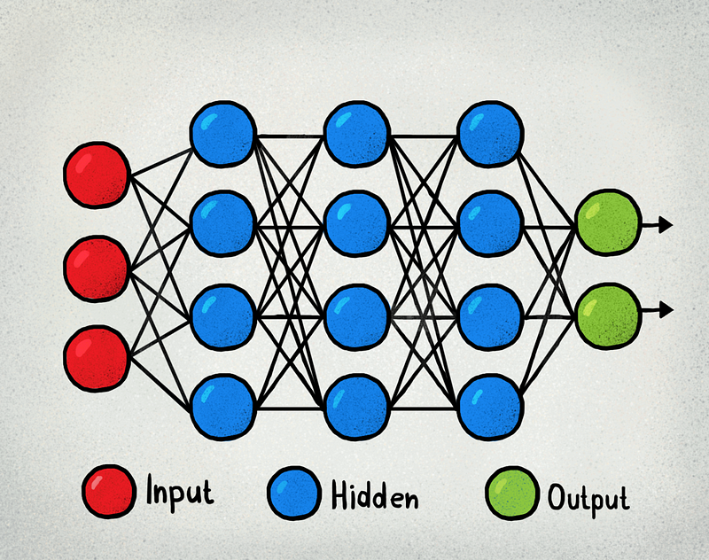
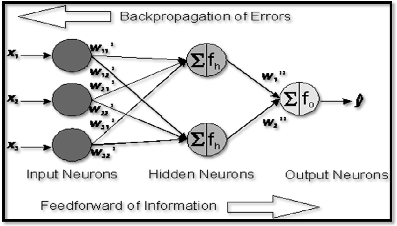
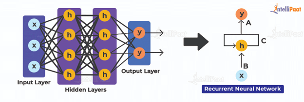
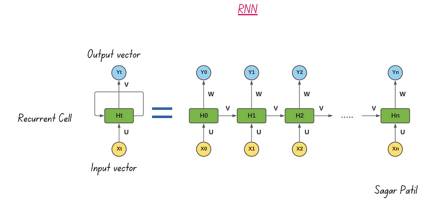

# Advanced Machine Learning Topics 
# Deep Learning 

This Github page is a valuable resource for technical interviews on deep learning and neural networks 🧠. It consolidates essential questions, offering a comprehensive study tool 📚. Whether reinforcing foundational knowledge or preparing for an interview, this page It explores fundamental principles and inquiries relevant to algorithms, techniques, concepts etc., ensuring success in technical interviews.

## List of Questions
## Part 1: Deep Learning and Neural Networks

### Q0 -What is Deep Learning?
- It is a subset of machine learning that involves training artificial neural networks with multiple layers (deep neural networks). 
- It is used to model complex patterns and representations.
- DL models are trained using large amounts of data.
- The term "deep" refers to the depth of the neural network, which consists of multiple hidden layers through which data is processed.
- It eliminates the need for manual feature engineering by automatically learning hierarchical representations from raw data during the training process.

    
### Q1- What are some real-life applications of deep learning algorithms?
- DL is used in various real-life scenarios across different fields.
- Here are some common applications for DL:
    - **Computer Vision:** object detection, image classification, facial recognition, and autonomous driving
    - **Natural Language Processing (NLP):** translation, chatbots, sentiment analysis etc.
    - **Healthcare:** medical image analysis, disease diagnosis, personalized treatment etc.
    - **Finance:** fraud detection, credit scoring, customer service automation etc. 
    - **Recommendation Systems:** for e-commerce, social media and advertising etc.
    - **Robotics**
    - **Autonomous Vehicles**
    - **Manufacturing:** such as predictive maintenance, process optimisation, quality control

### Q2- What are the common types of deep learning ?
- Artificial Neural Network (ANN)
- Convolutional Neural Networks (CNNs):
- Recurrent Neural Networks (RNNs)
- Autoencoders
- Transformers
- Generative Adversarial Networks (GANs)
- Graph Neural Networks (GNNs)

###  Q3- What is neural network?
- A neural network is a computational model which, has the same operational structure like the way biological neural networks in the human brain works.
- Neural networks are designed to recognize patterns, perform tasks, and make decisions by learning from data.
- It is an important component of deep learning and artificial intelligence.
- Here are the characteristics and components of neural networks:
    - Neurons
    - Layers
    - Connections (Weights)
    - Activation Function
    - Feedforward and Backpropagation
    - Learning
    

*source : https://medium.com/@parekhdhruvish1331/getting-into-deep-learning-c6b270e43055

### Q4- What does Neurons mean in NN?
- They are nodes or computational units that are considered as basic building blocks of a neural network.
- They are inspired by the neurons in the human brain.
- They are used to process and transmit information. 
- They works as follow:
   - They receive input 
   - Then, apply to them a mathematical operation
   - Finally, they produce an output.
- Each layer of NN has multiple number of neurons which are interconnected together.
- The strength of these connections defined as weights that are used to determine the contribution of each neuron's output to the next layer. 

### Q5- What are the main Layers of NN?
- An ANN has three main layers:
    - **Input Layer:** receives the initial input data and passes it on to the next layer.
    - **Hidden Layers:** intermediate layers that process the input and generate output.
    - **Output Layer:** produces the final output or prediction based on the computations performed in the hidden layers..   
- Each subset of neurons belongs to a layer. 
- Depending on the architecture of our NN, the number and configuration of network hidden layers can vary.
- Knowing that, we have different types of NN architectures, such as feedforward, recurrent, and convolutional etc. where each architecture has its own specific layer configurations

### Q6- What does Connections (Weights) mean in NN?
- They are the parameters used to determine the relationship strength between neurons in consecutive layers. 
- Each connection is associated with a weight which is used to determine the contribution of the neuron's output to the next layer.
- During training, NNs learn from data through the adjustment of weights based on the error between the predicted output and the actual output. 
- This adjustment is accomplished using optimization algorithms such as gradient descent.
- The learning process enables the network to recognize patterns, generalize from examples, and make predictions on new, unseen data.

### Q7- What are the various activation functions used in NN?
- Each neuron has an activation function that determines its output based on the weighted sum of its inputs.
- They help in transforming the output of the neural network into a suitable format for the specific problem domain.
- Common activation functions are:
    - Sigmoid
    - Hyperbolic tangent (tanh)
    - Rectified linear unit (ReLU)
    - Leaky ReLU
    - Softmax
    - Swish
    
- The choice of the activation function depends on the tak: 
   - Binary Classification (Single Output Neuron): Sigmoid or Logistic function.
   - Multiclass Classification (Multiple Output Neurons): Softmax function.
   - Regression (Single Output Neuron): ReLU (Rectified Linear Unit) or no activation function (identity function).
   

### Q8- Explain the Sigmoid function ?
- Formula : $σ(x) = {1 \over 1 + e^{-x}}$
- It compresses the input values, making sure they're all between 0 and 1.
- Used for binary Classification. 
- However, it suffers from the vanishing gradient problem.
- Illustration :
     

   
** Source: https://www.codecademy.com/resources/docs/ai/neural-networks/sigmoid-activation-function   

### Q9- Explain the Softmax function ?
- Formula : $softmax(x_i) = {e^{x_i} \over \sum_{j=1}^{n}e^{x_j}}$
- It converts the output of a NN into a probability distribution over multiple classes. 
- Suitable for multi-class classification problems.
- Illustration :

** Source : https://botpenguin.com/glossary/softmax-function

### Q10- Explain ReLU (Rectified Linear Unit) function      
- Formula : ReLU(x)=max(0,x), ReLU  returns x if x is positive, and 0 otherwise.
- It sets all negative values to zero and leaves positive values unchanged.
- It is widely used due to its simplicity and effectiveness in training deep neural networks.
- Illustration :
     

** Source : https://machinelearningmastery.com/rectified-linear-activation-function-for-deep-learning-neural-networks/

### Q11- Explain Hyperbolic tangent (tanh) function
- Formula: $tanh(x) = {e^x - e^{-x} \over e^x + e^{-x}}$
- Similar to the sigmoid function, but it squashes the input values between -1 and 1.
- It is often used in recurrent neural network
- Illustration :

** Source: https://en.m.wikipedia.org/wiki/File:Hyperbolic_Tangent.svg

### Q12- Explain Leaky ReLU function

- Formula: $ReLU_{Leaky}(x) = { x\  if\ x > 0,\ alpha \times x\ if\ x <= 0 }$, where is a small positive constant, typically in the range of 0.01 to 0.3, which determines the slope of the function for negative input values.
- It is similar to ReLU.
- However, it allows a small, positive gradient for negative inputs, which helps mitigate the "dying ReLU" problem.
- Illustration :

** Source: https://www.researchgate.net/figure/ReLU-activation-function-vs-LeakyReLU-activation-function_fig2_358306930

### Q13- Explain Swish function
- Formula: $Swish(x) ={x . sigmoid(x)} = {x \over 1 + e^{-x}}$
- Proposed as an alternative to ReLU. 
- Swish is a smooth, non-monotonic activation function. 
- It is preferred to be used in various neural networks because it often works really well.
- Illustration :

** Source: https://www.researchgate.net/figure/Self-Gated-Swish-Activation-Function-3_fig1_359571434

### Q14- What Is a Multi-layer Perceptron(MLP)?
- It is a type of ANN composed of multiple layers of neurons or nodes. 
- It has the next architecture:
    - One input layer
    - One or more hidden layers
    - One output layer
- As defined previously, weight is associated to each connection and each neuron is connected to all neurons in the consecutive layer.
- It has significant role in ML as it is able to learn complex patterns and nonlinear relationships in the data. 
- Actually, neurons use nonlinear activation functions which make the network able to learn complex patterns in data. 
- MLP is trained using backpropagation technique, where weights are adjusted to minimize the difference between its predictions and the true target values.
- MLP is used for multiple tasks: 
  - Classification
  - Regression 
  - Pattern recognition
  
### Q15- What is Shallow neural network?

- It is a single-layer neural network that has only one hidden layer between the input and output layers.
- It is simple and computationally efficient. 
- Each neuron in the hidden layer receives inputs from the input layer.
- Then, performs a weighted sum of these inputs, applies an activation function
- Finally, passes the result to the output layer.
- Shallow neural network can be used for simple linear classification or regression tasks.
  
### Q16- What is Deep neural network?

- It is a type of ANN that has multiple hidden layers
- It consist of an input layer, one or more hidden layers, and an output layer.
- Each layer has multiple neurons which perform computations on the input data using weighted connections and activation functions.
- During the training phase, DNN uses backpropagation and gradient descent algorithm to adjust the weights and connections biases based on minimizing the difference between predicted and actual outputs.
- DNN is able to learn complicated patterns and representations in data.
- They are more suitable for complex tasks such as : natural language processing, image recognition and speech recognition.

### Q17- Deep neural networks versus Shallow neural networks :

- **Shallow neural networks:**
    - Simple architecture : only one hidden layer.
    - They are more used with simple tasks, where the data has simple patterns or relationships.
    - They are suitable for cases when the dataset is small.  
    - They have a limited capacity to learn complex patterns in data.
    - They are simple, easier to train and computationally efficient. 
    
- **Deep neural networks:** 
    - They have complex architecture with multiple hidden layers.
    - They can capture and learn more complex patterns and non-linear relationships in data.
    - They are suitable for more challenging and complicated tasks with large amount of data.
    - They require more computational resources and large amount of labeled data to achieve optimal performance during training phase. 
    
### Q18- What types of data processing are typically performed in neural networks?
Typically, data processing in neural networks involves several steps:
- **Data Cleaning:** handling missing values, ensuring data coherence and removing outliers
- **Data Normalization:** scaling numerical features to a standard range.
- **Feature Engineering:** creating new features or transforming existing ones
- **Encoding Categorical features:** converting categorical variables into numerical form suitable for neural networks.
- **Data Augmentation:** generating additional training samples 
- **Dimensionality Reduction:** reducing the number of features
- **Train-Test Split:** splitting the dataset into training and testing subsets. 
- **Data Balancing:** addressing class imbalances by oversampling, undersampling, or using techniques like SMOTE.

### Q19- Why do we need Data Normalization in neural networks?
- It is used to achieve stable and fast training of the model
- It aims to bring all the features to a certain scale or range of values, usually between 0 and 1. 
- Without normalization, there's a higher risk of the gradient descent failing to converge to the global or local minima and instead oscillating back and forth.
- Normalized data reduces the likelihood of numerical instability that can occur when working with features with vastly different scales.
- It is used to prevent overfitting and improve the generalization ability of the model.
- Normalizing features ensures that they contribute equally to the model's learning process. 

### Q20- Why do we need Data Augmentation in neural networks?
Here are some points why Data Augmentation is important in neural network: 
- Increase the model robustness and improve performance via exposing it to a larger number of various data samples.
- Enhance the model generalization ability and improve performance. 
- Mitigating and reducing overfitting.
- It increases the effective size of the dataset to overcome the lack of data issue. Especially, when the provided dataset is so small. 
- It helps in reducing the dependency on Large Datasets -> the need for collecting and annotating large datasets is reduced.
- Training process is more cost effective 

### Q21- What does Image augmentation mean?
- An efficacious Technique when we do not have enough amount of data to train a DL model.
- It aims to increase the diversity of images in a dataset via applying various transformations to images : 
   - Rotation
   - Scaling and resizing
   - Cropping and flipping
   - Changing color and brightness
- It increases the diversity of the dataset without collecting new data.
- It helps improve the robustness and generalization ability of models by exposing it to a wider range of variations.
- It is widely used in computer vision tasks such as object detection and classification.
- It is very useful when dealing with limited or imbalanced datasets.
- It helps prevent overfitting and improves model performance on unseen data.
- DL frameworks such as TensorFlow and PyTorch provide built-in support for image augmentation.
- Augmentation parameters must be chosen carefully 

### Q22- How to address the problem of class imbalance ?
- It is important to address the class imbalance issue in neural networks to ensure that the model learns effectively from all exisitng classes. 
- Here are some common techniques to mitigate class imbalance:
    - **Data Augmentation:** generate artificial samples for minority classes.
    - **Resampling Techniques:**
        - Oversampling: increase the number of samples in the minority class by replicating existing samples or generating synthetic data.
        - Undersampling: Decrease the number of samples in the majority class to match the size of the minority class.
    - **Ensemble Methods:** various models are trained on different subsets of data or different algorithms are used, then merge their predictions to handle class imbalance.
    - **Cross-Validation techniques:** use validation techniques such as k-fold cross-validation.
    - **Weighted loss functions** which give more importance to minority class samples (Assign higher weights to the loss) during training, helping the model better learn from these instances and improve performance on imbalanced datasets.
    - **Use Specific algorithms:** which are designed to handle class imbalance, such as SMOTE (Synthetic Minority Over-sampling Technique) or ADASYN (Adaptive Synthetic Sampling).
    - **Choose the right Evaluation Metrics:** in case of class imbalance accuracy alone is not a robust or an accurate metric. Instead, we can use precision, recall, F1-score or ROC-AUC.
      
### Q23- What Are Hyperparameters and parameters of neural network?
- Neural network has several important hyperparameters and parameters. 
- Hyperparameters guide the learning process, while parameters are learned from data during training.
- **Hyperparameters:**
   - Set before the training process.
   - Control the model's architecture and learning process.
   - Tuning hyperparameters affects model performance.
   - Examples: learning rate, batch size, and number of layers.
- **Parameters:**
   - Learned during the training process.
   - Adjusted iteratively to minimize the loss/cost function.
   - Define the model's ability to capture patterns in the data.
   - Examples: weights and biases in the network's connections.

### Q24- What is the Learning rate in neural network and how  to choose its optimal value? 
- It is an hyperparameter of the model. 
- It aims to control the step size taken during updating the weights of the network. 
- It determines how much the model's parameters (weights) are adjusted with respect to the loss / cost function. 
- During the optimization process, we aim to minimize the gradient descent loss function
- The loss function corresponds to the difference between predicted and actual outputs.
- Choosing the optimal learning rate is crucial for achieving better performance :
  - High : faster convergence and might lead to overshooting the optimal solution.
  - Low: slower convergence but more stable training. 
- To choose the optimal learning rate, we use techniques like :
   - Grid search
   - Random search
   - Leverage adaptive learning rate algorithms : AdaGrad, RMSprop, or Adam.

### Q25- What is batch size in neural network ? 
- It corresponds to the number of training samples used in one iteration.
- It determines how many samples are propagated through the network before updating the model parameters during training.
- It is considered as an hyperparameter in neural network training.
- Adjusting the batch size can affect the convergence speed and generalization of the model
- It is an important aspect to tune during the training process.

### Q26- How to choose the best batch size ?
- Several factors must be considered while choosing the best batch size. 
- Factors can be : dataset size, model complexity, available computational resources, and training objectives
- However, it is important to try with different batch sizes to identify the best one for your specific task and constraints.
- Here are some ideas how to choose the right value :
   - Consider hardware limitations and dataset size: large datasets requires large memory and expensive computational resources.
   - Try various batch sizes : a range between 10 and 250 and choose the size that optimizes training speed and accuracy.
   - Balance between speed and accuracy: 
       - Smaller batch sizes may lead to slower convergence but: can provide more noise in gradient estimation + potentially leading to better generalization. 
       - Larger batch sizes may speed up training but could result in poorer generalization.
   - Consider total dataset size :
       - For large datasets: smaller batches can still offer sufficient randomness
       - For smaller datasets: bigger batches might be better.
   - Smaller batch sizes can help in mitigating overfitting during the optimization process

### Q27- What Is the difference between Epoch, Batch, and Iteration in Deep Learning?
In deep learning:
- Epoch: One pass through the entire dataset.--> numder of epochs defines the number of times the algorithm sees the entire dataset.
- Batch: Subset of the dataset used in one iteration.
- Iteration: One update of the model's parameters using one batch of data.
- An epoch consists of multiple iterations, and each iteration processes one batch of data.
### Q28- What is the significance of using the Fourier transform in Deep Learning tasks?
- It plays a crucial role in deep learning as it used for several tasks:
    -  **Feature Extraction:** extract frequency-domain features from signals or images, aiding in the representation of data for deep learning models.
    - **Data Preprocessing:** such as denoising, smoothing signals and remove irrelevant components, before feeding them into neural networks. 
    - **Data Augmentation:** applying transformations (Fourier transform and its variants, such as the Short-Time Fourier Transform (STFT) like rotation or scaling in the frequency domain.
    - **Efficient Convolution:** it can be used to implement convolution operations in convolutional neural networks (CNNs) and reducing computational complexity.
    - **Time-Series Analysis:** used to analyze time-series data or audio signals, and identify patterns or anomalies effectively.
      
## Part 2: Tensorflow, Keras and Pytorch
### Q1- What is Tensorflow and what it is used for?
- It is an Open-source machine learning framework by Google.
- It aims to Build, train, and deploy machine learning models.
- Key features: it supports neural networks, including deep learning models.
- Itallows users to build complex neural network architectures using high-level APIs like Keras or through its own lower-level API.
- It perform efficient training on large datasets, including distributed training across multiple GPUs or TPUs (Tensor Processing Units).
- Used to develop and deploy models for making predictions on new data.
- It offers an advanced visualization tools that are used for monitoring and analyzing model performance.
- It supports various deployment options, including exporting models to different formats for deployment on different platforms, such as mobile devices or the web.
- It is widely used in research and industry for tasks like image recognition and NLP.

### Q2- What are the programming elements in Tensorflow?

In TensorFlow, the main programming elements include:

- **Tensors:** fundamental data structures representing multi-dimensional arrays.
- **Variables:** mutable tensors that can hold state that can be updated during computation.
- **Constants:** parameters whose value does not change.
- **Placeholders:** allow us to feed data to a tensorflow model from outside a model
- **Layers:** high-level abstractions for building neural network layers.
- **Sessions:** execution environments where operations are evaluated and tensors are computed.
- **Operations:** mathematical operations that can be performed on tensors.
- **Graphs:** computational graphs that define the flow of data and operations.
- **Estimators:** high-level API for training and evaluating TensorFlow models.
- **Optimizers:** algorithms for optimizing the parameters of a model during training.
- **Loss Functions:** functions that compute the error or loss between predicted and actual values.
- **Metrics:** functions for evaluating the performance of a model.
### Q3- What does Tensor mean in Tensorflow?
- Tensor corresponds to fundamental data structures representing a multi-dimensional array that can be vectors, matrices and even complex data structures.
- The term "tensor" is a mathematical concept that represents data with multiple dimensions.
- In Tensorflow setup, a tensor can be considered as a container that can hold data in multiple dimensions.
- The data could be input data, model parameters, and outputs that is passed between operations in a computational graph.
- Tensorflow, perform mathematical operations on this data efficiently, even if it is of large-scale data. 

### Q4- What do placeholders mean in Tensorflow ? 
- First, they are used to create a computational graph. 
- At the beginning, they are considered as empty variables, that will be fill with data during execution (running the graph).
- Then, they allow us to feed data to a tensorflow model (a computational graph) from outside a model, when running the graph. 
- They are typically used to define the input and target data for training a machine learning model.
- To define a placeholder, we use the `tf.placeholder()` command. 
- This separation of graph definition and data feeding enables flexibility and efficiency in TensorFlow's execution.

### Q5-  Explain a Computational Graph.
- TensorFlow operates via constructing a computational graph.
- In the computational graph we have: 
    - Interconnected Nodes that correspond to mathematical operations such as  addition, multiplication, or convolution
    - Edges represent tensors, which are multi-dimensional arrays carrying data between nodes (data flow).
- By using operations within the graph, TensorFlow allows for dynamic computation and optimization during execution.
- This structure forms a "DataFlow Graph," enabling efficient computation and optimization of machine learning models.
- This graph-based approach facilitates distributed computing and parallel execution, enhancing scalability and performance.

### Q6- What do Variables and Constants mean in TensorFlow? 
- First of all, Variables and Constants are two important elements in building and training machine learning models using TensorFlow.
- **Variables:**
    - Mutable tensors that hold values that can be updated during computation,
    - They are typically used to represent trainable parameters, such as weights, biases, in machine learning models.
    - To define a variable, we use the `tf.Variable()` command and initialize them before running the graph in a session
    - Example : W = tf.Variable([.5].dtype=tf.float32)
- **Constants:**
    - Immutable tensors whose values remain fixed and constant during the execution of a TensorFlow graph
    - They are typically used to represent fixed values or hyperparameters in a model.
    - To define a constant we use  `tf.constant()` command.
    - Example: `a = tf.constant(6.0,tf.float32)`

### Q7- Explain Session in TensorFlow 
- It is an execution environment for running operations or evaluating tensors.
- It encapsulates the control and state of the TensorFlow runtime, allowing to perform computations on the defined computational graph.
- It manages the resources (memory allocation and device management) required for running the computations efficiently.
- It maintains the state of variables and other resources throughout the execution
- Here are how you should use Session:
    - First create a Session object in your TensorFlow program using `with tf.Session() as sess:` command
    - Then, run operations and evaluate tensors within the context of the Session using `sess.run(...)`
- TensorFlow setup gives you the flexibility in managing the flow of computations via having control over when to start and end the execution of operations within the Session.

### Q8- What is Keras and what it is used for ?
- It is a Python-based open-source framework, that simplifies the process of developing deep learning models.
- It offers a user-friendly API and a high-level interface for building, training, and deploying neural networks enabling rapid development and experimentation.
- Models in Keras are built using layers, which can be easily stacked and configured to create complex architectures.
- It supports both **convolutional and recurrent neural networks**, as well as combinations of the two.
- Also, it provides support for custom layers, loss functions, and metrics.
- It allows creating custom layers, callbacks, and regularizers tailored to specific requirements or tasks.
- Compatible with multiple backends, including TensorFlow, Theano, etc.
- Simplifies the process of developing deep learning models for various applications.

### Q9- What is Pytorch and what it is used for ?
- It is an open-source machine learning framework used for building deep learning models.
- It supports both:
    - Traditional feedforward networks
    - Advanced architectures like RNNs and CNNs.
- It has an automatic differentiation engine that enables gradient-based optimization methods for training neural networks. 
- It allows efficient gradients computation and complex optimization algorithms implementation simplification.
- It is widely used in research (enable explore new ideas and algorithms quickly) and industry (model serialization, inference optimization, and integration with other frameworks and platforms) for various machine learning tasks.
- It integrates smoothly with GPUs, accelerating computation for training large-scale models and handling massive datasets efficiently.
- It is used in many fields such as: 
    - Computer vision
    - Natural language processing
    - Reinforcement learning

**Notes:**
- RNNs: Recurrent Neural Networks
- CNNs: Convolutional Neural Networks

### Q10- Why is Tensorflow the most preferred Library in Deep Learning?
- **Flexibility:** it allows building a wide range of neural networks, from simple to complex architectures.
- **Community Support:** it has a large community with extensive documentation and resources available.
- **Performance:** it is optimized for speed and efficiency, utilizing hardware accelerators like GPUs and TPUs.
- **Ease of Use:** high-level APIs like Keras make it easy to build and train neural networks with an intuitive interface.
- **Deployment Options:** models can be deployed across various platforms, including mobile devices, desktops, servers, and the cloud.
- **Continuous Development:** it is actively maintained, receiving regular updates and improvements to stay current with the latest advancements.

### Q11- Tensorflow Versus Pytorch
- TensorFlow and PyTorch are two popular deep learning frameworks 
- The choice between them depends on:
   - Specific project requirements
   - Familiarity with the framework
   - Personal preference
- **Tensorflow :**
    - Based on theano library.
    - Developed By Google and has a larger user base and extensive documentation.
    - Easy to use
    - It Offers both:
      - high-level APIs like Keras for quick development of neural networks
      - lower-level APIs for fine-grained control over model architecture.
    - Has Tensorboard for visualizing deep learning models
    - Better support for deployment in production environments, has tools for mobile and embedded devices: 
       - TensorFlow Serving 
       - TensorFlow Lite 
    - Very performant, particularly on large-scale distributed training and deployment scenarios. 
- **Pytorch :**
    - Based on Torch library
    - Developed by Facebook/ Meta and has an active research community, particularly in academia.
    - Offers dynamic computation graphs, which makes it flexible, and easy to debug. 
    - It is more Pythonic and intuitive for developers.
    - Visualization features are existing
    - Historically, deployment in production has been more challenging compared to TensorFlow.
    - Competitive performance for its efficient GPU utilization and dynamic graph execution.
- **In summary:**
   - TensorFlow is often favored for its ease of use, deployment capabilities, and extensive ecosystem
   - PyTorch is more preferred by researchers and developers who value flexibility, dynamic computation graphs, and Pythonic design.

## Part 3: Model training and Evaluation
### Q1- What is the Cost Function? 
- It is also called loss function
- It measures the performance of the neural network model during training phase. 
- It calculates the difference between predicted and actual/true values. 
- During the training phase, the main goal is to minimize the cost function via adjusting the model's parameters to improve its accuracy

### Q2- What  do you  understand by Feedforward
- To train a neural network, we use two main algorithms:
  - **Feedforward**
  - **Backpropagation**
- It aims to find predictions and outputs via passing data through the neural network. 
- The information is following one direction, from input layer to output layer.
- It has no feedback loops or recurrent connections. 
- Each layer in the network takes the input data and transforms it, making it more abstract as it goes.
- The final /output layer provides the predictions that are compared to the true / target values to identify the loss or error.  
- It does not have memory, therefore, it is used for tasks where the input-output mapping is fixed and does not depend on previous states or inputs.

**Notes:**
- "More abstract" means that the features become less directly related to the raw input data and instead capture higher-level patterns or concepts
- Unlike recurrent networks, feedforward networks do not have memory and are typically used for tasks where the input-output mapping is fixed and does not depend on previous states or inputs.

### Q3- What  do you  understand by Backpropagation?
- It is a key algorithm used to train a neural network. 
- It aims to adjust the model's weights and biases to minimise the cost function and improve the model's accuracy.
- It involves propagating the error backward from the output layer to the input layer.
- It calculates the gradient of the loss function with respect to each parameter in the network.
- It enables efficient optimization using gradient descent or its variants.
- Iteratively, it adjusts the model's parameters based on these gradients to improve performance over time.

### Q4- What are the parameters and hyperparameters of neural network?

- **Parameters:** 
   - **Weights:** the coefficients that adjust the strength of the connections between neurons in different layers.
   - **Biases:** the constants added to the weighted inputs of each neuron in a layer.
- **Hyperparameters:**
   - **Learning Rate:** controls the step size in the gradient descent optimization process.
   - **Number of Hidden Layers:** determines the depth of the network and complexity of learned features.
   - **Number of Neurons per Layer:** sets the width of each layer in the network.
   - **Activation Functions:** defines the non-linear transformation applied to the output of each neuron.
   - **Batch Size:** specifies the number of training examples processed before updating the model parameters.
   - **Epochs:** refers to the number of times the entire dataset is passed forward and backward through the neural network during training. 
   
   
### Q5- How to perform hyperparameters tuning in neural network?
- Tuning or optimization aims to find the best set of hyperparameters for a machine learning model.
- In a neural network, it involves the following steps:
1. **Define Hyperparameters:** learning rate, batch size, number of layers, number of neurons per layer, activation functions, etc
2. **Choose a Search Space:** define range or values for each hyperparameter.
3. **Select a Tuning Method:** choose a method for tuning, such as grid search, random search, or Bayesian optimization.
4. **Set up Validation Strategy:** using cross-validation or a holdout validation set.
5. **Perform Hyperparameter Search:** run the chosen tuning method to explore the hyperparameter space and evaluate each configuration's performance based on the validation strategy.
6. **Evaluate Results:** analyze the results of the hyperparameter search to identify the best-performing hyperparameter configuration.
7. **Fine-tuning:** optionally, perform additional rounds of tuning around the best-performing configurations to refine the hyperparameters further.
8. **Final Evaluation:** evaluate the performance using the chosen hyperparameters on a separate test dataset.

**Notes:**
- Hyperparameter tuning is essential for improving the generalization performance of a machine learning model.
- It helps to avoid overfitting and ensures that the model is well-configured to handle new, unseen data effectively.
- In machine learning, fine-tuning usually refers to the process of taking a pre-trained model and further training it on a specific task or dataset with a small learning rate.

### Q6- What does Optimizer mean in neural network ? 
- It is a technique used to adjust the attributes, such as weights and biases, of a neural network during training.
- It aims to minimize the error or loss function to improve the network's predictive accuracy.
- Some popular optimizers: Gradient Descent, Adam, RMSprop.
- Each optimizer has its own approach to adjust network parameters based on gradients of the loss function.

### Q7- Explain the Adam optimization algorithm?
- It is a popular variant of stochastic gradient descent (SGD).
- It combines ideas from both momentum-based optimization and adaptive learning rate methods. 
- **Momentum:** a component that helps the optimization algorithm navigate through steep and narrow optimization landscapes by accumulating past gradients' momentum.
- Adaptive learning rate method is the **Root Mean Square Propagation (RMSProp)** which adapts the learning rate for each parameter individually based on the recent history of gradients, ensuring smoother convergence in different directions of the optimization space.
- It's particularly beneficial for tackling complex problems with large datasets or parameters
- Unlike traditional SGD, Adam requires less memory and is highly efficient.
- By integrating momentum and RMSProp, Adam offers faster convergence and better performance in optimizing deep neural networks, making it a popular choice for various machine learning tasks.

### Q8- Explain the Gradient Descent algorithm?
- It is an optimization algorithm used to to find the set of parameters that minimizes the cost function and error.
- It aims to improves the model’s performance or accuracy via adjusting parameters iteratively in the direction of the negative gradient.
- It can be used in various ML algorithms such as Linear regression, Logistic regression, neural networks etc.
- It works as follow :
    - **Initialization:** it starts with an initial set of parameters and updates them in small steps.
    - **Calculate Gradient:** it calculates the gradient of the cost function, which represents the direction and magnitude of the steepest ascent.
    - **Negative Gradient Descent:** since we aim to minimize the cost function, gradient descent moves in the opposite direction of the gradient, known as the negative gradient direction.
    - **Iterative Refinement:** iteratively, refine or updated the parameters in the negative gradient direction based on the cost function.
    - **Convergence:** it gradually converges towards the optimal parameters that offer the lowest cost.
    - **Learning Rate:** at each iteration, a learning rate (a hyperparameter) determines the step size taken. It directly influences the speed and stability of convergence.
    
### Q9- How many hyperparameters do we have in Gradient Descent (GD)?
- One hyperparameters: the **Learning Rate**.
- **Number of Iterations** can also be considered a hyperparameter in some contexts
- However, number of Iterations is more commonly referred to as a tuning parameter or a parameter of the optimization process rather than a hyperparameter.
- The learning rate and the number of iterations play crucial roles in the performance of gradient descent.

### Q10- How to determine the optimal hyperparameters ?
- Use a grid search or random search across various values.
- Iteratively, adjusting the learning rate and number of iterations values.
- Evaluate each hyperparameter combination using cross-validation.
- At each iteration, monitor training progress and model performance.
- Choose the combination that yields the best performance on unseen data.
  
### Q11- What are the different variations of gradient descent ?
- Actually, each variant is tailored for specific scenarios:
   - Batch Gradient Descent
   - Stochastic Gradient Descent (SGD)
   - Mini-batch Gradient Descent:
- Each variant has its pros and cons, making them suitable for different optimization tasks based on:
   - Dataset size
   - Computational resources
   - Convergence requirements
   
### Q12- What is Batch Gradient Descent ?
- Iterates through the entire dataset to calculate the gradient of the cost function.
- This means that the gradient is computed with respect to each data point individually.
- It updates the model parameters based on the average gradient of all data points.
- Provides accurate but slow convergence, especially for large datasets.
- Computationally expensive as it requires storing the entire dataset in memory, making it memory-intensive for big data scenarios.

   
### Q13- What is Stochastic Gradient Descent (SGD) ?
- Randomly select a single data point or a small subset (mini-batch) from the training set.
- Compute the gradient of the cost function and update the parameters using that data point or that mini-batch.
- Update the model parameters in the direction of the negative gradient scaled by the learning rate.
- Repeat the process for a fixed number of iterations or until convergence is achieved.
- Faster convergence but noisy updates due to frequent parameter updates.

### Q14- What is Mini-batch Gradient Descent
- Randomly, divide the training dataset into small batches of data points.
- Compute the gradient of the cost function with respect to the model parameters using each mini-batch.
- Update the model parameters based on the average gradient computed from the mini-batch.
- Repeat the process for all mini-batches in the dataset for a fixed number of iterations or until convergence is achieved.
- Effectively manages the balance between accuracy and speed, making it a popular choice for training deep learning models.

### Q15- Why do we use mini-batch gradient ?
- **Efficiency:** Faster computation than batch gradient descent, especially for large datasets. It updates the model parameters more frequently to reach optimal solution faster.
- **Regularization:**  introduces noise into the parameter updates due to the randomness of the mini-batch selection. This noise acts as a form of regularization, preventing the model from overfitting to the training data.
- **Smooth Convergence:** can lead to smoother convergence to the optimal solution compared to stochastic gradient descent (SGD) by averaging the gradient estimates over multiple examples in each mini-batch.
- **Parallelization:** easily parallelized across multiple processors or GPUs, enabling faster training on hardware with parallel computing capabilities.

### Q16- What is the difference between stochastic gradient descent (SGD) and gradient descent (GD)?
- **Batch Size:** SGD processes one data point or a small subset at a time. While, GD uses the entire dataset.
- **Efficiency:** SGD is faster for large datasets because it uses only sinle point or mini-batch. While, GD can be slower and more memory-intensive as it requires the whole dataset.
- **Convergence:** SGD may have more fluctuations due to the randomness coming from using individual data points or mini-batches. While, GD converges more smoothly as it considers the entire dataset for each update.
- **Stability:** GD provides more stable updates. While, SGD can be more erratic due to the noisy updates from individual data points.
- **Hyperparameter Tuning:** SGD requires more careful tuning of the learning rate and other hyperparameters  due to its sensitivity to noise. While, GD is less sensitive to learning rate choices since it uses the entire dataset consistently.

### Q17- What is the difference between Batch Gradient Descent and Stochastic Gradient Descent?  
- They are both optimization algorithms used to train neural networks, but they differ in how they update the model's parameters during training.
- **Batch Gradient Descent (BGD):**
   - The entire training dataset is used to compute the gradient of the cost function with respect to the model parameters in each iteration.
   - After computing the gradient, the model parameters are updated once per iteration by taking a step in the direction opposite to the gradient.
   - It provides accurate parameter updates but can be computationally expensive, especially for large datasets, as it requires processing the entire dataset in memory for each iteration.
- **Stochastic Gradient Descent (SGD):**
   - Instead of using the entire dataset, only one training example (or a small random subset, known as a mini-batch) is used to compute the gradient in each iteration.
   - After computing the gradient, the model parameters are updated based on the gradient of the cost function for the current training example.
   - SGD is computationally less expensive than BGD, as it processes only one or a few examples at a time. It also introduces noise into the parameter updates, which can help escape local minima and speed up convergence, especially in noisy or non-convex optimization landscapes.
   
**Summary:**
- The main difference between BGD and SGD lies in the amount of data used to compute the gradient and update the model parameters in each iteration.
- BGD uses the entire dataset, providing accurate but computationally expensive updates, while SGD uses only a single example or a mini-batch, leading to faster but noisier updates.

### Q18- How do we initialize Weights in a neural network?
- Various initialization method are used to initialize Weights in a neural network
- Each method has its advantages and is chosen based on the specific characteristics of the neural network architecture and the training task at hand.
- Here are some common strategies: 
  - **Zero:** setting all weights to zero but it is not very used as it leads to symmetric gradients and identical weight updates during training.
  - **Random:** initialisation with random values taken from a uniform or Gaussian distribution. This approach can avoid the symmetry in the network and promotes diverse updates during training.
  - **Xavier:** also, called Glorot initialization. It initializes weights with random values drawn from a distribution with zero mean and a specific variance based on the number of input and output units of the layer. It helps stabilize the gradients and speeds up convergence.
  - **He:** like Xavier initialization, but scales the variance based on the number of input units only. It is often preferred for activation functions like ReLU.
  - **Pre-trained Weights:** initializing weights with pre-trained values from a model trained on a similar task or dataset. This approach is common in transfer learning scenarios, where the pre-trained model's knowledge is leveraged to accelerate training on a new task.

### Q19- What is the need to add randomness in the weight initialization process?
- If all weights are initialized to the same value, neurons with the same input would always update identically, leading to symmetry in the network.
- This symmetry could persist throughout training, causing the network to learn redundant features and limiting its ability to represent complex patterns in the data.
- Randomness in initialization process helps in preventing this problem as encourages the network to explore a wider range of possible solutions. 
- The model will learn more diverse representations of the input data and potentially better generalization performance.
- So, each weight starts with a different initial value, breaking the symmetry and allowing neurons to update independently during training.

### Q20- What does model convergence mean?
- It is a state reached during the training of a model. 
- At this point:
  - The model has learned the underlying patterns in the data to a satisfactory degree.
  - The loss changes very little between each iteration. -> loss stabilizes
  - Further training epochs are unlikely to significantly improve the model's performance on the training dataset.
  - The model has "learned" as much as it can from the data and further training doesn't lead to substantial improvement.

### Q21- How to evaluate models in neural networks?
- Several metrics could be used to evaluate neural network models. 
- The choice of the model depends on the problem: classification or regression. 
- Models are often evaluated on a separate validation set during training to monitor performance and prevent overfitting.
- The final evaluation is done on a holdout test set to assess generalization to unseen data.
- Here's how models can be evaluated:
  - **Classification:** 
      - **Loss Function:** measures the error between the predicted values and the actual values. Lower values indicate better performance.
      - **Accuracy:** measures the proportion of correct predictions out of the total number of predictions.
      - **Precision:** measures the proportion of true positive predictions out of all positive predictions.
      - **Recall:** measures the proportion of true positive predictions out of all actual positives 
      - **F1 Score:** is the harmonic mean of precision and recall.
      - **Confusion Matrix:** provides a detailed breakdown of correct and incorrect predictions for each class in classification tasks.
      - **ROC Curve:** ROC (Receiver Operating Characteristic) curve plots the true positive rate against the false positive rate.
      - **AUC Score:** AUC (Area Under the Curve) score measures the area under the ROC curve. -> Binary classification
  - Regression:
      - **Mean Absolute Error (MAE):** measures the average difference between predicted and actual values
      - **Mean Squared Error (MSE):** measure the average difference between predicted and actual values
      - **Loss Function**
      
**Notes:**
- It is important to use Cross-validation techniques, such as k-fold cross-validation. 
- The validation technique divides the dataset into multiple subsets for training and testing, providing a more robust estimate of model performance.

### Q22- What is ovefitting and underfitting ?
- **Overfitting:**
    - It is a common challenges in machine learning that relate to the performance of a model on unseen data.
    - It occurs when a machine learning model learns the training data too well, capturing noise and random fluctuations in addition to the underlying patterns (as concept).
    - High error on testing dataset.
- **Causes of Overfitting :**
    - Too many features or parameters.
    - Model is too complex for the available data.
    - Training on a small dataset or training for too many iterations
- **Underfitting:** 
    - It is the case when the model is too simple to capture the underlying patterns in the training data.
    - Besides, the model performs poorly not only on the training data but also on new, unseen data.
    - High error rate on both training and testing datasets.
    - It occurs when the model lacks the complexity or flexibility to represent the underlying relationships between the features and the target variable.
- **Causes of Underfitting:**
    - Too few features or parameters: inadequate feature representation.
    - Insufficient model complexity: using a model that is too basic for the complexity of the data.
    - Inadequate training time or data.
    
### Q23- How to mitigate overfitting in neural network?
To mitigate overfitting in neural networks, you can employ several techniques:
- **Regularization:** add regularization terms to the loss function, such as L1 or L2 regularization, to penalize large weights and prevent overfitting.
- **Dropout:** introduce dropout layers, which randomly deactivate a fraction of neurons during training, preventing the network from relying too heavily on any particular feature.
- **Data augmentation:** increase the diversity of the training data by applying transformations such as rotation, translation, or scaling to the input samples.
- **Early stopping:** monitor the validation loss during training and stop training when the validation loss starts to increase, indicating that the model is overfitting the training data.
- **Reduce Model Complexity:** Simplify the architecture of the neural network by reducing the number of layers or the number of neurons in each layer to make it less prone to overfitting.
- **Cross-Validation:** use techniques like k-fold cross-validation to evaluate the model's performance on different subsets of the data and ensure that it generalizes well to unseen data.

**Notes:**
- It is possible to apply one or more of these techniques to reduce reduce overfitting effectively and improve the generalization performance of your neural network model.

### Q24- How to mitigate underfitting in neural network?
- **Increase model complexity:** add more layers or neurons to capture complex patterns in the data.
- **Train for more epochs:** allow the model to learn from the data for a longer period.
- **Add more features:** include additional relevant features to enhance the model's understanding.
- **Reduce regularization:** decrease the strength of techniques like dropout or weight decay.
- **Change the model architecture:** experiment with different architectures to find a better fit.
- **Adjust hyperparameters:** fine-tune parameters like learning rate and batch size for optimal performance

### Q25- What does early stopping mean?
- Early stopping is a technique used in training neural networks to prevent overfitting.
- It involves monitoring the model's performance on a separate validation dataset during training.
- If the model's performance on the validation set degrades, indicating overfitting, training is stopped early.
- The model at this point is saved, and it is considered the final model.
- Early stopping helps prevent the model from becoming too complex and ensures it generalizes well to unseen data.
- It effectively balances the trade-off between model complexity and generalization performance.

### Q26- What does Dropout mean?
- As mentioned before, it is a regularization technique used to prevent overfitting.
- It randomly deactivate a fraction of neurons during training. 
- This action prevents the network from relying too heavily on any particular feature and encourages robustness by forcing the network to learn redundant representations.
- Dropout is applied during the training phase but is turned off during inference.

### Q27- What does Batch Normalization mean?
- It is a technique used to mitigate the internal covariate shift problem, which refers to the change in the distribution of layer inputs during training. 
- It normalizes the activations of each layer in a mini-batch, making training more stable and accelerating convergence.
- It calculates the mean and standard deviation of the inputs across the batch dimension and normalizes each input based on these statistics.
- By normalizing the inputs to each layer, Batch Normalization reduces the sensitivity of the network to weight initialization and helps to ensure that gradients flow more smoothly during backpropagation.
- It helps in faster training and allows the use of higher learning rates.
- Batch Normalization is applied during the training phase and is not used during inference.

### Q28- What does Layer Normalization mean?
- It is a technique use to normalize the inputs to a layer across the feature dimension.
- calculates the mean and standard deviation of the inputs across the feature dimension (each neuron's inputs) and normalizes each input based on these statistics.
- Similar to batch normalization, layer normalization helps stabilize training by reducing internal covariate shift, making it easier for the network to learn effectively.
- Unlike batch normalization, which normalizes inputs across the mini-batch dimension, layer normalization operates independently for each example in the mini-batch.
- Less affected by batch size and more suitable for recurrent neural networks (RNNs) or tasks where batch size varies.

### Q29- How to perform Regularization in neural netowrks?
- It is a technique used to mitigate overfitting.
- Examples: 
  - Regularization techniques: L1 regularization (lasso), L2 regularization (ridge)
  - Early stopping
  - Dropout
  - Batch Normalization
  - etc.

### Q30- What are callbacks in neural networks?
- They are function that aims to a flexible and powerful mechanism for customizing the training process.
- Also, they help in implementing advanced training techniques in neural networks. 
- Those functions are called at specific points during the training process to perform some actions. 
- Here are some common uses of callbacks
   - **Model Checkpointing:** saving the model periodically during training.
   - **Early Stopping**
   - **Learning Rate Scheduling:** gradually reduce or increase the learning rate as training progresses.
   - **TensorBoard Logging**
   - **Custom Logging and Monitoring**

- They help in customizing and extending the training process behavior without explicitly modifying the training loop.

### Q31 - What does Model Checkpointing mean?
- It is a technique used in the context of training neural networks.
- Regularly, saving the current model state (weights and other parameters) during training. 
- These saved states are referred to as checkpoints.
- This technique allows to : 
   - Resume training , if training is interrupted, and restore the model to the best performing state.
   - Select the best model based on validation performance.
   - Debugging and Analysis: saves snapshots of a model's progress during training which allows pausing and resume training, pick the best-performing model, and compare the performance of the model at different checkpoints.
   - Transfer Learning: save the progress of fine-tuning and experiment with different hyperparameters or training strategies without starting from scratch each time.

### Q32- What is tranfert learning? 
- It is a machine learning technique where a model trained on one task is reused or adapted for a different but related task.
- Instead of starting the learning process from scratch, transfer learning takes knowledge gained from solving one task.
- Then, learned model is applies to help solve a different but related problem, possibly more complex one.
- By leveraging previous experience, it helps improve performance on the new task. Especially, if previous model has been trained on larget dataset

### Q33- How to use a pre-trained model?
Using a pre-trained model typically involves the following steps:
- Loading the Pre-trained Model: involves using a deep learning framework like TensorFlow or PyTorch and importing the pre-trained model class from a model repository.
- Preparing the Data: involve resizing images, tokenizing text, or normalizing numerical data, depending on the type of model and task.
- Feature Extraction or Fine-tuning: feature extraction involves using the pre-trained model to extract useful features from your data, while fine-tuning involves further training the model on your specific task.
- Inference or Prediction: use the model to make predictions or generate outputs for your task.
- Evaluation and Iteration: evaluate the performance of the pre-trained model and iterate. This may involve fine-tuning hyperparameters, adjusting the architecture of the model, or collecting more labeled data for training.

**Two options :**
- Option 1: if source dataset like target dataset==> use a fixed pre-trained model (no training is needed)
- Option 2: if source dataset is different than target dataset ==> training from scratch, freezing the other pre-trained feature layers. 

### Q34- What are some common used transfer learning models?
Some of the popular transfer learning models are:
- **VGG:** like VGG16 and VGG19, are famous for their simplicity and effectiveness in recognizing images. They have layers that first look for patterns, like edges or textures, and then combine them to recognize objects like cats or cars.
- **BERT:** a powerful model for understanding language, pre-trained on lots of text data. It's great at tasks like answering questions, understanding sentiment, and recognizing named entities.
- **MobileNet:** are designed for mobile and embedded devices with limited computational resources.
- **Inception (GoogLeNet):** use a combination of convolutional filters with different kernel sizes to capture features at multiple scales. They are efficient and have been used in various image recognition tasks.
- **ResNet:** uses skip connections to help alleviate the vanishing gradient problem in deep networks. It is widely used for image classification and other computer vision tasks.
- **GPT:** are transformer-based language models trained on large corpora of text. They have been used for tasks like text generation, language translation, and text summarization. Examples include GPT-2 and GPT-3.

**Notes:**
- GPT: Generative Pre-trained Transformer
- BERT: Bidirectional Encoder Representations from Transformers
- ResNet: Residual Network
- VGG: Visual Geometry Group

### Q35- What is Vanishing Gradient?
- It is a phenomenon that occurs during the training process. Especially, if the neural network has many layers.
- Knowing that, neural networks learn by adjusting their weights using gradients to minimize errors.
- Gradients are calculated backward through the network to update weights.
- **Vanishing Gradient** refers to the situation where the gradients of the loss function with respect to the weights of the earlier layers (input) become extremely small as training progresses.
- It means that the earlier layers of the network receive very little feedback about their contribution to the overall loss function.
- As a result, these layers may learn less or not learn meaningful features from the data, leading to poor performance .

### Q36- How to mitigate  vanishing gradient ?
Here are several techniques that can be employed:
- Use activation functions like ReLU or Leaky ReLU to avoid gradient saturation (become very small). These functions allow gradients to flow more easily during backpropagation.
- Initialize weights carefully using techniques like Xavier or He initialization to ensure gradients will propagate effectively through the network.
- Normalize layer inputs with batch normalization to stabilize training and encourage gradient flow. It helps  keeping activations within a reasonable range.
- **Gradient Clipping:** Limit the gradient size to prevent it from becoming too large or too smal.
- Employ skip connections (found in residual networks (ResNet)) to help gradients propagate effectively through the network. This allows gradients to bypass certain layers during backpropagation.
- Some architecture design can help: shallower networks, RNNs, LSTM etc.

### Q37- What is Exploding Gradient?
- It is a phenomenon that occurs during the training process where gradient become very large.
- Actually, very large gradients causing weight updates to become too large as well.
- The training process become unstable and causing the model's performance to degrade.
- It can prevent the model from converging to a good solution or even cause it to diverge altogether.

### Q38- How to mitigate  Exploding Gradient?
Here are some useful techniques to mitigate Exploding Gradient : 
- Gradient Clipping
- Apply regularization techniques such as L2 or L1 to the network's weights
- Use normalization techniques like batch normalization or layer normalization to stabilize activations within the network
- Adjust the learning rate dynamically during training using learning rate scheduling techniques. 
- Instead of clipping individual gradients, clip the norm (magnitude) of the entire gradient vector to a predefined threshold. 
- Use activation functions that are less prone to exploding gradients, such as ReLU or its variants (Leaky ReLU, Parametric ReLU)

### Q39- Can we use bagging and boosting with neural network 
- Actually, it is better to use bagging and boosting with simpler model such as decision trees.
- However, it is possible to use them with neural networks but it is not comman as they are already powerful models that can capture complex patterns in the data and computationally expensive to train.
- Here are some Examples how to use them : 
  - **Bagging (Bootstrap Aggregating):**
     - Multiple neural networks are trained independently on different subsets of the training data, often with replacement (bootstrap sampling). 
     - The final prediction is made by averaging or voting across the predictions of all individual networks.
     - By introducing diversity in the ensemble, it help reduce overfitting and improve generalization. 
  - **Boosting:**
     - Builds a sequence of neural networks, where each subsequent model focuses on the mistakes made by the previous ones.
     - Each model in the sequence is trained to correct the errors of the previous model, leading to a strong overall predictor.
     - It can be computationally intensive and may require careful tuning of hyperparameters.
     
- In specific cases, ensemble methods in conjunction with neural networks are beneficial, such as when dealing with noisy data or when aiming for improved robustness.

## Part 4:  Advanced neural network architectures.
### Q1- Explain a Recurrent Neural Network (RNN) ?
- It is a type of neural network specialized in sequential data like text, time series or audio signals. 
- They use loops in their architecture to remember past information as they process each new input.
- Each neuron in an RNN receives input not only from the previous layer but also from its own output at the previous time step.
- They understand the order of inputs, crucial for tasks like language understanding or predicting future values in a time series.
- They can capture temporal dependencies in the data by maintaining a hidden state that represents a summary of past information

### Q2- Give some real-life applications of RNN ?
- RNNs are powerful models for handling sequential data therefore, they are widely used.
- Here are some real-life applications: 
   - Natural Language Processing (NLP): Sentiment Analysis, Text Generation etc. 
   - Time Series Analysis
   - Speech Recognition: Speech-to-Text Conversion
   - Sequence Generation: Music Composition, Image Captioning etc. 
   - Healthcare: Disease Diagnosis
   - Video Analysis: Action Recognition, Video Captioning etc.

### Q3- How the RNN structure looks like ?
- It consists of the following components:
   - **Input Layer:**
      - Receives input data at each time step.
      - Represents the features or dimensions of the input data.
   - **Recurrent Layer:**
      - Contains recurrent neurons/cell that maintain a hidden state representing past information.
      - Each neuron receives input not only from the previous layer but also from its own output at the previous time step.
   - **Output Layer:**
      - Produces output predictions or classifications based on the processed sequence data.
      - Typically consists of one or more neurons depending on the task.

*Source: https://intellipaat.com/blog/tutorial/artificial-intelligence-tutorial/recurrent-neural-network/
      

*Source: https://plainenglish.io/community/vanishing-gradient-problem-in-rnns-9d8e14
