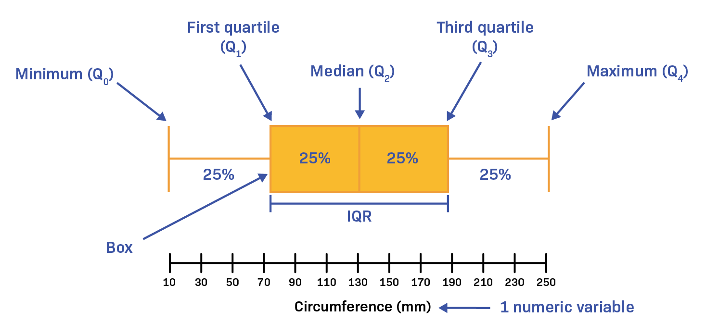

# Data Science Feature Engineering 
This page is a valuable resource for those gearing up for data scientist and machine learning interviews, focusing specifically on feature engineering tasks. It compiles pertinent questions to help individuals prepare effectively. It encapsulates a comprehensive collection of questions, insights, and best practices related to crafting and optimizing features for predictive modeling.

Feature engineering is crucial in data science and machine learning, involving the careful transformation of raw data to boost predictive model performance. The quality and relevance of features significantly impact the effectiveness of machine learning models, influencing accuracy, preventing overfitting, and revealing hidden patterns. Proficient feature engineering is a cornerstone of the model-building process, enabling practitioners to extract meaningful insights, enhance predictions, and harness the full potential of data-driven decision-making.

## List of Questions:

### Q1- What does feature engineering mean? 

Feature engineering refers to the process of raw data manipulation such as addition, deletion, combination, mutation etc. It encompasses the process of creating new features or modifying existing ones to improve the performance of a machine learning model. 

Here is a range of significant activities used in Feature Engineering :

- Feature Selection
- Data Transformation
- Text Data Processing
- Time-Series Feature Engineering

### Q2- What does data transformation mean?

Data transformation is indeed one subtask within the broader field of feature engineering in machine learning. It is a specific aspect of feature engineering that involves modifying the raw data to make it more suitable for the learning algorithm.
It includes : 
- Feature Scaling
- Feature encoding
- Feature extraction
- Binning or Discretization
- Creating Interaction Terms
  
### Q3- What does feature scaling mean ?
Feature scaling is a preprocessing step in machine learning that involves transforming the numerical features of a dataset to a common scale. Feature scaling is particularly important for algorithms that rely on distance metrics or gradient descent optimization.

### Q4- Why do we need perform feature scaling ? 
The goal is to ensure that all features contribute equally to the learning process and to prevent certain features from dominating due to differences in their magnitudes.

### Q5- What are the common techniques for feature scaling?

Here are common techniques for feature scaling:
- Normalization
- Standard scaling : converts features to standard normal variables (by subtracting the mean and dividing the standard error)
- Log scaling or Log transformation
- Polynomial transformation
- Robust scaling
  
#### 5.1 - Normalization - Min-Max Scaling
- Scales the feature values to a specific range, usually between 0 and 1
- Formula : $X_{normalized}= {X-X_{min}\over X_{max}-X_{min}}$

#### 5.2 - Standard scaling - Z-score normalization
- Centers the feature values around zero with a standard deviation of 1.
- Suitable for algorithms that assume a normal distribution of features.
- Formula: $X_{standardized} ={ X - mean(X) \over std(X)}$

#### 5. 3- Robust Scaling
- Scales the features based on the interquartile range (IQR) to handle outliers.
- Formula: $X_{robust} = {X - median(X)\over IQR(X)}$

#### 5. 4- Log Transformation

- The log transformation is the most popular among the different types of transformations used in machine learning.
- It aims to make highly skewed distributions (features with high variance) less skewed.
- The logarithm used is often the natural logarithm (base e) or the common logarithm (base 10).
- Generally, we use the natural logarithm function in Log transformation.
- If the original data follows a log-normal distribution or approximately so, then the log-transformed data follows a normal or near normal distribution.
- However, our real raw data do not always follow a normal distribution. They are often so skewed making the results of our statistical analyses invalid. That’s where Log Transformation comes in.

#### 5. 5- Polynomial transformation
- It is a feature engineering technique used in machine learning and statistics to capture non-linear relationships between variables.
- It involves transforming input features by raising them to the power of an integer, creating polynomial terms. The most common form is the quadratic transformation (squared terms), but higher-order polynomials can also be used.
- Such transformations are often beneficial for machine learning algorithms, particularly in tasks involving numerical input variables, improving predictive accuracy, especially in regression tasks.
- If X is one input feature ==> $X^2$ is its polynomial feature.
- The “degree” of the polynomial is used to control the number of features added, e.g. a degree of 3 will add two new variables for each input variable. Typically a small degree is used such as 2 or 3. Choosing the best polynomial degree is so important as it impacts the number of input features created. 

**More notes:** 

- Higher-degree polynomials (Degree > 2) can lead to overfitting, capturing noise in the data rather than true underlying patterns. Regularization techniques may be needed to mitigate this.
- It's important to scale features before applying polynomial transformations to prevent features with larger scales from dominating the transformed values.

### Q6- What does IQR : interquartile range mean?
- The IQR is the difference between the third quartile (Q3) and the first quartile (Q1): IQR = Q3 - Q1
- Q1: It represents the median of the lower 50% of the data.
- Q3 : It represents the median of the upper 50% of the data

Here's how you calculate the IQR: 
- 1. Order the dataset: arrange the values in the dataset in ascending order
- 2. Determine the median (Q2): which is the middle value of the dataset. If the dataset has an odd number of observations, the median is the middle value. If it has an even number, the median is the average of the two middle values.
- 3. Find the First Quartile (Q1)
- 4. Find the Third Quartile (Q3)
- 5. Calculate the IQR

The IQR provides a robust measure of the spread of the middle 50% of the data, making it less sensitive to extreme values or outliers. It is commonly used in box plots to visually represent the dispersion of data.

### Q7- How to deal with categorical values ?
- Drop categorical variables
- Perform feature encoding

### Q8- What does feature encoding mean? 

Feature encoding is the process of converting categorical data or text data into a numerical format that can be easily used for machine learning algorithms. In many machine learning models, the input features are expected to be numerical, and encoding is necessary when dealing with non-numeric data.

Here are some common encoding methods: 
- Ordinal encoding: Assign numerical values based on the inherent order of categories
- One-hot encoding : Create binary columns for each category, indicating its presence (1) or absence (0)
- Label Encoding : Assign a unique numerical label to each category in a categorical variable
- Binary Encoding : Convert each category into its binary representation.
- Frequency (Count) Encoding: Replace each category with its frequency or count in the dataset

**!! Notes :**
- Ordianl encoding is a good choice in case we have ranking in our categorical variables (Low, medium, high), most used with DT and Random Forest.
- One-hot encoding is more used when there is no ranking in the categorical variables.
- If our dataset is very large (high cardinality) --> one-hot encoding can greatly expand the size of dataset : number columns.

### Q9- What does Feature extraction mean?
One of the primary goals of feature extraction is to reduce the dimensionality of the dataset. High-dimensional data can lead to the curse of dimensionality, making it challenging for models to generalize well.

Feature extraction aims to retain the most relevant information from the original data. This involves identifying features that contribute significantly to the variability and patterns within the dataset while discarding redundant or irrelevant information.

Here are all types of Feature Extraction:

- Principal Component Analysis (PCA)
- Singular Value Decomposition (SVD)
- Independent Component Analysis (ICA)
- Bag-of-Words (BoW)

### Q10- What does Principal Component Analysis (PCA) mean? 
- It is an unsupervised dimensionality reduction technique that aims to transforms input data into a new set of uncorrelated features while keeping the maximum variance in the data.
- It can be applied to both supervised and unsupervised machine learning tasks
- To calculate it, we can use various python libraries such as `NumPy`, `SciPy`, and `scikit-learn`
- It has two main use cases :
    - Data Visualization: it aids in visualizing complex datasets, providing valuable insights into the underlying patterns.
    - Algorithm Optimization: it can significantly accelerate the learning process of algorithms that may otherwise exhibit slow training speeds.
    
Here are the steps of calculating PCA using the covariance matrix and use eigenvalue decomposition to obtain the eigenvectors and eigenvalues. Here are the steps to apply :
 - 1. Standardise the data
 - 2. Compute the covariance matrix and use eigenvalue decomposition to obtain the eigenvectors and eigenvalues.
 - 3. Select the k largest eigenvalues and their associated eigenvectors.
 - 4. Transform the data into a k dimensional subspace using those k eigenvectors.
    
#### 10.1- How to choose the correct number of PCA Components ?

#### 10.2- Why do we need to find eigenvalues and eigenvectors?
Because the principal component directions are given by the eigenvectors of the matrix, and the magnitudes of the components are given by the eigenvalues.

### Q11- What does Singular Value Decomposition (SVD) means ? 
Singular Value Decomposition (SVD) is a mathematical technique widely used in linear algebra and numerical analysis. 

It is a method for decomposing a matrix into three other matrices, which can be helpful in various applications, including signal processing, data analysis, and machine learning. The SVD of a matrix A is represented as:

$ A = U Σ V^T $ 
 

Here's a breakdown of the terms:

- A: The original matrix that we want to decompose.
- U: The left singular vectors matrix. Columns of U are the eigenvectors of $AA^T$ (covariance matrix of A).
- Σ: The diagonal matrix of singular values. The singular values are the square roots of the eigenvalues of $AA^T$ OR $A^TA$. They represent the magnitude of the singular vectors.

- $V^TV$: The transpose of the right singular vectors matrix. Columns of V are the eigenvectors of $A^TA$ (or $AA^T$) 
 
SVD has several applications and implications:

- **Dimensionality Reduction** 
- **Image Compression**
- **Pseudo-Inverse** 
- **Collaborative Filtering**
- **Latent Semantic Analysis (LSA)** 

### Q12- What does Independent Component Analysis mean ? 

### Q13- What are the different dimensionality reduction techniques?

**Note:**
Please be aware that I am committed to maintaining the accuracy and relevance of this page. If you come across any errors, potential adjustments, or missing details, kindly bring them to my attention. Your feedback is invaluable, and together, we can ensure the continual improvement and accuracy of this resource.

