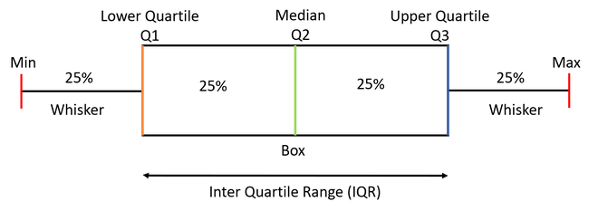

# Data Science Feature Engineering 

 

This page contains well-structured questions and answers to improve your knowledge of feature engineering, a crucial task in the data science life cycle. It is especially useful for those preparing for data scientist and machine learning interviews, providing essential questions, answers, and best practices for effective preparation. 🛠⚙️

Here are the social channels I am active on. I would love to connect with and follow others who share the same passion for data science, machine learning, and AI.
Let's exchange ideas, collaborate on projects, and grow together in this exciting field! 🥰 🥳

  
  
  
  
  

## List of Questions:

### Q1- What does feature engineering mean? 

- Feature engineering refers to the process of raw data manipulation such as addition, deletion, combination, mutation etc.
- It encompasses the process of creating new features or transforming existing ones to improve the performance of a machine learning model.
- Here is a range of significant activities used in Feature Engineering :
  - Feature Selection
  - Feature/Data Transformation
  - Text Data Processing
  - Time-Series Feature Engineering

### Q2- How feature engineering affect the model’s performance? 

- Feature engineering enhance the model performance via:
  - Improving accuracy via creating relevant features from raw data that help highlighting important patterns and relationships.
  - Reducing the risk of overfitting by removing noise and irrelevant features to ensure the model generalizes better to new data.
  - Enhancing interpretability by Constructing meaningful and interpretable features which help in understanding how the model makes predictions, aiding in transparency and trust.
  - Improving convergence using normalised and scaled features which can speed up the convergence of gradient descent algorithms, leading to faster training times.
  - Creating interaction features or polynomial features that can help the model capture complex relationships between variables that simple linear models might miss.

### Q3- What does Feature Selection mean and how to perform it?
- It is an important step in Data Science and Machine Learning and it is very useful to:
   -  Improve the model performance
   -  Reduce overfitting
   -  Enhance interpretability. 
- Three main methods are used for feature selection : 
    - **Filter Methods**
    - **Wrapper Methods**
    - **Embedded Methods**
- Choosing the appropriate feature selection method depends on various factors such as the dataset size, dimensionality, nature of features, computational resources, and the desired model performance. 

### Q3.1- What does **Filter Methods:** mean in Feature Selection?

- They aim to select features based on their statistical properties, no learning algorithm is adopted here.
- Common techniques are the next : 
  - **Correlation-based:** used for continuous variable in regression cases and it is based on correlation with Target variable. For example, we can use a correlation matrix.
  - **Chi-square Test:** used for categorical target variables to select features that are most related to the target. It is mainly used in classification problems. 
  - **Information Gain / Mutual Information:** aims to measure the dependency between variables. Then it selects features with the highest information gain or mutual information with the target. It is mainly used in classification. 
  - **Variance Thresholding:** based on removing features with low variance, assuming they contain no relevant information.

### Q3.2- What does **Wrapper Methods:** mean in Feature Selection?

- They aim to evaluate the performance of a trained model with a selected subset of features.
- Common techniques are:
  
  - **Recursive Feature Elimination (RFE):**
      - It is a greedy optimisation algorithm that aims to iteratively find the best performing feature subset.
      - It repeatedly creates models and keeps aside the best or the worst performing feature at each iteration.
      - It builds successive models using the remaining features until all options are exhausted.
      - Then, it ranks the features based on the sequence in which they were eliminated.
        
  - **Forward Selection:**
      - It starts with an empty set of features, then it starts adding one feature at each iteration.
      - Finally, it selects the one that improves the model performance the most.
      - It involves iteratively adding features to our model until the addition of a new variable no longer improves its performance.
        
  - **Backward Elimination:** 
      - It starts with all features.
      - Then,  it removes the least relevant feature , at each iteration, which improves the performance of the model.
      - It is a repetitive process untill no improvement is found on removal of features.

### Q3.3- What does **Embedded Methods:** mean in Feature Selection?

- They are based on adding regularisation terms that penalise the magnitude of coefficients, that forces some coefficients to shrink to zero and leading to automatic feature selection.
- Examples: regularised Linear Models: L1 (Lasso) and L2 (Ridge) regression techniques.
- IN addition, we can use Elastic Net
- Tree-based Methods:  like Decision Trees, Random Forests, and Gradient Boosting Machines, they  automatically select the best features (most informative) for making decisions and splitting each node.

### Q4- What does data transformation mean?

- Data transformation is indeed one subtask within the broader field of feature engineering in machine learning.
- It is a specific aspect of feature engineering that involves modifying the raw data to make it more suitable for the learning algorithm.
- It includes : 
   - **Feature Scaling**
   - **Feature encoding**
   - **Feature extraction**
   - **Binning or Discretization**
   - **Creating Interaction Terms**
  
### Q5- What does feature scaling mean and why we use it ?

- Feature scaling is a preprocessing step in machine learning that involves transforming the numerical features of a dataset to a common scale.
- Feature scaling is particularly important for algorithms that rely on distance metrics or gradient descent optimization.
- The goal is to ensure that all features contribute equally to the learning process and to prevent certain features from dominating due to differences in their magnitudes.

### Q6- What are the common techniques for feature scaling?

Here are common techniques for feature scaling:
- **Normalization**
- **Standard scaling:** converts features to standard normal variables (by subtracting the mean and dividing the standard error)
- **Robust scaling**
  
### Q7- Why do we perform data normalization ?

- It aims to bring all the features to a certain scale or range of values.
- To achieve stable and fast training of the model and prevent features with larger ranges from dominating the model.
- It means preventing models from being biased towards features with larger values.
- Many machine learning algorithms perform better with normalized data.
- Without normalization, there's a higher risk of the gradient failing to converge to the global or local minima and instead oscillating back and forth.
- Algorithms like gradient descent converge faster when features are normalized.

### Q8- How do we achieve normalization ?

- Common techniques include Min-Max Normalization, Standardization, and Robust Scaling.

**1. Min-Max Normalization:**
  
- We normalize data using Min-Max Scaling
- It aims to scale the feature values to a specific range of [0, 1]
- Formula : $X_{normalized}= {X-X_{min}\over X_{max}-X_{min}}$

**2. Standardization (Z-Score Normalization):**

- Centers the data around a mean of 0 with a standard deviation of 1.
- Suitable for algorithms that assume a normal distribution of features.
- Formula: $X_{standardized} ={ X - mean(X) \over std(X)}$

**3. Robust Scaling:**

- Scales the features using the interquartile range (IQR) and the median.
- It is less sensitive to outliers.
- Formula: $X_{robust} = {X - median(X)\over IQR(X)}$
  
### Q9- What does IQR : interquartile range mean?
- The IQR is the difference between the third quartile (Q3) and the first quartile (Q1): IQR = Q3 - Q1
- Q1: It represents the median of the lower 50% of the data.
- Q3: It represents the median of the upper 50% of the data
- It provides a robust measure of the spread of the middle 50% of the data, making it less sensitive to extreme values or outliers.
- It is commonly used in box plots to visually represent the dispersion of data.

_Source: https://www.geeksforgeeks.org/box-plot/_

- Here's how you calculate the IQR: 
1. Order the dataset: arrange the values in the dataset in ascending order
2. Determine the median (Q2): which is the middle value of the dataset. If the dataset has an odd number of observations, the median is the middle value. If it has an even number, the median is the average of the two middle values.
3. Find the First Quartile (Q1)
4. Find the Third Quartile (Q3)
5. Calculate the IQR

### Q10- How to handle categorical values ?
- Two main approaches are used to handle categorical values
   - **Drop categorical variables (columns)**, which is generally not a good solution for several reasons such as loss of information
   - **Perform feature encoding:** such as label encoding, one-hot encoding, binary encoding, frequency encoding etc.
 
### Q11- Why dropping categorical data is not a good solution ?

- Retaining and properly handling categorical data is essential for building robust, accurate, and insightful models.
- Categorical data such as "Gender," "Occupation," or "Product Type"  may contain valuable information.
- Dropping it can :
   - Lead to a loss of important insights.
   - Result in an incomplete understanding of the data.
   - Impact the predictive power of a model and leading to inaccurate predictions and poor performance.
- In addition, removing categorical data reduces the size of the dataset, which can limit the model’s ability to learn from the data and generalize to new data.
- Categorical features can often be key predictors. Ignoring them might result in a model that overlooks important patterns.

### Q12- What does feature encoding mean? 

- Feature encoding is the process of converting categorical data or text data into a numerical format that can be easily used for machine learning algorithms.
- In many machine learning models, the input features are expected to be numerical, and encoding is necessary when dealing with non-numeric data.
- Here are some common encoding methods: 
   - **Ordinal encoding:** assign numerical values based on the inherent order of categories
   - **One-hot encoding:** create binary columns for each category, indicating its presence (1) or absence (0)
   - **Label Encoding:** assign a unique numerical label to each category in a categorical variable
   - **Binary Encoding:** convert each category into its binary representation.
   - **Frequency (Count) Encoding:** replace each category with its frequency or count in the dataset
  
**!! Notes :**
- Ordinal encoding is a good choice in case we have ranking in our categorical variables (Low, medium, high), most used with Decision Tree and Random Forest.
- One-hot encoding is more used when there is no ranking in the categorical variables.
- If our dataset is very large (high cardinality) --> one-hot encoding can greatly expand the size of dataset : number columns.

### Q13- What does Feature extraction mean and why do we need it?

- It is a critical step in data preprocessing, focusing on reducing the number of features while retaining the most relevant information from the original data.
- It refers to the process of transforming raw data into a format that is suitable for analysis or modeling.
- It improves model performance, reduces computational costs, and enhances data visualization by transforming the original features into a more informative and compact form.
- Techniques like PCA, LDA, t-SNE, and autoencoders are commonly used for this purpose and Bag-of-Words (BoW) is commonly used in natural language processing (NLP) and text analysis.
- Here are some key reasons for its usage:
   - **Dimensionality Reduction:** reduces the number of features to prevent issues related to high dimensionality and enhance model performance.
   - **Noise Reduction:**  helps in eliminating redundant and irrelevant information, enhancing the signal-to-noise ratio.
   - **Computational Efficiency:** decreases computational load and storage requirements, making models faster and more efficient.
   - **Improved Visualization:** simplifies the data for better visualization and understanding.

### Q14- What does Dimensionality reduction mean?

- It is a technique used in machine learning and statistics to reduce the number of input variables or features in a dataset.
- The goal is to simplify the dataset while retaining its essential information and patterns.
- High-dimensional datasets, where the number of features is large, can suffer from the curse of dimensionality, leading to increased computational complexity and potential overfitting.
- Dimensionality reduction methods aim to overcome these challenges by transforming or selecting a subset of features, preserving the most relevant information and reducing noise in the data.
- Here are popular examples of Dimensionality reduction techniques:
  - Principal Component Analysis (PCA)
  - Singular Value Decomposition (SVD)
  - Independent Component Analysis (ICA)
  - Linear Discriminant Analysis (LDA)
  - t-Distributed Stochastic Neighbor Embedding (t-SNE)

### Q15- What does Principal Component Analysis (PCA) mean and how to apply it? 

- It is an unsupervised dimensionality reduction technique that aims to transforms input data into a new set of uncorrelated features while keeping the maximum variance in the data.
- It can be applied to both supervised and unsupervised machine learning tasks
- To calculate it, we can use various python libraries such as `NumPy`, `SciPy`, and `scikit-learn`
- PCA serves primarily in two key use cases:
    - **Data Visualization:** it aids in visualizing complex datasets, providing valuable insights into the underlying patterns.
    - **Algorithm Optimization:** it can significantly accelerate the learning process of algorithms that may otherwise exhibit slow training speeds.
- Multiple methods and libraries are available for applying PCA:
  - **Method 1:** Using scikit-learn library: `sklearn.decomposition.PCA()`
  - **Method 2:** Using NumPy, SciPy libraries 
    
    
### Q15.1- Case 1 : Using scikit-learn library

- This method is based on using `sklearn.decomposition.PCA(n_components=n)`, where n is the number of PCA components 
- How to choose the correct number of PCA Components ?
  - The first principal components that capture the most significant variance in the data
  - Example 97% or 99% of data variability.
- If we found the correct component number, example: n=2,  then we use the next code : PCA(n_components=2)  

### Q15.2- Case 2: Using NumPy, SciPy libraries: 

- This method consists on applying PCA using the eigenvalue decomposition, which is based on finding the eigenvectors and eigenvalues.
- Here are the consecutive steps to apply this method:
    1. Standardise the data.
    2. Compute the covariance matrix and use eigenvalue decomposition to obtain the eigenvectors and eigenvalues.
    3. Select the k largest eigenvalues and their associated eigenvectors.
    4. Transform the data into a k dimensional subspace using those k eigenvectors.
 
### Q16- What are Eigenvalues and Eigenvectors ?

- More details can be found under probabil
- **Eigenvalues:** The eigenvalues of the covariance matrix represent the variance of the data along the corresponding eigenvectors. Larger eigenvalues indicate directions of maximum variance, and smaller eigenvalues indicate directions of minimum variance.
- **Eigenvectors:** Eigenvectors are the directions (principal components) in which the data varies the most. Each eigenvector corresponds to a principal component.
       
### Q17- Why do we need to find eigenvalues and eigenvectors in PCA?

- In PCA, finding eigenvalues and eigenvectors is a crucial step in transforming the original data into a new coordinate system (principal components) that captures the maximum variance.
- PCA begins by calculating the **covariance matrix** of the original data which, summarizes the relationships between different variables.
- The principal component directions are given by the eigenvectors of the matrix, and the magnitudes of the components are given by the eigenvalues.
- The eigenvectors are ranked in order of their corresponding eigenvalues. Then, the first few eigenvectors (principal components) with the largest eigenvalues capture the most significant variance in the data ( 97% or 99% of data variability).
- Larger eigenvalues indicate directions of maximum variance, and smaller eigenvalues indicate directions of minimum variance.
- By choosing a subset of these components, you can effectively reduce the dimensionality of the data while retaining the most important information.
- Eigenvectors are orthogonal, meaning they are perpendicular to each other. This orthogonality ensures that the principal components are uncorrelated, simplifying the interpretation of the transformed data.

### Q18- What does Singular Value Decomposition (SVD) mean ? 

- Singular Value Decomposition (SVD) is a mathematical technique widely used in linear algebra and numerical analysis.
- is often used to reduce the number of features or dimensions in a dataset.
- The singular values obtained from the decomposition can be used to identify the most important components or features, and the corresponding vectors can be used to transform the data into a lower-dimensional space.
- Here are steps to apply this method:
  - It aims to represent the original matrix A  with fewer dimensions via decomposing it into three other matrices U, V and Σ.
  - The SVD of a matrix A is represented as: $A = U Σ V^T$ :
    - A: The original matrix that we want to decompose.
    - **Left Singular Vectors U:** these vectors form an orthonormal basis for the column space of the original matrix A. They capture the relationships between the rows of A.
    - **Singular Values Σ:** the singular values on the diagonal of Σ are the square roots of the eigenvalues of $AA^T$ (or $A^TA$). They represent the amount of variability or importance associated with each singular vector. The singular values are arranged in descending order.
    - **Right Singular Vectors $V^T$:** these vectors form an orthonormal basis for the row space of the original matrix A. They capture the relationships between the columns of A.
- This decomposition is widely used in signal processing, data analysis, and machine learning. Examples:
  - **Dimensionality Reduction** 
  - **Image Compression**
  - **Pseudo-Inverse** 
  - **Collaborative Filtering**
  - **Latent Semantic Analysis (LSA)**
    
### Q19- PCA Versus SVD? 

- PCA is a specific method for dimensionality reduction and data analysis, SVD is a more general matrix decomposition technique.
- PCA can be viewed as a special case of SVD when applied to the covariance matrix of the data.
- Both techniques have their applications and are widely used in various fields, often complementing each other in data analysis and modeling.
- Here some key differences in their formulations and applications:
  - PCA: aims to find the principal components (or directions) along which the data varies the most. SVD decomposes a matrix into three other matrices, capturing the inherent structure and relationships within the data.
  - PCA is a specific application of SVD where the input matrix is the covariance matrix of the data. SVD is a more general matrix decomposition technique applicable to any matrix.
  - PCA typically involves centering the data (subtracting the mean) before computing the covariance matrix. SVD can be applied directly to the original data matrix without the need for centering.
  - PCA Commonly used for dimensionality reduction, data visualization, and noise reduction. SVD Applied in a broader range of applications, including matrix inversion, image compression, collaborative filtering, and solving linear least squares problems.

### Q20- What does Independent Component Analysis (ICA) mean ? 

- ICA is a computational technique used in signal processing and data analysis.
- It aims to separate a multivariate signal into additive, independent components, with the assumption that the original signals are statistically independent and non-Gaussian.
- Here's a breakdown of key concepts related to Independent Component Analysis:
  - **Statistical Independence:** ICA assumes that the observed signals are composed of independent source signals. Independence is a crucial assumption, as it allows ICA to uncover the underlying sources.
  - **Non-Gaussianity:** Unlike Principal Component Analysis (PCA), which assumes that the components are orthogonal and Gaussian, ICA relies on the non-Gaussian nature of the sources. Non-Gaussianity is exploited as a criterion for finding independent components.
- It consists on finding independent components.
- Does not focus on variance issues, it focuses on the mutual Independence of the component.
- The general form of the linear mixing model in ICA is expressed as:
  - Form: $X=A⋅S$
  - **X:** is the observed signal (mixture).
  - **A:** is the mixing matrix (often unknown).
  - **S:** is the vector of independent source signals.
- Solution of previous form is :
  - $S=W⋅X=A^{-1} ⋅X$
  - S: represents the independent components identified by ICA
  - W: the inverse of the mixing matriX
- Here some examples of ICA Applications:
  - **Blind Source Separation:** Unmixing signals when the mixing matrix is unknown.
  - **Image Processing:** Separating mixed images into their constituent sources.
  - **Biomedical Signal Processing:** Separating brain signals (e.g., EEG or fMRI) into independent components.
    
**Note:**
- ICA is a powerful technique, especially when dealing with scenarios where the sources are mixed together, and the mixing process is unknown or complex.
  
### Q21- How to measure non-Gaussianity in ICA? 

- ICA aims to break down a multivariate signal into independent components.
- It relies on the assumption that observed data stems from independent sources, and it's essential that these sources exhibit non-Gaussian behavior.
- This non-Gaussianity enables ICA to effectively discern and isolate the independent components.
- Non-Gaussianity in Independent Component Analysis (ICA) can be measured using various statistical metrics or tests.
- These measures and tests provide insights into the departure of the data distribution from a Gaussian distribution, which is essential for successful ICA decomposition.
- Here are the main measures for non-Gaussianity:
   - **Kurtosis:** in a non-Gaussian distribution, the kurtosis will deviate from the expected value for a Gaussian distribution, which is 3. Higher kurtosis indicates heavier tails than a Gaussian distribution, while lower kurtosis indicates lighter tails.
   - **Skewness:** in a non-Gaussian distribution, the skewness will deviate from 0, which is the expected value for a symmetric Gaussian distribution. Positive skewness indicates a longer tail on the right side of the distribution, while negative skewness indicates a longer tail on the left side.
   - **Negentropy:** negentropy is a measure of non-Gaussianity which, quantifies the difference between the entropy of a Gaussian distribution and the observed distribution. Lower negentropy values indicate closer resemblance to a Gaussian distribution.
   - **Mutual Information:** it measures the amount of information that one random variable contains about another random variable. Since Gaussian distributions are maximally non-informative, components with low mutual information are more likely to be closer to Gaussian, while those with high mutual information are more likely to be non-Gaussian.
   - **Jarque-Bera Test:** The Jarque-Bera test is a statistical test that assesses whether sample data have the skewness and kurtosis matching a normal distribution. A low p-value indicates departure from normality.

### Q22- Fast-ICA versus ICA ?

- Fast-ICA and ICA are both techniques used for separating mixed signals into statistically independent components.
- However, they differ in terms of computational efficiency, optimization methods, assumptions, convergence speed, applications, and robustness.
- The choice between the two depends on the specific requirements of the task at hand and the characteristics of the dataset.
- Here's a comparison between the two:
   - **Speed and Efficiency:**
       - Fast-ICA employs techniques such as negentropy maximization and gradient ascent to rapidly converge to a solution.
       - ICA algorithms may be computationally slower compared to Fast-ICA, especially for large datasets or high-dimensional signal sources.
   - **Optimization Method:**
       - Fast-ICA uses optimization methods like negentropy maximization or fixed-point iteration to find the separating matrix that maximizes independence.
       - ICA methods may employ various optimization techniques, including gradient ascent, kurtosis maximization, or mutual information minimization.
   - **Assumptions:**
       - Fast-ICA often assumes that the sources are non-Gaussian and have non-quadratic cumulants and it aims to exploit non-Gaussianity to separate the signals.
       - ICA assumes generally that the sources are statistically independent and aims to find a linear transformation that maximizes their independence.
   - **Convergence:**
       - Fast-ICA tends to converge faster due to its efficient optimization techniques, making it suitable for real-time applications or large datasets.
       - ICA convergence speed may vary depending on the optimization method and the complexity of the dataset.
   - **Applications:**
       - Fast-ICA used in signal processing tasks such as blind source separation, audio processing, and image analysis where computational efficiency is crucial.
       - ICA applied in fields like neuroscience, telecommunications, and biomedical signal processing for separating mixed sources into meaningful components.
   - **Robustness:**
       - Fast-ICA is efficient but more sensitive to the choice of initialization and parameters, requiring careful tuning for optimal performance.
       - ICA methods may offer more robustness and flexibility, allowing for customization based on specific dataset characteristics.
  

### Q23- What does "creating interaction terms" mean in feature engineering?

- It involves generating new features that capture the interactions between existing features.
- It helps models understand the combined effect of multiple variables on the target variable, which might not be evident when considering each feature individually.
- Polynomial transformation is the method used to create interaction terms and higher-order features.

### Q24- How to perform Polynomial transformation?

- It is a feature engineering technique used in machine learning and statistics to capture non-linear relationships between variables.
- It involves transforming input features by raising them to the power of an integer, creating polynomial terms.
- The most common form is the quadratic transformation (squared terms), but higher-order polynomials can also be used.
- It is useful for machine learning, particularly in tasks involving numerical input variables, improving predictive accuracy, especially in regression tasks.
- If X is one input feature ==> $X^2$ is its polynomial feature.
- The “degree” of the polynomial is used to control the number of features added, e.g. a degree of 3 will add two new variables for each input variable.
- Typically a small degree is used such as 2 or 3.
- Choosing the best polynomial degree is so important as it impacts the number of input features created. 

**More notes:** 
- Higher-degree polynomials (Degree > 2) can lead to overfitting, capturing noise in the data rather than true underlying patterns. Regularization techniques may be needed to mitigate this.
- It's important to scale features before applying polynomial transformations to prevent features with larger scales from dominating the transformed values.

### Q25- What is Log Transformation and how to perform it?

- The log transformation is a type of feature transformation that changes the distribution of the data.
- It is the most popular among the different types of transformations used in machine learning.
- It aims to make highly skewed distributions (features with high variance) less skewed.
- Generally, we use the natural logarithm function in Log transformation.
- If the original data follows a log-normal distribution or approximately so, then the log-transformed data follows a normal or near normal distribution.
- However, our real raw data do not always follow a normal distribution. They are often so skewed making the results of our statistical analyses invalid. That’s where Log Transformation comes in.
- Briefly, log transformation changes the distribution of a feature, often to handle skewness or reduce the impact of outliers.

**Note:**
Please be aware that I am committed to maintaining the accuracy and relevance of this page 🤞🏻. If you come across any errors, potential adjustments, or missing details, kindly bring them to my attention. Your feedback is invaluable, and together, we can ensure the continual improvement and accuracy of this resource. 🚀🎯

