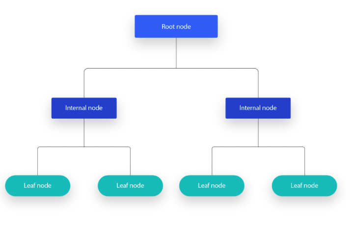

# ML : Supervised Learning 
# Regression Analysis

Supervised learning encompasses two main techniques: classification and regression. This page is a one-stop resource for mastering regression analysis, offering essential information and detailed insights tailored for technical interviews. Whether you're reinforcing foundational knowledge or delving into specific regression concepts, this page serves as a concise yet comprehensive guide.

## List of questions:
### Q0- What does regression analysis mean?

- It is a statistical technique used in data science and machine learning fields. 
- It aims to model the relationship between a dependent variable and one or more independent variables.
- By modeling the relationship between inputs and output, it is easy to understand the nature and strength of the relationship and to make predictions based on that understanding.

- Mainly, we use regression analysis to resolve problems and answer questions such as:
    - How does a change in one variable (independent variable) impact another variable (dependent variable)?
    - Can we predict the value of the dependent variable based on the values of one or more independent variables?
- It is widely used in various fields, including economics, finance, biology, psychology, and machine learning.

### Q1- Examples of well-known machine learning algorithms used to solve regression problems
Here are some well-known machine learning algorithms commonly used to solve regression problems:

- Linear Regression
- Decision Trees
- Bayesian Regression
- Lasso Regression
- Ridge Regression
- Support Vector Machines (SVM)
- K-Nearest Neighbors (KNN)
- Random Forest
- Gradient Boosting Algorithms (e.g., XGBoost, LightGBM)
- Neural Networks (Deep Learning)
  
### Q2- What is linear regression, and how does it work?
- It is the easiest and one of the most popular Machine Learning algorithms for predictive analysis
- LR, is a statistical method to model the relationship between a dependent variable (target) and one or more independent variables (inputs).
- Called "linear" because we assume the existence of linear relationship between previous variables.
- It aims to predict continuous/real or numeric variables such as temperature, salary, quantity, price etc. using the remaining features
- It can be classified into two main types : 
    - Simple Linear Regression : to model relationship between an independent variable (x) and a dependent variable (y).
    - Multiple Linear Regression : involves using more than one independent variable (X) to model the relationship with the dependent variable (y).
- It can be used for both continuous and categorical dependent variables (y) and can handle multiple independent variables.
  
### Q3- What are some real-life applications of regression algorithms?
Some examples of real-life applications of regression algorithms are:
- Housing Prices Prediction
- Sales Forecasting: predict future sales using historical sales data and marketing inputs.
- Demand Forecasting
- Financial Forecasting: predict stock prices, exchange rates, and interest rates in finance.
- Risk Assessment: evaluate insurance risks, credit scores, and loan defaults.
- Marketing ROI Analysis: analyze marketing campaign effectiveness for sales prediction.
- Energy Consumption forecasting: forecast electricity usage for energy management.
- Weather Prediction: predict weather patterns, temperature, and precipitation.
- Crop Yield Prediction: estimate crop yields based on weather and soil conditions.
  
## Q4- How Simple Linear Regression works? 
- It is used to model relationship between an independent variable (x) and a dependent variable (y).
- Example: Predicting the price of a house based on its size.

- The line of regression, is a line of best fit is plotted on a scatter plot of the data points as it is shown in the Figure above
- The equation of this line is : $$y=w \times x + b$$
- Where : 
    - y: dependent/response/target variable, we want to predict it or explain it.
    - x: independent/input/predictor variable(s), it is (they are) used to predict or explain the variability of y
    - w: regression coefficients: the parameters in the regression equation that indicate the strength and direction of the relationship between variables.
    - b:bias term which represents patterns that do not pass through the origin
        
- The line is determined by finding the values of the slope (w) and intercept (b) that minimize the sum of residuals.
- Residuals: 
    - Corresponds to the prediction error which is differences between the observed (y) and predicted values ($\hat y$), .
    - Formula : $e=y-\hat y$
    - We calculate the Sum
- Our main goal is to find the best fit line where the error between predicted values and actual values should be minimized.

*Source:https://www.javatpoint.com/linear-regression-in-machine-learning

### Q5- How Multiple Linear Regression works? 
- The unique difference between Simple and Multiple Linear Regression lies in the number of independent variables used in the regression model.
- We have multiple independent variables $x_1, x_2, ..., x_n$
- New equation: $y=b_0+b_1 x_1 + b_2x_2+ ...+b_n x_n$
- Where $b_0$ represents the intercept, and $b_1, b_2, ..., b_n$ represent the coefficients of the independent variables.
- Simple linear regression involves one independent variable, while multiple linear regression involves two or more independent variables.
- Example: Predicting the performance of a student based on their age, gender, IQ, etc.
  
### Q6-  What assumptions should you consider before starting a linear regression analysis?
Here are some important assumptions of Linear Regression: 

- Linear relationship between the independent and dependent variables.
- No or little multicolinearity between the features: independent variables are not correlated with each other
- Normal distribution of error terms: residuals (errors), are normally distributed with a mean of zero and a constant variance.
- The residuals are independent of each other, no autocorrelations in error terms
- The model includes all the relevant independent variables needed to accurately predict the dependent variable.
- Homoscedasticity Assumption: it is a situation when the error term is the same for all the values of independent variables. With homoscedasticity, there should be no clear pattern distribution of data in the scatter plot

**Note:**
- Multicollinearity involves high-correlation between the independent variables.
- In this situation, it become difficult to find the true relationship between the predictors and target variables.
- More precisely, it is challenging to point which predictor variable has the major influence on the target variable.
  
### Q7- What are the performance metrics for Regression Analysis? 
- Several performance metrics are commonly used to evaluate the accuracy and goodness of fit of regression models.
- Here are some common performance metrics for regression:
    - **Mean Absolute Error (MAE)**
    - **Mean Squared Error (MSE)**
    - **Root Mean Squared Error (RMSE)**
    - **Mean Absolute Percentage Error (MAPE)**
    - **R-squared (R2)**
- The choice of metric is related to several goals and characteristics of the regression problem to solve.
- It is possible to use one of the above metrics next to accuracy, precision, and the ability to explain variance.
- Considering multiple metrics is better solution to gain a comprehensive understanding about the model performance.
- Almost, all regression tasks uses error to evaluate the model: if error is high ==> we need either to change the model or retrain it with more data.
  
### Q8- What is Mean Absolute Error (MAE) ? 
- As its name indicates, it represents the average absolute difference between the predicted values and the actual values.
- **Formula :**
$$MAE ={1\over n}{\sum_{i=1}^{n}|y_{i}-\hat{y}_{i}|}$$

### Q9- What is Mean Squared Error (MSE) ?
- It represents the average squared difference between the predicted values and the actual values.
- It penalizes larger errors more heavily than MAE.
- **Formula:** $$MSE = {1\over n} {\sum_{i=1}^{n}(y_{i}-\hat{y}_{i})^2}$$ 

### Q10- What is Root Mean Squared Error (RMSE) ? 
- It represents the square root of the MSE
- It provides a measure of the average magnitude of errors in the same units as the target variable.
- **Formula:** $$RMSE= {\sqrt MSE} $$

### Q11- What is Mean Absolute Percentage Error (MAPE) ? 
- It calculates the average percentage difference between the predicted and actual values.
- It is a relative error metric
- **Formula:** $$MAPE = {1\over n}{\sum_{i=1}^{n}|y_{i}- \hat{y}_{i}| \over |y_{i}|\times 100}$$

### Q12- What is R-squared (R2)
- Known also as the coefficient of determination.
- It corresponds to the degree to which the variance in the dependent variable (the target, y) can be explained by the independent variables (features). 
- Generally, it measures the proportion of variance explained by our regression model model via representing the correlation between true value and predicted value.
- **Formula:** $$R^2= 1 - {MSE \over Var(y)}= 1- {\sum_{i=1}^{n}(y_{i}-\hat{y}_{i})^2 \over {\sum_{i=1}^{n}(y_{i}-\overline{y})^2}}$$
- $\overline{y}$: is the mean of the target variable.
- MSE: Mean Square Error, captures the prediction error of a model
- It is a relative metric where value varies between 0 and 1, the closer is to 1, the better is the fit.
  
Notes: 
- R² does not give any measure of bias, so you can have an overfitted (highly biased) model with a high value of R².
- It is better to look at other metrics to get a good understanding of a model’s performance.
- In the case of non-linear models, it is possible that R² is negative.
- It is possible to use **Adjusted R-squared**, which provides a penalized version of R-squared that adjusts the model complexity.
  
### Q13- Which evaluation metric is more robust to the outliers : MAE or MSE or RMSE ?
- MAE is robust to the outliers as compared to the MSE or RMSE. 
- This is because MAE calculates the average absolute difference between predicted and actual values, which makes it less sensitive to extreme values or outliers. 
- MSE and RMSE involve squaring the differences, which can amplify the impact of outliers on the overall error. 
- Therefore, in datasets with outliers, MAE is often preferred as a more resilient metric for evaluating model performance.
  
##  Decision Trees
### Q14- What does decision tree mean ? 
- It is a non-parametric supervised learning algorithm. 
- It has the tree structure: root node, edges (branches), internal and leaf nodes
- It can be used to solve both Classification and Regression problems.
- We build a tree with datasets broken up into smaller subsets while developing the decision tree
- It can handle both categorical and numerical data 

*Source: https://www.ibm.com/topics/decision-trees
### Q15- What are the types of decision tree 
- We have three main types :
    - **ID3:** Iterative Dichotomiser 3: splitting datasets is based on metrics like entropy and information gain. 
    - **C4.5:** it is identified as a later iteration of ID3, where it uses information gain or gain ratios to split datasets.
    - **CART:** Classification And Regression Trees: it utilizes Gini impurity to identify the ideal attribute to split the dataset on.

### Q16- What are the different menthods used by DT in splitting datasets? 
Here is the list of methods:

- **Variance:** 
    - Splitting datasets using the variance
    - The variance indicates the spread or dispersion of the data. It measures how much the individual data points, in a dataset, is deviated from the average value. 
    - Prefered when the target variable is continous (Regression)
    - It measures the node impurity via determining the homogeneity of continuous target variables within each node of the tree.
    - High Variance means data points within a node are spread out (heterogeneous), Low Variance means data points within a node are similar and close to the mean.    
    
- **Entropy:** 
    - It is typically used for categorical target variables (Classification).
    - It measures the impurity or disorder in a dataset to evaluate its homogeneity.
    - It determines the best split to build an informative decision tree model.
    - High entropy means that data is heterogeneous (mixed), Low entropy means data is homogeneous and well organized.
    - Formula: $$Entropy =-{\sum p_{i} log_{2}p_{i}}$$
- **Information gain :**
    - It is criteria used to decide whether a feature should be used to split a node or not.
    - Prefered when the target variable is categorical (classification)
    - It corresponds to the mutual information betwee input attribute A and target variable Y.
    - It quantifies the effectiveness of input attribute A in classifying the data by measuring the reduction in entropy or impurity achieved by splitting the data based on that attribute.
    - Formula : $$IG=1- Entropy$$  
- **Gini Impurity :**
    - It is one method to split DT nodes prefered when the target variable is categorical (Classification)
    - Formula : $$Gini Impurity =1−\sum_{i=1}^{c}(p_{i})^2$$
    - Where : $Gini=\sum_{i=1}^{c}(p_{i})^2$, c is the number of classes and $p_{i}$ is the proportion of data points belonging to class i
    - As its name indicates, it measures the impurity of a node
    - Gini is the probability of correctly classifying a randomly chosen data point  if it was randomly labeled according to the distribution of labels in the node. 
    - Gini Impurity is the probability of incorrectly classifying a randomly chosen element if it was randomly labeled based on the distribution of classes in the dataset.
    - Evaluation of Gini Impurity value :
        - If value is low, the homogeneity of the node is high
        - If value is high, the homogeneity of the node is low
        - The Gini Impurity of a pure node is zero
    - Gini Impurity is preferred to information gain because it does not contain logarithms which are computationally intensive an expensive.
- **Chi-Square:**
    - Again, it is one method to split DT nodes prefered when the target variable is categorical (Classification)
    - Formula : $$Chi-Square_{class}=\sqrt{(Actual-Expected_Value)^2 \over Expected_Value}$$
    - Where Expected_Value : the expected value for a class in a child node based on the distribution of classes in the parent node, and the Actual is the actual value for a class in a child node.
    - The Chi-Square for one node has the next formula, c is the number of classes : $$ Chi-Square= \sum_{c}(Chi-Square_{class})$$
    - Evaluation of total Chi-Square value: 
        - If it is high, the differences between parent and child nodes is high ==> high homogeneity.
        - If it is low, the differences between parent and child nodes is low ==> low homogeneity.
                  
### Q17- How many splits are there in a decision tree?
 - As mentioned before, the splitting criteria used by the regression tree and the classification tree are different.
 - For classification problems, if we have n classes in a decision tree, the maximum splits will be $2^{(n -1)} – 1$. 
 - The number of splits in a decision tree for regression depends on several factors:
     - Features number: each feature can be used for splitting at multiple nodes.
     - Maximum tree depth : the deeper is the tree, the more splits we have. However, it can increase the risk of model overfitting.
     - Thresholds: if our feature is continous, we have infinite values that could be used to split node
     - Stopping Criteria: some conditions like minimum samples per leaf or maximum tree depth, can limit the number of splits and prevent the tree from growing excessively.
     
### Q18- What is the best method for splitting a decision tree?
 - Actually, there is no best method that is suitable for all problems but it depends on the problem itself and the target variable we want to estimate (continous or discrete)
 - The most widely used method for splitting a decision tree is the gini index or the entropy.
 - The scikit learn library provides all the splitting methods for classification and regression trees.
   
### Q19- What are the Advantages of Decision Trees?
- Easy to interpret
- Little or no data preparation is needed: handle categorical and continous variables, handle variables with missing values.
- High flexibility : it is used for both classification and regression tasks.

### Q20- What are the disadvantages of Decision Trees ?
- Prone to overfitting : building complex decision tree model can easily overfit because it does not generalize well to unseen data
- High variance estimators :  even little variations within data can produce a very different decision tree
- Too costly: it uses greedy search approach to build decision tree model therefore, training this model can be very expensive to train compared to other algorithms.
  
### Q21- How to avoid Overfitting of a Decision Tree model?
- Overfitting corresponds to the situation when the model captures noise or random fluctuations in the training data which gives poor performance on unseen data. 
- Here a list of methods that could help in avoiding overfitting in DT:
    - Limiting Tree Depth : avoiding having complex trees
    - Pruning : using pre-pruning or post-pruning algorithm.
    - Feature Selection: select the most important features and discard irrelevant and redundant features
    - Cross-Validation: appy cross validation technique such as K-fold cross validation to better tune hyperparameters and prevent overfitting
    - Ensemble learning algorthims: such as Random Forests or Gradient Boosting where it leverages combining multiple models to limit overfitting .
    - Minimum Samples per Leaf
    - Minimum Samples per Split    
    
### Q22 - What does pruning decision tree mean? 
- Pruning is a technique in ML that aims to reduce the size of DT and remove specific subtrees.
- It aims to reduce the complexity of final model (tree) and improve its generalization performance on real data and unseen. 
- Reduce the complexity means removing or cutting down specific nodes in a decision tree
- Pruning helps improve the predictive accuracy by reducing and prevent overfitting. 
- Two main pruning algorithms : 
    - Pre-pruning : removes subtrees while constructing the model
    - Post-pruning : removes subtrees with inadequate data after tree construction.
      
### Q23- What does Pre-pruning and Post-pruning algorithms mean?
- **Pre-pruning:** 
    - Also, it is called early stopping.
    - It aims to stop the growth of the tree before it becomes fully expanded.
    - We cut or remove a node if it has low importance while growing the tree
    - It occurs in Top-down fashion : it will traverse nodes and train subsets starting at the root
    - Techniques: 
        - Setting maximum tree depth
        - Setting minimum number of samples in leaf nodes
        - Stopping when :
            - There is insufficient data
            - No significant improvements (in impurity or other metrics) are present 

- **Post-pruning:** 
    - Also, it is called backward pruning
    - It involves growing the tree to its maximum size
    - Then, it removes selected branches or subtrees with inadequate data after tree construction or that have no improved performance on validation data.
    - It occurs in Bottom-down fashion : once the tree is built, we start pruning the nodes based on their significance.
    - Techniques:
        - Cost-complexity pruning or reduced error pruning
        - Subtree replacement
          
### Q24- What are the popular pruning algorithms?
Various pruning algorithms are used to reduce the complexity of decision trees and prevent overfitting:
- **Cost complexity pruning**
- **Reduced error pruning**
- **Error-Based Pruning**
- **Subtree Replacement**
- **Minimum Description Length (MDL) Pruning**

- **Cost complexity pruning:**
    - Post-pruning algorithm for Decision Tree
    - It aims to minimising the cost-complexity measure while building the tree.
    - It involves balancing between model simplicity (few nodes) and its performance while building the tree.
    - The pruning process is guided by a cost-complexity parameter, which penalizes complex trees.
    - The decision tree is computed using cross-validation technique to prevent overfitting
    - The decision tree with the smallest cost-complexity measure is choosen as the pruned tree.

- **Reduced error pruning:**
    - It aims to reduce prediction error via removing subtrees which do not improve prediction accuracy on a validation dataset.
    - The tree will be at its maximum size then subtrees which do not significantly decrease the error rate on the validation dataset are selected and removed
    - No conditions regarding tree complexity or a cost-complexity measure are considered.
    - It is all based on the Error reduction.
  
- **Error-Based Pruning:**
    - Includes any pruning technique where pruning subtrees is based on their impact on prediction error.
    - Reduced Error Pruning is a specific example of error-based pruning
    
- **Subtree Replacement:**
    - It consists on replacing a subtree or a branch of the decision tree with a single leaf node.
    - It is an iterative process then, the decision tree's performance is evaluated after each replacement.
    - The model with the best generalization performance is chosen.
    
- **Minimum Description Length (MDL) Pruning**
    - It consists on reducing the complexity of the tree via recursively merging nodes that do not significantly decrease the description length of the tree.
    - Its main target is to find the best model that optimally compresses data via minimizing the combined length of the tree structure and the encoded data.              

### Q25- What are the stopping criteria in splitting datasets in decision trees
- Stopping criteria in decision trees indicate when to stop the process of splitting nodes further and growing the tree :
    - Minimum samples per leaf: minimum number of samples required to be present in a leaf node.
    - Maximum Tree depth: once the model reaches the maximum depth or level of the tree, no further splitting is performed, and all nodes at the maximum depth become leaf nodes.
    - Maximum features: fixing the maximum number of features considered for splitting at each node.
    - Maximum number of nodes: fixing the total number of nodes in the tree.
    - Minimum impurity decrease: it is all based on the comparison between impurity decrease and the minimum decrease in impurity (threshold), no further splitting is performed
      
### Q26 - Final comments regarding Decision trees
- Decision trees are very common algorithm in machine learning for solving both classification and regression problems.
- However, creating an optimal decision tree requires finding the right features and splitting the data in an effective way that maximizes information gain.
- Here some useful terms and assumptions regarding decision trees:
    - Binary Splits
    - Feature Independence
    - Homogeneity
    - Can handle both Categorical and Numerical Features
    - Structure :
        - Root Node, Decision Nodes, Leaf Nodes
        - Subtree or branches
        - Parent and Child Node
          
###  Q27- What does Ensemble learning algorithm mean?
- Ensemble involves taking a group of things instead of individual 
- It is a ML algorthim that makes improved decision by combining the predictions from multiple models.
- It leverages the diversity of multiple models to make more robust and accurate predictions.
- It seeks better predictive performance and to increase the accuracy because we could have high variance using a single model.

### Q28- What are the common techniques used by ensemble learning?
- Various techniques are used in Ensemble Learning approach. Here are some common techniques:
    - Bagging (Bootstrap Aggregating)
    - Boosting
    - Averaging
    - Stacking
    
### Q29- What does Bagging Ensemble Learning mean? 
- It is an ensemble learning technique. 
- It is known as Bootstrap Aggregating
- It aims to improve the stability, avoid overfiting and increase accuracy of machine learning models 
- It is based on training multiple instances of the same model on different subsets of the training data and combining their predictions.
- It helps deacrease the variance of the individual models and increase prediction accuracy within noisy dataset 
- It is highly parallelizable since each base model can be trained independently on a separate bootstrap sample
- Bagging is widely used in various machine learning applications, including classification, regression, and anomaly detection, to improve predictive performance and generalization ability.
- Bagging can be used for :
  - Classification 
  - Regression
   
### Q30- How Bagging algorithm works?
- Bagging starts by creating multiple bootstrap samples (Bootstrapping) from the original training data.
- The extracted subsets with replacement have the same size as the original datasets.
- Some data points may be repeated in each bootstrap sample, while others may be left out because bootstrap sampling involves random selection with replacement.
- Then, a machine learning algorithm is applied to each of these subsets. 
- After training each single model, bagging combines predictions from all models using an aggregation method.
- The aggregation method changes based on the task and the problem: 
    - For classification tasks, the most common aggregation method is to use a majority voting scheme.
    - For regression tasks, the predictions of base models are typically averaged to obtain the final prediction. This means adding up the predictions from all the models and dividing by the total number of models to get the average prediction.
 

*source:https://www.researchgate.net/publication/322179244_Data_Mining_Accuracy_and_Error_Measures_for_Classification_and_Prediction      
### Q31- Some examples of  of bagging algorithms?
Here is the list :
- Random Forest
- Bagged Decision Trees
- Bagged Support Vector Machines (Bagged SVM)
- Bagged Neural Networks

### Q32- How Random Forest works? 
- It is a specific ensemble learning technique that combines multiple decision trees trained on random subsets of the data and features.
- It can be used for both :
   - Classification 
   - Regression
- It works as follow:
   - **Bootstrapping:** Randomly sample the dataset **with replacement** to create multiple subsets. Random Subset Selection. 
   - **Feature Selection:** Randomly select a subset of features for each subset. They are consider when splitting a node in the decision tree. 
   - **Tree Building:** Build a decision tree for each subset using the selected features. Multiple trees are built.
   - **Final Prediction:** Aggregate the predictions of all trees to make the final prediction:
      - Classification:using voting
      - Regression: compute the average.
 
### Q33- What are the advantages and the disadvantages of Random Forest?
- **Advantages:**
    - Randomness and diversity Introduction
    - Reducing correlation among the trees in the forest. 
    - High Accuracy
    - Robustness to Overfitting
    - Ability to Handle Large Datasets
    - Implicit Feature Selection
- **Disadvantages:** 
    - Less interpretable compared to simpler models.
    - Can overfit noisy data.
    - Requires careful tuning of hyperparameters.

### Q34-What are some of the hyperparameters of the random forest regressor which help to avoid overfitting?
- The key hyperparameters of a Random Forest include:
    - max_depth: Limits the depth of each tree to prevent overfitting.
    - n_estimators: Determines the number of decision trees in the forest.
    - min_samples_split: Specifies the minimum number of samples required for a node to split.
    - max_leaf_nodes: Controls node splitting and helps restrict the model's depth.
    
### Q35- What does Boosting Ensemble Learning mean?
- It is an ensemble learning technique that combines multiple weak learners to create a strong learner.
- Boosting trains weak learners sequentially.
- Each new learner corrects the mistakes of the previous ones, enhancing the ensemble's performance over time.
- weak learner means a simple model
- Boosting algorithms are widely used in both classification and regression tasks and are known for their ability to achieve high accuracy and generalization performance.
- Here is some examples of boosting techniques:
   - Adaptive Boosting: AdaBoost
   - Gradient Boosting 
   - Extreme Gradient Boosting: XGBoost
   - Light Gradient Boosting Machine: LightGBM
- Each boosting algorithm has its own variations and enhancements

### Q36- How Boosting techniques works in Regression?
- Iteratively training a series of weak regression models to predict continuous target values.
- Each subsequent model aims to  reduce the errors made by the previous ones.
- The algorithm assigns higher weights to the instances where the previous models had larger errors, effectively boosting their importance in subsequent iterations.
- This iterative process continues until a strong regression model, which combines the predictions of all weak models, is obtained.
- Generally, it aims to enhance the accuracy and predictive power of the final regression model.
 
*Source: https://www.geeksforgeeks.org/boosting-in-machine-learning-boosting-and-adaboost/

### Q37- How Gradient Boosting works?
- It builds an ensemble of decision trees, where each tree is trained to correct the errors of the previous ones by minimizing a loss function.
- Loss function measures the difference between predicted and actual values such as MSE
- It uses a gradient descent algorithm to optimization (minimise) the loss fucntion.
- Here is more details how it works :
   - The first weak learner in the gradient boosting algorithm will not be trained on the dataset.
   - It will predict the average of the relevant column.
   - Then, subsequent learners focus on minimizing the errors (residuals) made by the previous ones.
   - Each learner is trained to predict the residuals of the ensemble so far.
   - This process continues until the residuals become almost zero.
 
### Q38- Advantages Vs disadvantages of Gradient Boosting
- **Advantages:**
   - Excellent predictive accuracy, often outperforming other algorithms.
   - Handles mixed data types (numeric, categorical) well.
   - Automatically handles missing data.
- **Disadvantages:**
   - Prone to overfitting if not properly tuned.
   - Can be computationally expensive and time-consuming.
   - Requires careful hyperparameter tuning.

### Q39- How AdaBoost works?
- Short for Adaptive Boosting
- Here how it works: 
   - Initially, all data points  is assigned an equal weight.
   - After training the first weak learner (usually decision tree), AdaBoost increases the importance of larger errors (regression) points.
   - This makes them more influential in training subsequent weak learners, which focus more on correcting these mistakes.
   - This iterative process continues until a perfect model is achieved.
   - In the end, AdaBoost combines the predictions of all weak learners using weighted averaging to make the final prediction.
 
### Q40- Advantages Vs disadvantages of AdaBoost
- **Advantages:**
   - Versatile: works well with various types of data and base learners.
   - High Accuracy
   - Implicit Feature Selection: identifies important features through weighting.
   - Generalization: tends to generalize well and avoid overfitting.
   - Robustness: less affected by noisy data and outliers.
- **Disadvantages:**
   - Computational Cost: Requires more resources and time due to iterations.
   - Base Learner Dependency: performance relies heavily on base learner quality.
   - Data Requirements: needs sufficient data to avoid overfitting.
   - Imbalanced Classes: struggles with imbalanced class distributions.

### Q41- How XGBoost works?
- The full name of the XGBoost algorithm is the eXtreme Gradient Boosting.
- It is another boosting machine learning approach.
- It is a regularised version of the current gradient-boosting technique. 
- This regularisation approach makes it faster and more performant than old approach.

### Q42- Advantages Vs disadvantages of XGBoost
- **Advantages:**
    - Superior performance and scalability due to parallel processing.
    - Handles missing data efficiently.
    - Regularization techniques prevent overfitting.
    - Supports both classification and regression tasks.
    - Feature importance ranking aids in interpretability: identify which features have the most significant impact on the model's output.
- **Disadvantages:**
    - More complex and computationally intensive compared to simpler algorithms.
    - Requires careful tuning of hyperparameters.
    - Prone to overfitting with large datasets if not properly regularized.
    - May struggle with highly imbalanced datasets.

### Q43- How LightGBM works?
- The full name Light Gradient Boosting Machine
- It uses histogram-based algorithms for tree construction (ensemble learning), which groups data points into discrete bins based on feature values. 
- This reduces memory usage and speeds up training by avoiding the need to sort data points at each split.
- It grows trees **leaf-wise** (and not depth-wise like traditional methods). 
- It prioritize leaves that minimize loss, resulting in faster convergence compared to traditional depth-wise growth.
- This approach ensures faster training and improved accuracy.
- It employs two techniques to mitigate overfitting and improve training speed:
    - **Gradient-based One-Side Sampling (GOSS):** selects data instances based on gradients
    - **Exclusive Feature Bundling (EFB):** bundles less significant features together, reducing the feature set during training.

### Q44- Advantages Vs disadvantages of LightGBM
- **Advantages:**
   - Efficient: fast and memory-friendly.
   - High predictive performance /accuracy.
   - Flexible: works well with various data types.
   - Supports parallel and distributed training.
   - Feature importance.
- **Disadvantages:**
   - Complexity: configuring LightGBM parameters may require some expertise..
   - Overfitting: risk if not tuned properly.
   - Black-box: the model's inner workings may be less interpretable compared to simpler models like linear regression..
   - Preprocessing: requires careful data preparation.
   - Resource-intensive: may require more computational resources, particularly memory, compared to simpler models.

### Q45-  How can we use CatBoost to resolve classification problem?
- It is a powerful gradient boosting algorithm
- Specifically, it is designed for handling categorical features in machine learning tasks
- It can be used for both tasks:
  - Classification
  - Regression 
- The full name is Categorical Boosting
- It automatically handles categorical variables without requiring preprocessing like one-hot encoding.
- It uses an efficient algorithm to convert categorical features into numerical representations during training.
- It is based on the gradient boosting framework, where decision trees are sequentially trained to correct errors made by the previous trees.
- It optimizes a loss function by iteratively adding new trees to the ensemble.
- It incorporates regularization techniques to prevent overfitting, such as L2 regularization and feature permutation importance. ==> The model generalize well to unseen data.
- It employs parallelized algorithms and advanced optimization techniques to achieve high performance. ==> faster training and inference times

### Q46- Advantages Vs disadvantages of CatBoost
- **Advantages:**
    - Handles categorical features automatically without preprocessing.
    - Robust to overfitting due to built-in regularization techniques.
    - Efficient training speed, especially for large datasets.
    - Superior performance compared to other gradient boosting libraries.
    - Supports both classification and regression tasks.
- **Disadvantages:**
    - Requires more memory during training compared to some other algorithms.
    - Limited interpretability of models compared to simpler algorithms like decision trees.
    - May require parameter tuning to achieve optimal performance.

### Q47- Advantages  Vs Disadvantages of Boosting 
- **Advantages:**
    - Improved Accuracy
    - Robustness to Overfitting 
    - Better handling of imbalanced data: by focusing more on the data points that are misclassified 
    - Better Interpretability : by breaking the model decision process into multiple processes.  
- **Disadvantages:** 
    - Vulnerability to the outliers 
    - It is difficult to use for Real-Time applications.
    - It is computationally expensive for large datasets

### Q48- Boosting vs Bagging 
Boosting and bagging are both ensemble learning techniques used to improve model performance.
- Boosting: Focuses on sequentially training weak learners, with each subsequent learner learning from the mistakes of its predecessors. This results in a strong learner with improved predictive performance. Examples include AdaBoost and Gradient Boosting.
- Bagging: Involves training multiple weak learners independently on random subsets of the training data and combining their predictions. This helps to reduce overfitting and improve stability. Random Forest is a popular example of a bagging algorithm.

### Q49- What does Averaging Ensemble Learning mean?
- It is known as averaging methods or simple averaging. 
- It involves combining predictions from multiple models by averaging them, which can help reduce overfitting and improve generalization.
- Here are the main three steps :
    - Multiple base models are trained independently on the training data.
    - Each base model makes predictions on unseen data.
    - The predictions of all base models are combined by taking the average (or weighted average) to obtain the final prediction.
- It can be applied to various types of models, including decision trees, neural networks, and linear models etc.
### Q50- What does Stacking Ensemble Learning mean?
- It is known as stacked generalization or stacked ensemble. 
- It is a technique where multiple diverse base models are trained independently.
- Then, their predictions are used as input features for a meta-model, which combines these predictions to make the final prediction.
- The process of stacking ensemble learning has the next steps:
 - Base Models: A set of diverse base models (e.g., decision trees, support vector machines, neural networks) are trained on the training data.
 - Predictions: Each base model makes predictions on the validation set or a holdout set of the training data.
 - Meta-Model: The predictions from the base models are used as input features for a meta-model (e.g., logistic regression, random forest, gradient boosting). The meta-model is trained on the validation set, where the true target values are known.
 - Final Prediction: Once the meta-model is trained, it can make predictions on unseen data by using the predictions of the base models as input features. The final prediction is typically the output of the meta-model.
- It is a powerful technique for building robust and accurate machine learning models.

### Q51- What is Lasso Regression and how it works?
- It is short for Least Absolute Shrinkage and Selection Operator.
- It is a linear regression technique used for: 
   - Feature selection
   - L1 regularization : used over regression methods for a more accurate prediction.
- It consists on adding a penalty term to the objective function, which is ordinary least squares (OLS). 
- This penalty term penalizes the absolute values of the coefficients of the regression variables.
- Here is the formula of Lasso Regression objective function : $$ RSS + λ * (sum\ of\ the\ absolute\ values\ of\ the\ coefficients) $$
- Where :
   - RSS (Residual Sum of Squares) is the residual error between the predicted and actual values.
   - λ is the regularization parameter (Shrinkage coefficient) that controls the strength of the penalty term.
- It works as follow : 
   - Reducing the impact of less important features on the model by shrinking their coefficients towards zero.
   - It encourages sparsity in the model which involves selecting only the most important features while setting the coefficients of less important features to zero.
 
**Notes:**
- Lasso and Ridge regression are most used when dataset has high number of features.
- Large means can cause overfiting + Can cause computational challenges.
 
### Q52- Advantages of Lasso Regression
- The ability to perform feature selection automatically. 
- Very useful when dealing with high-dimensional datasets (large number of features)
- Prevent overfitting by penalizing large coefficients
- Gives models that are more generalizable to unseen data.
  
### Q53- What is Ridge Regression and how it works?
- It is a linear regression technique used for L2 regularization. 
- It adds penalty equivalent to the square of the magnitude of coefficients
- It penalizes the square of the coefficients of the regression variables by adding a penalty term to the ordinary least squares (OLS) objective function.
- Here is the formula of Ridge Regression objective function : $$RSS + λ * (sum\ of\ the\ squares\ of\ the\ coefficients)$$
- Where : 
  - RSS (Residual Sum of Squares) is the residual error between the predicted and actual values.
  - λ (lambda) is the regularization parameter (Shrinkage coefficient) that controls the strength of the penalty term.
- It works by shrinking the coefficients of less important features towards zero. 
- However, unlike Lasso Regression, it does not set coefficients exactly to zero.
- Instead, it shrinks them towards zero while still keeping them in the model.

### Q54- Advantages of Ridge Regression :
- Reducing the model complexity.
- Improving model performance by reducing variance, especially in cases of multicollinearity.
- Stabilizes the model and reduces sensitivity to changes in training data.
- More robust predictions on unseen data.
- It helps prevent overfitting in predictive models.

**Notes:**
- Multicollinearity means high correlation between predictor /input variables .

### Q55- Ridge Regression Vs Lasso Regression
Ridge Regression penalizes coefficients based on their squares, while Lasso Regression penalizes coefficients based on their absolute values, potentially selecting variables by driving some coefficients to zero.

### Q56- How to choose the right Shrinkage coefficient for Lasso and Ridge?
- It is important to choose the right shrinkage coefficient (know as regularization parameter or penalty parameter).
- By leveraging the next approaches, you can systematically select the shrinkage coefficient that optimizes the trade-off between model complexity and performance: 
   - **Cross-Validation:** use cross-validation to assess model performance with various shrinkage coefficients.
   - **Grid Search:** perform a grid search to test different values of the coefficient and selecting the one that yields the best performance metrics. 
   - **Regularization Path:** plot the regularization path to visualize how feature coefficients change with varying shrinkage coefficients.
   - **Information Criteria:** use AIC or BIC to compare models with different shrinkage coefficients. They penalize model complexity and aid in selecting the best balance between fit and complexity.
   - **Domain Knowledge:** any prior knowledge or domain expertise that may inform the choice of the shrinkage coefficient. For example, in case of Lasso regression,  if you know that certain features are likely to be more important than others, you may want to use a higher shrinkage coefficient to encourage sparsity in the coefficients.
 
**Notes:**
- AIC : Akaike Information Criterion
- BIC : Bayesian Information Criterion

### Q57- What is Elastic Net Regression and how it works?
- It is a hybrid approach that combines both Ridge and Lasso Regression techniques.
- It involves adding both the L1 (Lasso) and L2 (Ridge) penalties to the loss function.
- It involves adjusting the mixing parameter to find the right balance between L1 and L2 penalties.
- It can select groups of correlated features while still offering regularization benefits to prevent overfitting.
- There are no limitations on the number of selected variables. 
- Formula : $$\min_{\beta} \left( \frac{1}{N} \sum_{i=1}^{N} (y_i - X_i \beta)^2 + \lambda_1 \sum_{j=1}^{p} |\beta_j| + \lambda_2 \sum_{j=1}^{p} \beta_j^2 \right)$$
- Where : 
    - β represents the coefficients.
    - $y_i$ represents the observed values.
    - $X_i$ represents the predictor variables.
    - N represents the number of observations.
    - p represents the number of predictors.
    - $λ_1$ regularization parameter controlling the strength of the L1 (Lasso).
    - $λ_2$ regularization parameter controlling the strength of the L2 (Ridge) penalties.

### Q58- Advantages Vs Disadvantages of Elastic Net Regression
- **Advantages:**
    - Highly effective when dealing with datasets that have many predictors.
    - Handles multicollinearity. Especially, when predictors are highly correlated.
    - Feature selection
    - Prevent overfitting
    - Balance between Lasso and Ridge: combining their strengths to overcome their individual limitations.
    - Greater flexibility in controlling model complexity
- **Disadvantages :**
    - Complexity in tuning parameters: selecting the optimal values for the mixing parameter and regularization strength can be challenging.
    - It can suffer with double shrinkage
    - Computational complexity: requires more computational resources, especially for large datasets.
     - Interpretability:  more challenging to interpret the coefficients of the model compared to simple regression model

### Q59- What does Bayesian Regression mean? 
- It is a type of linear regression that uses Bayesian statistics/inference to estimate the unknown parameters of a model.
- It involves modelling the distribution of possible coefficient values based on prior knowledge and observed data. 
- So, it does not estimate a single set of coefficients for the predictors
- It aims to find the best estimate of the parameters of a linear model that describes the relationship between the independent and dependent variables.
- It provides more accurate predictive measures from fewer data points.

### Q60- How Bayesian Regression works?
- Starting with **Prior Distribution** that respresents uncertainty about the coefficients before observing any data and it reflects any prior knowledge or beliefs about the coefficients. 
- The **likelihood** function represents the connection between the predictor variables and the response variable, expressing the probability of observing the data given the model parameters.
- The prior distribution is updated with the observed data and using Bayes’ theorem to obtain the **posterior distribution** of the coefficients and estimate the likelihood of a set of parameters given observed data. 
- Parameter Estimation, which involves deriving the most likely values for the coefficients along with their uncertainties from the posterior distribution.
- BR uses the posterior distribution of coefficients to make predictions. 
- Predictions are made by averaging over the predictions from all possible parameter values weighted by their posterior probabilities.

**Notes:**
- Traditional linear regression assumes Gaussian or normal distribution for data.
- Bayesian regression imposes stronger assumptions and prior distributions on parameters.
- Traditional linear regressions are easier to implement and faster with simpler models.
- Effective results for traditional models when data assumptions are valid.

### Q61- The advantages and disadvantages of Bayesian regression
- **Advantages:**
    - Effective for small datasets.
    - Well-suited for online learning due to its real-time data processing capabilities.
    - Robust and mathematically sound approach without requiring extensive prior knowledge.
    - Employs skewed distributions to incorporate external information into the model.

- **Disadvantages:**
    - Model inference can be time-consuming.
    - Less efficient than frequentist approaches for large datasets.
    - Dependency on external packages can pose challenges in certain environments.
    - Vulnerable to common modeling mistakes like linearity assumptions.

### Q62- When to use Bayesian regression ?
Bayesian regression is particularly useful in the following scenarios:
   - **Limited Data:** in case of small sample sizes, BR is a great choice for complex models
   - **Prior Knowledge:** if you have strong prior knowledge to incorporate into your model, BR offers a straightforward way to do so.
   - **Real-time Learning**

### Q63 - How determine whether a predictive model is underfitting
To determine if a predictive model is underfitting, consider these indicators:
- **Low Training and Test Accuracy:** If both the training and test accuracies are low, it suggests that the model is not capturing the underlying patterns in the data, indicating underfitting.
- **High Bias, Low Variance:** Underfit models typically have high bias and low variance, meaning they make simplistic assumptions about the data and are unable to capture its complexity.
- **Poor Performance on Training Data:** If the model performs poorly on the training data, failing to fit even the basic patterns, it is likely underfitting.
- **Simple Model with Few Parameters:** Models that are too simplistic or have too few parameters may underfit the data, as they cannot capture its underlying structure.
- **Visual Inspection of Learning Curves:** Learning curves showing the model's performance on training and test data as a function of training set size can indicate underfitting if both error rates converge to a high value.
- **Increasing Training Size Doesn't Improve Performance:** If increasing the size of the training set does not significantly improve model performance, it suggests underfitting, as the model is unable to learn from additional data.

### Q64 - How to determine whether a predictive model is overfitting ?
To determine if a predictive model is overfitting, consider these indicators:
- **High Training Accuracy, Low Test Accuracy:** If the model performs significantly better on the training data compared to unseen test data, it may be overfitting.
- **Large Gap Between Training and Test Error:** A substantial difference between the error rates of the training and test datasets suggests overfitting.
- **Visual Inspection of Learning Curves:** Plotting learning curves showing the model's performance on training and test data as a function of training set size can reveal overfitting if the test error remains high or decreases slowly as the training set size increases.
- **Regularization Parameter Tuning:** Tuning the regularization parameter can indicate if the model is overfitting or underfitting.
- **Complex Model with Many Parameters:** Overly complex models with a large number of parameters are prone to overfitting as they can capture noise in the training data.
- **Unstable Model Performance:** If the model's performance fluctuates significantly with small changes in the training data or model parameters, it might be overfitting.

### Q65 - Which factors do we consider while selecting Regression Model ?
To select the right regression model, consider these key factors:
- **Data Exploration:** Begin by exploring your data to understand variable relationships and impacts.
- **Model Evaluation Metrics:** Compare models using metrics like statistical significance, R-square, Adjusted R-square, AIC, BIC, and Mallow’s Cp criterion to assess goodness of fit and potential bias.
- **Cross-Validation:** Use cross-validation to evaluate predictive models, dividing data into training and validation sets to measure prediction accuracy.
- **Confounding Variables:** Exercise caution with automatic model selection methods if your dataset includes multiple confounding variables, as including them simultaneously may lead to issues.
- **Objective Alignment:** Consider your objective; sometimes a less powerful model may be more suitable for implementation than a highly statistically significant one.
- **Regularization Methods:** Employ regression regularization methods like Lasso, Ridge, and ElasticNet when dealing with high dimensionality and multicollinearity among variables.

### Q66- How can we use Neural Network to resolve regression problem?
- Neural networks can be used to solve both regression and classification problems.
- For regression probelms, it involves training a network to learn the mapping between input features and continuous output values.
- Here are the steps to use a neural network for regression:
1. **Data Preparation:** organize your dataset with input features and corresponding continuous output values.
2. **Model Architecture:** design the neural network architecture, including the number of input nodes (features), hidden layers, and output nodes. In case of regression, we use an input layer, one or more hidden layers, and an output layer.
3. **Initialization:** initialize the weights and biases of the neural network randomly or using predefined methods.
4. **Forward Propagation:** pass input data through the network to compute output predictions.
5. **Loss Calculation:** calculate the difference between predicted and actual output values using a loss function (e.g., mean squared error).
6. **Backpropagation:** propagate the error backward through the network to update the weights and biases using optimization algorithms like gradient descent.
7. **Iterative Training:** repeat steps 4-6 for multiple iterations (epochs) or until convergence, adjusting the model parameters to minimize the loss function.
8. **Prediction:** once the model is trained, use it to make predictions on new data by passing input features through the trained network.
9. **Evaluation:** Evaluate the performance of the model using metrics such as mean squared error, mean absolute error, or R-squared value on a separate validation or test dataset.
 
**Notes:**
- Sometimes, it is important to fine-tune the model architecture, hyperparameters, and training process to improve performance if needed.
- You can find more in-depth information about neural networks in the sections dedicated to deep learning and advanced machine learning. 

### Q67- What are the activation functions commonly used in the output layer of neural networks?
- They help in transforming the output of the neural network into a suitable format for the specific problem domain.
- The choice of the activation function depends on the tak: 
   - Binary Classification (Single Output Neuron): Sigmoid or Logistic function.
   - Multiclass Classification (Multiple Output Neurons): Softmax function.
   - Regression (Single Output Neuron): ReLU (Rectified Linear Unit) or no activation function (identity function).

**Notes:**
- Sigmoid: 
   - Formula : $σ(x) = {1 \over 1 + e^{-x}}$
   - Illustration :
     

   
- Softmax :
   - Formula : $softmax(x_i) = {e^{x_i} \over \sum_{j=1}^{n}e^{x_j}}$
   - Illustration :
     

      
- ReLU (Rectified Linear Unit):
   - Formula : f(x)=max(0,x), f  returns x if x is positive, and 0 otherwise.
   - Illustration :
     

- ** Source (1): https://www.codecademy.com/resources/docs/ai/neural-networks/sigmoid-activation-function
- ** Source (2) : https://botpenguin.com/glossary/softmax-function
- ** Source (3) : https://machinelearningmastery.com/rectified-linear-activation-function-for-deep-learning-neural-networks/

### Q68- What does Support Vector Regression SVR mean and how it works?
- It is a type of support vector machines (SVM) used perform regression tasks.
- It is useful when the relationship between the input variables and the target variable is complex or nonlinear. 
- It works by finding the hyperplane that best fits the data while also maximizing the margin, which is the distance between the hyperplane and the nearest data points. 
- It is very useful when dealing with datasets that have a high dimensionality or contain outliers.
- SVR can use both linear and non-linear kernels : 
 - A linear kernel is a simple dot product between two input vectors.
 - A non-linear kernel is a more complex function that employs a more sophisticated function to capture more intricate patterns in the data.
- The choice of kernel depends on the data’s characteristics and the task’s complexity.

### Q69- What are advantages of Support Vector Regression (SVR) ?
- **Effective in High-Dimensional Spaces:** data with many features.
- **Robust to Overfitting:** less prone to overfitting, especially when using appropriate regularization parameters and kernel functions.
- **Handles Nonlinear Relationships:**  captures complex nonlinear relationships through the use of kernel tricks.
- **Works with Small Datasets:** works well with relatively small datasets especially when combined with appropriate kernel functions to capture complex patterns.
- **Flexibility with Kernel Functions:** different kernel functions could be used to find nonlinear relationships between variables.
- **Optimal Margin Maximization:** find the hyperplane that maximizes the margin while still fitting the data within a specified tolerance level, leading to robust generalization performance.

### Q70- What are the disadvantages of Support Vector Regression (SVR) ? 
- **Sensitivity to outliers:** outliers can significantly impact the position and orientation of the hyperplane and for sure the model performance
- **Computationally intensive:** computationally demanding, especially for large datasets +can become slow with increasing data size.
- **Difficulty in interpreting parameters:** complex models, interpreting the meaning of the parameters, such as support vectors, can be challenging compared to simpler linear regression models.
- **Sensitivity to kernel choice:** performance depends on the kernel function, and selecting the appropriate kernel can be challenging.

### Q71- What does K-Nearest Neighbors mean?
- Simple supervised ML algorithm
- Used for both :
   - Regression
   - Classification
- For classification, the prediction for a new data point is made based on the majority class
- For regression, the prediction for a new data point is made based on the average of the nearest K neighbors
- K :  the number of nearest neighbors considered for making predictions.
- It works as follow:
   - Calculating the distance between the new data point and all other data points in the training set, typically using Euclidean distance
   - Then selecting the K nearest neighbors
   - The prediction is then determined based on the majority class of the K neighbors
- It is a non-parametric and instance-based learning algorithm : no strong assumptions about the data distribution and instead relies on the local structure of the data to make predictions.

### Q72- How to select the best value for the number of neighbors (K)?
- It is important to find optimal value that balance between bias and variance.
- Here's a simple approach: 
   - **Cross-Validation:** split the data and for each value of K, train the KNN model on the training data and evaluate its performance on the validation data.
   - **Grid Search:** use a range of K values to test.
   - **Evaluate Performance:** evaluate each model using the appropriate evaluation metric such as accuracy (classification) or MSE (regression).
 - Choose Optimal K that gives the best performance first validation set then, test it on testing sets.

### Q73- The advantages Vs disadvantages of K-Nearest Neighbors (KNN)
- **Advantages:**
    - **Simple**
    - **No Training Phase:** doesn't need training; it uses stored data for predictions based on neighbor proximity.
    - **Non-Parametric:** does not make any assumptions about the underlying data distribution.
    - **Versatile:** used for both classification and regression tasks
    - **Interpretable:** predictions are easily interpreted, as they are based on the majority class or the average of neighboring points.
- **Disadvantages:**
    - High computational cost during prediction :as it needs to calculate distances to all training samples
    - Sensitivity to irrelevant features
    - Inefficiency with high-dimensional data
    
###  Q74- What does Principal Component Regression mean?
- It is a technique used in regression analysis.
- It combines principal component analysis (PCA) with linear regression.
- It reduces the dimensionality of predictor variables by transforming them into principal components.
- These components are linearly uncorrelated and capture the maximum variance in the data.
- PCR is used when dealing with multicollinearity among predictors or when the number of predictors exceeds the number of observations.
- The principal components are then used as predictors in a linear regression model to predict the response variable.

**Notes:**
- Multicollinearity refers to the situation where two or more predictor variables in a regression model are highly correlated with each other. 
- It can affect the accuracy and reliability of the regression model's predictions. 
  
